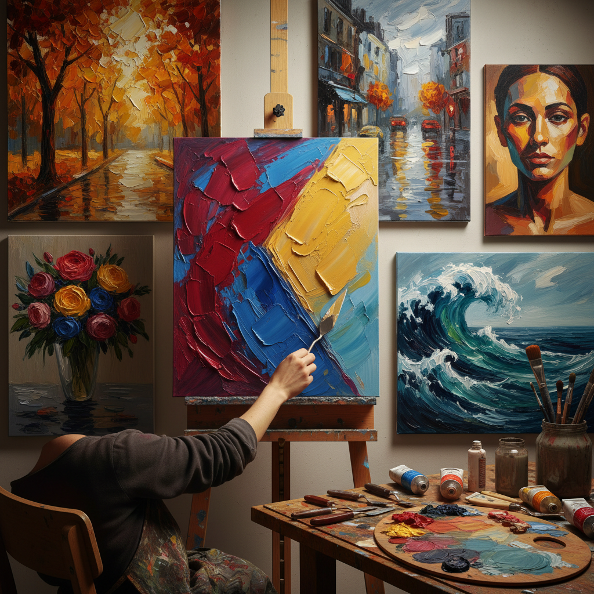

# Palette Knife Painting 刮刀画

> "The palette knife frees painting from the tyranny of the brush — its flat blade spreads color like butter on bread, scrapes it away like a sculptor removing clay, and builds texture with an architectural boldness that bristles can only envy." — Unknown

## 概述

刮刀画（Palette Knife Painting）是一种使用调色刀（palette knife）代替画笔在画布上涂抹、刮擦和堆积颜料的绘画技法。调色刀的扁平金属刀片能产生画笔无法实现的效果：大面积的平整色块、锐利的边缘、厚重的肌理堆积、刮擦露出底层的效果。刮刀画的特点是大胆、直接、有强烈的物质感和建筑感。

刮刀画在印象派和后印象派中得到广泛使用——Gustave Courbet是早期的刮刀画大师，他用刮刀创造了厚重的岩石和海浪纹理。当代的刮刀画家（如Leonid Afremov）使用刮刀创作色彩鲜艳、肌理丰富的风景和城市场景。刮刀画的魅力在于其"即时性"和"物质性"——每一刀都是果断的决定，颜料的厚度和纹理成为画面表达的重要部分。

## 核心特征

| 特征 | 描述 |
|------|------|
| 刮刀 | 使用调色刀作画 |
| 厚涂 | 厚重的颜料堆积 |
| 肌理 | 丰富的肌理效果 |
| 大胆 | 大胆直接的表达 |
| 锐利 | 锐利的边缘 |
| 物质 | 强烈的物质感 |

## 视觉特征

- **厚重**：厚重的颜料层
- **肌理**：丰富的表面肌理
- **锐利**：锐利的色块边缘
- **大胆**：大胆的色彩
- **建筑**：建筑般的结构感
- **光影**：颜料厚度产生的光影

## 代表作品

| 作品 | 艺术家 | 年代 | 意义 |
|------|--------|------|------|
| *The Wave* | Gustave Courbet | 1869 | 早期刮刀画大师 |
| *Palette knife landscapes* | Leonid Afremov | 当代 | 当代刮刀画代表 |
| *Knife paintings* | Nicolas de Staël | 20世纪 | 抽象刮刀画 |
| *Impasto knife works* | Various | 当代 | 厚涂刮刀作品 |
| *Contemporary knife art* | Various | 当代 | 当代刮刀画艺术 |

## 历史时间线

| 时期 | 事件 |
|------|------|
| 17世纪 | Rembrandt等画家偶尔使用刮刀 |
| 19世纪 | Courbet系统使用刮刀作画 |
| 印象派 | 印象派画家的刮刀应用 |
| 20世纪 | Nicolas de Staël的抽象刮刀画 |
| 当代 | Leonid Afremov等的流行刮刀画 |
| 当代 | 社交媒体上刮刀画的流行 |

## 中国语境

刮刀画在中国有广泛的流行——特别是在社交媒体时代。中国的油画爱好者群体中，刮刀画因其"效果惊艳、上手快"的特点而极受欢迎。中国的一些画室和培训机构开设刮刀画课程。中国的短视频平台上有大量刮刀画创作视频。中国的一些当代油画家使用刮刀创作具有强烈肌理感的作品。中国市场上有丰富的调色刀选择——从国产到进口品牌。

## AI生成概念图

## 与其他风格的关系

- **Impasto** → 厚涂
- **Oil Painting** → 油画
- **Expressionism** → 表现主义
- **Abstract Art** → 抽象艺术
- **Texture Art** → 纹理艺术
- **Alla Prima** → 一次完成画法

---

*浮光艺志 | Chronicle of Artistry*
