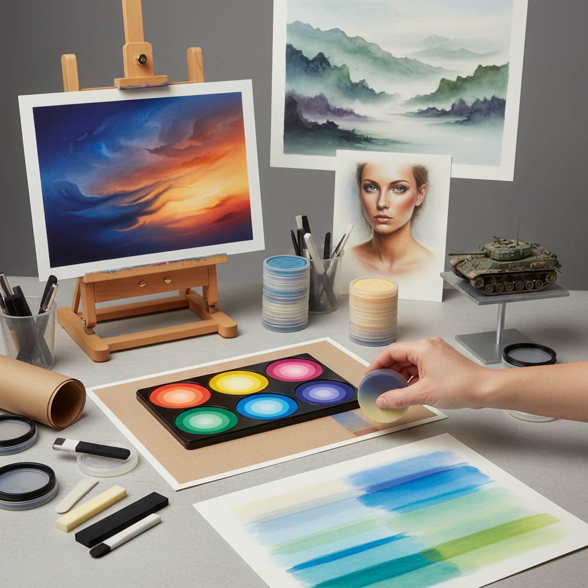

# Pan Pastel 盘式色粉

> "Pan Pastel is pastel reimagined for the painter's hand — ultra-soft pigment pressed into pans like cosmetics, applied with sponge tools in sweeping gestures that cover ground like painting yet retain the pure pigment brilliance of traditional pastels." — Unknown

## 概述

盘式色粉（Pan Pastel）是一种2007年由美国Colorfin公司推出的创新色粉形式——将超细研磨的色粉颜料压制成类似化妆品粉饼的圆形盘状，使用专用的海绵工具（Sofft Tools）涂抹。Pan Pastel保留了传统色粉的纯颜料特性（最少的粘合剂），但改变了应用方式——从棒状变为盘状，从直接涂画变为海绵涂抹。

Pan Pastel的创新之处在于：它能快速覆盖大面积（比传统色粉棒快得多）、产生极其均匀柔和的色调、几乎不产生粉尘、可以精确控制色彩的浓淡。Pan Pastel特别适合：大面积的天空和背景、柔和的渐变效果、与其他媒介的混合使用。Pan Pastel在模型制作、插画、纯艺术和混合媒介中都有应用。

## 核心特征

| 特征 | 描述 |
|------|------|
| 盘状 | 粉饼状的色粉 |
| 海绵 | 海绵工具涂抹 |
| 超细 | 超细研磨颜料 |
| 快速 | 快速覆盖大面积 |
| 低尘 | 几乎不产生粉尘 |
| 创新 | 2007年的创新产品 |

## 视觉特征

- **柔和**：极其柔和的色调
- **均匀**：均匀的色彩覆盖
- **渐变**：自然的渐变效果
- **轻盈**：轻盈的色彩层
- **纯净**：纯净的颜料色彩
- **大面积**：适合大面积效果

## 代表作品

| 作品 | 艺术家 | 年代 | 意义 |
|------|--------|------|------|
| *Pan Pastel landscapes* | Various | 当代 | 盘式色粉风景画 |
| *Model weathering* | Various | 当代 | 模型做旧效果 |
| *Mixed media art* | Various | 当代 | 混合媒介艺术 |
| *Pan Pastel portraits* | Various | 当代 | 盘式色粉肖像 |
| *Underpainting studies* | Various | 当代 | 底层色调研究 |

## 历史时间线

| 时期 | 事件 |
|------|------|
| 2007 | Colorfin公司推出Pan Pastel |
| 2008 | Sofft Tools专用海绵工具发布 |
| 2010s | Pan Pastel在模型制作中的流行 |
| 2010s | 纯艺术家的采用和推广 |
| 2015+ | 色彩范围的持续扩展 |
| 当代 | Pan Pastel在混合媒介中的广泛应用 |

## 中国语境

Pan Pastel在中国的美术和模型制作社区中有一定的知名度。中国的一些画材店和在线平台销售Pan Pastel产品。中国的模型制作爱好者使用Pan Pastel进行模型的做旧和气氛效果。中国的一些色粉画家尝试将Pan Pastel与传统色粉棒结合使用。Pan Pastel的"低粉尘、快速覆盖"特点在中国的工作室环境中有吸引力。中国的美术教育者开始关注Pan Pastel作为教学工具的潜力。

## AI生成概念图

## 与其他风格的关系

- **Soft Pastel** → 软色粉
- **Pastel Painting** → 色粉画
- **Airbrush** → 喷笔
- **Mixed Media** → 混合媒介
- **Model Making** → 模型制作
- **Cosmetics** → 化妆品（形式灵感）

---

*浮光艺志 | Chronicle of Artistry*
