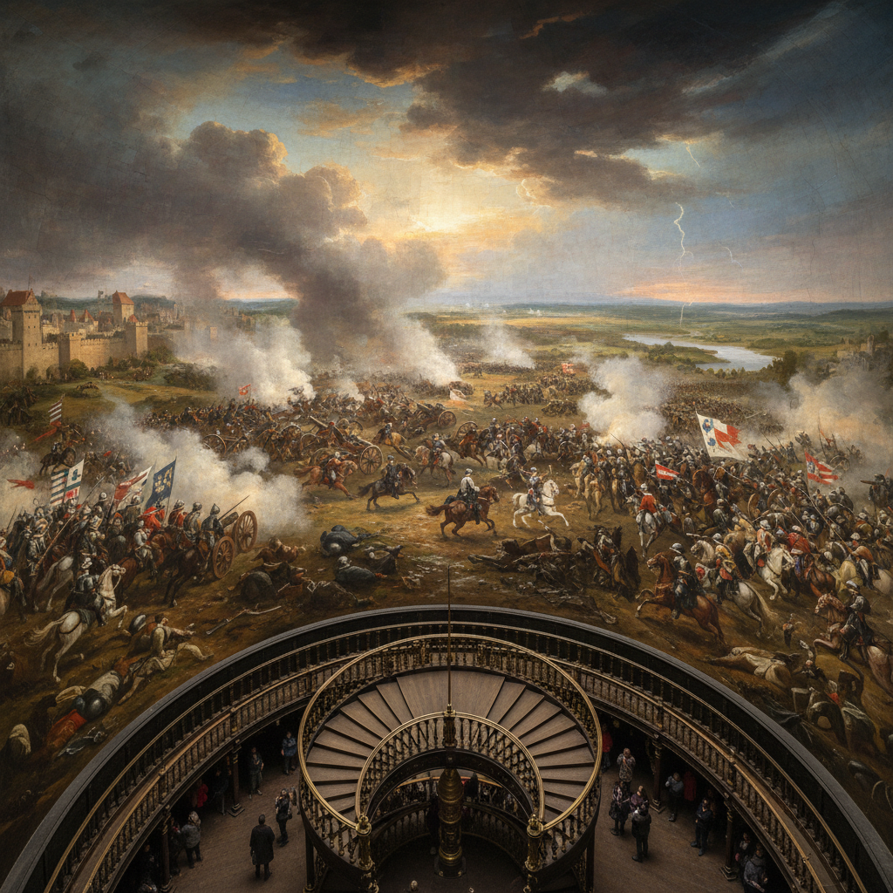

# Panorama Painting 全景画

> **时期：** 18世纪–20世纪初  
> **关键词：** 360度环绕、沉浸体验、巨幅画布、战役场景、早期VR

## 概述

Panorama Painting（全景画）是18世纪末发明的沉浸式绘画形式——在圆形建筑内壁悬挂360度连续画布，观众站在中央平台上被巨幅风景或战役场景完全包围。它是摄影和电影出现之前最接近虚拟现实的视觉体验，也是大众娱乐的早期形态。

## 风格特征

- **360度连续**：无缝环绕的全景构图
- **巨大尺幅**：通常高15米、周长超100米
- **沉浸感**：消除画框，模糊真实与虚构
- **精确透视**：从固定观察点计算的视角
- **前景实物**：真实物品与画面衔接

## 代表人物与作品

- 罗伯特·巴克（全景画发明者）
- 梅索尼耶《1807年弗里德兰战役》
- 中国《清明上河图》（卷轴全景）
- 当代：Yadegar Asisi 巨型全景

## 概念图

