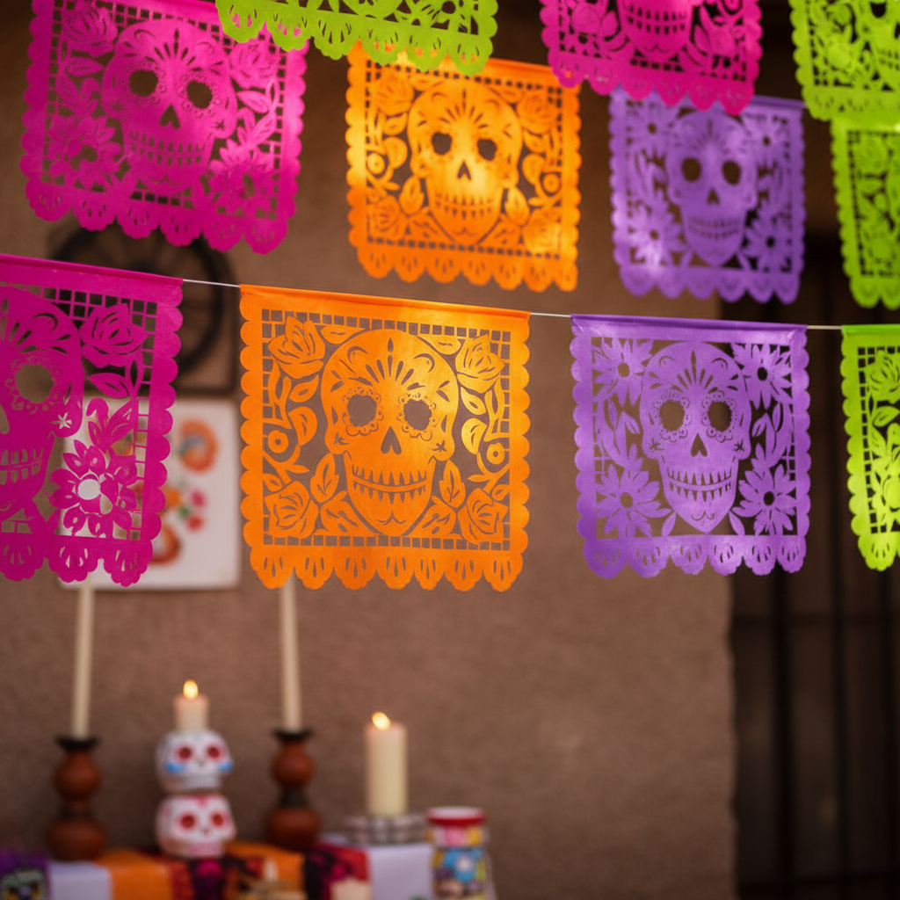

# Papel Picado 墨西哥彩纸 | Papel Picado

> **"风吹过彩纸的镂空——亡灵节的天空下，死亡也可以如此美丽。"**

## 概述

Papel Picado（墨西哥彩纸 / 意为"穿孔的纸"）是墨西哥传统的装饰剪纸艺术，用凿子（cincel）在多层彩色薄纸（papel de china）上凿出精细的图案。这种艺术与墨西哥的节日文化紧密相连——亡灵节（Día de los Muertos）、独立日、婚礼、洗礼和各种庆典都会悬挂彩色的Papel Picado横幅。普埃布拉州（Puebla）的圣萨尔瓦多·瓦希奥特诺科（San Salvador Huixcolotla）是最著名的产地，2006年被列为墨西哥非物质文化遗产。

## 核心特征

- **凿刻技法**：用锤子和凿子在多层纸上凿出图案
- **彩色薄纸**：使用极薄的彩色纸（papel de china）
- **多层制作**：一次凿刻40-50层纸
- **悬挂展示**：串在绳子上横跨街道或房间
- **节日用途**：与特定节日和庆典相关
- **风中飘动**：设计考虑风吹时的动态效果

## 常见题材

| 题材 | 节日 |
|------|------|
| 骷髅 Calavera | 亡灵节 |
| 花卉 Flores | 各种庆典 |
| 鸟类 Pájaros | 婚礼、春天 |
| 国旗/鹰 | 独立日 |
| 十字架 | 宗教节日 |
| 太阳/星星 | 宇宙主题 |

## 视觉特征

- 鲜艳的多色薄纸
- 精细的镂空图案
- 光线透过镂空的效果
- 风中飘动的轻盈感
- 对称的构图
- 正负空间的精妙平衡

## 与其他风格的关系

| 风格 | 关系 |
|------|------|
| 中国剪纸 | 共享纸艺传统（剪vs凿） |
| 波兰Wycinanki | 共享节日剪纸传统 |
| 瑞士Scherenschnitte | 共享欧洲纸艺传统 |
| 墨西哥亡灵节艺术 | Papel Picado是核心元素 |
| Otomi刺绣 | 共享墨西哥民间艺术传统 |

## 概念图

---

*浮光艺志 | Chronicle of Artistry*
