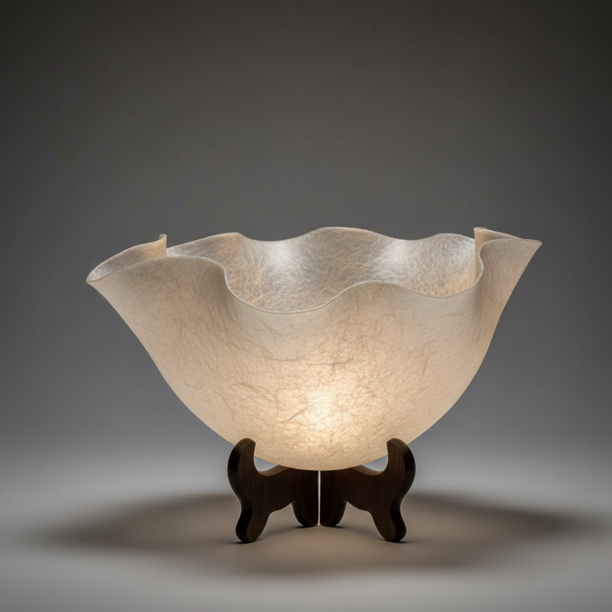

# Paper Clay Art 纸黏土艺术

> "Paper clay is clay set free from its own weight — cellulose fibers from recycled paper pulped into liquid slip, creating a composite that defies ceramic gravity, joining wet to dry, bridging cracks that would doom ordinary clay, building walls thin as eggshell that survive the kiln because the paper burns away leaving a network of tiny air channels that make the fired body light as pumice and strong as lace." — Unknown

## 概述

纸黏土艺术（Paper Clay Art）是一种将纸浆纤维（通常来自回收纸张）混入陶瓷泥浆中创造的复合材料艺术。纸纤维的加入从根本上改变了陶土的性能——纸黏土可以极薄而不塌陷，可以湿接干而不开裂，可以修补已干燥的坯体，可以创造极轻薄的结构。烧制时纸纤维燃烧消失，留下微小的气孔网络，使成品轻盈而坚固。

纸黏土艺术的核心要素包括：1）纸浆纤维——回收纸张制成的纤维；2）复合材料——纸纤维与陶土的混合；3）超薄结构——可创造极薄的器壁；4）湿接干——可将湿泥接在干坯上；5）自修复——可修补裂缝和断裂；6）轻盈感——烧成后极为轻盈；7）结构自由——突破传统陶瓷的结构限制。

## 核心特征

| 特征 | 描述 |
|------|------|
| 纸纤维增强 | 纸浆纤维增强陶土 |
| 超薄可能 | 可创造极薄的结构 |
| 湿接干 | 湿泥可接在干坯上 |
| 自修复 | 可修补裂缝 |
| 轻盈 | 烧成后非常轻 |
| 结构自由 | 突破重力限制 |

## 视觉特征

- **薄如纸张**：极薄的半透明器壁
- **轻盈飘逸**：如纸般轻盈的质感
- **有机形态**：自由流动的有机造型
- **纹理丰富**：纸纤维留下的微妙纹理
- **半透光**：薄壁处可透光
- **脆弱美感**：看似脆弱实则坚固

## 代表作品

| 作品 | 艺术家/文化 | 年代 | 意义 |
|------|-------------|------|------|
| *Graham Hay作品* | Graham Hay | 当代 | 纸黏土艺术先驱 |
| *Cheryl Ann Thomas作品* | Cheryl Ann Thomas | 当代 | 纸黏土雕塑 |
| *Inge Roberts作品* | Inge Roberts | 当代 | 大型纸黏土装置 |
| *日本纸黏土陶艺* | 日本陶艺家 | 当代 | 日本纸黏土传统 |
| *当代纸黏土探索* | 各地陶艺家 | 当代 | 纸黏土的多元应用 |

## 历史时间线

| 时期 | 事件 |
|------|------|
| 1980年代 | 纸黏土概念的提出 |
| 1990年代 | 纸黏土技术的系统化研究 |
| 2000年代 | 纸黏土在陶艺教育中普及 |
| 2010年代 | 纸黏土艺术的成熟发展 |
| 当代 | 纸黏土作为独立艺术媒介 |

## 中国语境

纸黏土在中国当代陶艺中正在获得越来越多的关注。中国陶艺教育机构——景德镇陶瓷大学、中国美术学院等——都开设了纸黏土相关课程。中国陶艺家利用纸黏土的特性创作大型装置和超薄器物——将中国传统的"薄如蝉翼"审美理想推向新的极致。纸黏土与中国造纸术有精神上的联系——都是将植物纤维转化为文明载体。中国年轻陶艺家特别喜欢纸黏土的自由度——它允许更大胆的实验和更自由的表达，打破了传统陶瓷制作的许多技术限制。

## AI生成概念图

## 与其他风格的关系

- **Porcelain** → 瓷器（薄壁传统）
- **Mixed Media** → 混合媒介
- **Installation Art** → 装置艺术
- **Fiber Art** → 纤维艺术
- **Experimental Ceramics** → 实验陶瓷
- **Light Art** → 光艺术

---

*浮光艺志 | Chronicle of Artistry*
