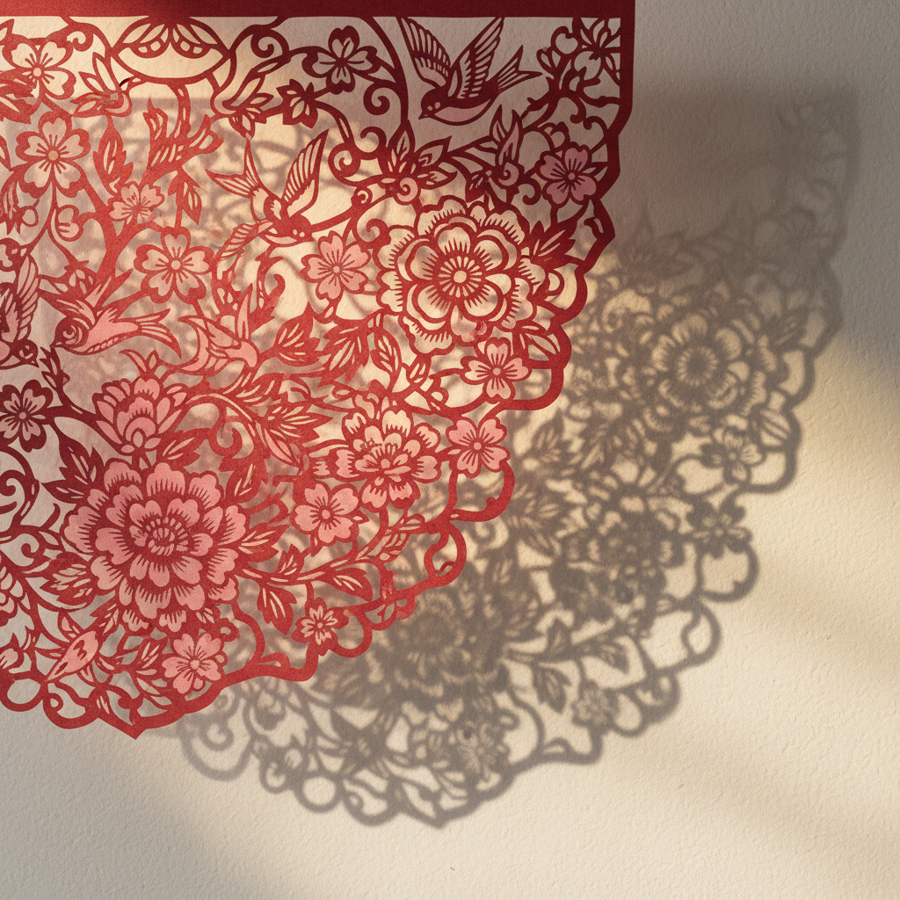

# Paper Cut Art 剪纸艺术



> **"一把剪刀、一张纸——在正负空间之间创造整个世界。"**

## 概述

| 维度 | 描述 |
|------|------|
| 时期 | 古代–至今（跨文化、跨时代） |
| 别名 | Paper Cut, Scherenschnitte, Kirigami, 剪纸 |
| 核心色彩 | 红色（中国）、黑色剪影（欧洲）、多色（当代） |
| 关键元素 | 正负空间、剪影、层叠、精细镂空、叙事性 |
| 代表人物 | Matisse (晚期), Kara Walker, Rob Ryan, 中国民间剪纸艺人 |
| 关联风格 | Folk Art, Silhouette Art, Illustration, Storybook |

---

## 历史脉络

| 年份 | 事件 |
|------|------|
| 6世纪 | 中国剪纸——世界最早的剪纸传统 |
| 16世纪 | 欧洲剪影艺术(Scherenschnitte) |
| 1940s | Matisse 晚期剪纸——"用剪刀画画" |
| 2000s | 当代剪纸艺术复兴——Kara Walker, Rob Ryan |
| 2010s | 数字"剪纸风格"——扁平设计的变体 |
| 2020s | 剪纸美学在动画、品牌中的应用 |

### 核心哲学

剪纸艺术的精神是**"减法就是加法——剪掉的部分和留下的部分同样重要"**：
- 正负 = 对话（"空白不是'没有'——是另一种存在"）
- 减法 = 本质（"不是添加——是去除多余"）
- 一刀 = 不可逆（"没有Ctrl+Z——每一刀都是决定"）
- 传统 = 活的（"千年的技艺——今天依然在创新"）
- Matisse: "剪刀比铅笔更敏感"

---

## 视觉语法

### 色彩系统

```
传统：
  红色 (#FF0000) — 中国剪纸
  黑色 (#000000) — 欧洲剪影
  白色 (#FFFFFF) — 负空间

当代：
  多色层叠 — 不同颜色纸张
  渐变 — 通过层叠实现
  任何颜色 — 当代自由

规则：
  - 正负空间的对话
  - 平面性（无透视）
  - 轮廓清晰
  - 层叠创造深度

质感：
  纸张 — 边缘、纤维
  阴影 — 层叠产生
  镂空 — 光线穿透
  手工 — 剪刀痕迹
```

### 标志性元素

| 类别 | 元素 |
|------|------|
| 技法 | 剪、刻、折、叠、镂空 |
| 空间 | 正负空间对话、剪影、层叠 |
| 题材 | 自然、人物、叙事、装饰、文字 |
| 工具 | 剪刀、刻刀、纸张 |
| 传统 | 中国窗花、德国剪影、日本切绘 |
| 态度 | 精细、耐心、减法、传统与创新 |

---

## 与千禧怀旧的关系

### 数字时代的"手工"回归
- 剪纸风格在数字设计中的应用
- 动画中的剪纸美学（如《养家之人》）
- "在3D渲染的时代——2D剪纸的平面感变得珍贵"
- 品牌设计中的"剪纸风格"插画

### 跨文化的共鸣
- 中国剪纸 = UNESCO非物质文化遗产
- 全球当代艺术家的剪纸实践
- "剪纸是少数真正'全球性'的艺术形式"

---

## 中国语境

- 中国剪纸的深厚传统（陕北、山东、河北等）
- 中国剪纸作为UNESCO非物质文化遗产
- 当代中国艺术家对剪纸的创新
- 中国品牌设计中的剪纸元素

---

## 设计应用

| 场景 | 应用方式 |
|------|----------|
| 品牌 | 剪纸风格插画+正负空间+层叠+精细 |
| 动画 | 剪纸动画+层叠+平面+叙事 |
| 包装 | 镂空+层叠+窗花+传统+现代 |
| 空间 | 装置+灯光+阴影+层叠+互动 |

---

## 相关风格

← [Collage Art 拼贴艺术](collage-art.md) | [Folk Art 民间艺术](folk-art.md) →

↑ [返回千禧怀旧目录](README.md) | [返回总目录](../README.md)
