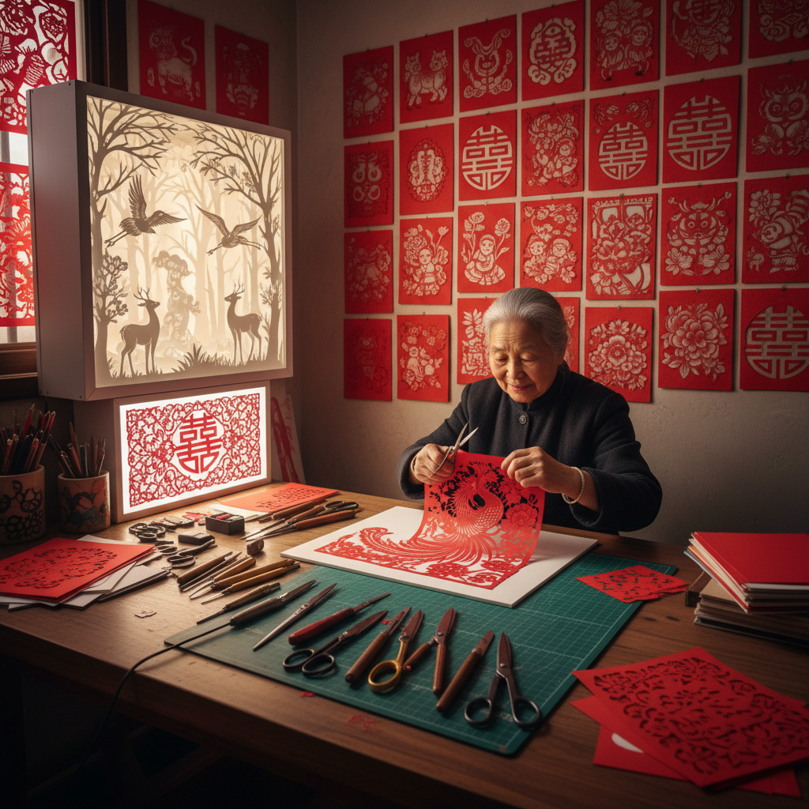

# Paper Cutting Art 剪纸艺术

> "Paper cutting art transforms the simplest of materials — a flat sheet of paper — into the most intricate of artworks through the simplest of tools — a pair of scissors or a blade. Every cut removes material, every removal creates form, every form tells a story. The paper cutter works in negative space, thinking not about what to add but what to take away, understanding that beauty often lies in what is absent rather than what is present." — Unknown

## 概述

剪纸艺术（Paper Cutting Art）是通过剪刀或刻刀在纸张上剪刻出图案和形象的传统艺术形式。剪纸是世界上分布最广泛的民间艺术之一，几乎每个有纸的文化都发展出了自己的剪纸传统。

剪纸艺术的实践包括：1）传统剪纸——用剪刀直接剪出图案（中国窗花）；2）刻纸——用刻刀在纸上刻出精细图案；3）剪影——剪出人物或物体的侧面轮廓；4）立体剪纸——将平面剪纸折叠或组合成三维形态；5）当代剪纸——将传统剪纸技法应用于当代艺术创作；6）激光切割纸艺——用激光切割技术创作精密纸艺。

## 核心特征

| 特征 | 描述 |
|------|------|
| 减法 | 减法创作（去除材料） |
| 平面 | 平面到立体 |
| 对称 | 折叠对称 |
| 精细 | 极度精细 |
| 民间 | 民间传统 |
| 象征 | 吉祥象征 |

## 视觉特征

- **镂空**：镂空的负空间
- **对称**：折叠产生的对称
- **红色**：中国剪纸的红色
- **精细**：极细的线条和图案
- **剪影**：清晰的轮廓
- **层次**：多层剪纸的深度

## 代表作品

| 作品 | 艺术家 | 年代 | 意义 |
|------|--------|------|------|
| *中国窗花* | 民间传统 | 古代至今 | 中国剪纸传统 |
| *Scherenschnitte* | 瑞士/德国传统 | 16世纪至今 | 欧洲剪纸 |
| *Contemporary paper cuts* | Kara Walker | 1990年代 | 当代剪纸艺术 |
| *Paper sculptures* | Peter Callesen | 2000年代 | 纸雕塑 |
| *Laser cut art* | Various | 2010年代 | 激光切割纸艺 |

## 历史时间线

| 时期 | 事件 |
|------|------|
| 公元6世纪 | 中国剪纸的最早记录 |
| 唐代 | 剪纸在中国的普及 |
| 16世纪 | 欧洲剪纸传统发展 |
| 2009 | 中国剪纸入选非遗 |
| 当代 | 剪纸与数字技术结合 |

## 中国语境

剪纸艺术在中国有极其深厚的文化传统——中国是剪纸艺术的发源地之一，有超过1500年的历史。中国剪纸在2009年被列入联合国教科文组织人类非物质文化遗产代表作名录。中国各地有丰富多样的剪纸流派——陕北剪纸的粗犷豪放、江南剪纸的精细秀丽、山东剪纸的朴实大方、河北蔚县的彩色剪纸等。中国剪纸与民间生活紧密相连——春节的窗花、婚礼的喜字、丧葬的纸扎等。中国剪纸的题材极其丰富——花鸟鱼虫、十二生肖、戏曲人物、民间故事、吉祥图案等。中国当代的一些艺术家在探索剪纸艺术：将中国传统剪纸的美学与当代装置结合、用激光切割技术创作超大规模剪纸、以及将中国剪纸的"负空间"思维与当代建筑设计对话。

## AI生成概念图

## 与其他风格的关系

- **Folk Art** → 民间艺术
- **Silhouette Art** → 剪影艺术
- **Paper Art** → 纸艺术
- **Shadow Art** → 影子艺术
- **Origami** → 折纸
- **Laser Cut Art** → 激光切割艺术

---

*浮光艺志 | Chronicle of Artistry*
