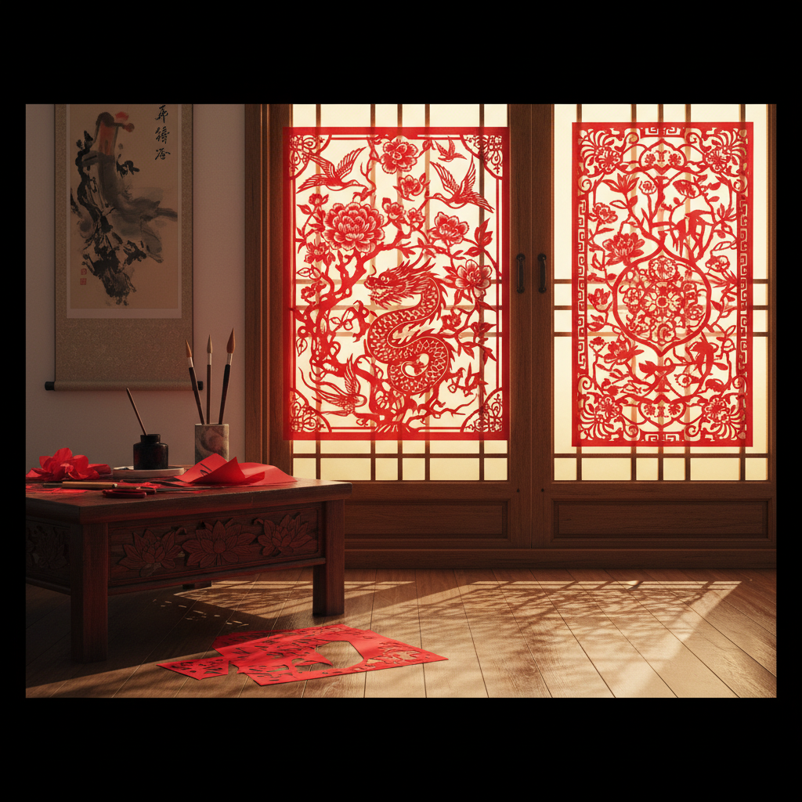

# Paper Cutting 剪纸艺术

> "Paper cutting is drawing with scissors — every snip reveals a world hidden in the negative space." — Unknown

## 概述

剪纸艺术（Paper Cutting）是用剪刀或刻刀在纸上剪刻出图案的装饰艺术。这是人类最古老、最普遍的民间艺术形式之一——从中国的窗花到波兰的wycinanki，从德国的Scherenschnitte到墨西哥的papel picado，几乎每个文化都有自己的剪纸传统。剪纸的独特之处在于它的"减法"本质——通过去除纸张来创造图案，正形与负形同样重要。

剪纸的哲学在于：虚实相生——剪去的部分和保留的部分共同构成完整的画面，如同中国哲学中的阴阳互补。

## 核心特征

| 特征 | 描述 |
|------|------|
| 减法 | 通过剪除创造图案 |
| 平面 | 平面的装饰艺术 |
| 对称 | 常利用折叠创造对称 |
| 虚实 | 正负形的互动 |
| 民间 | 深厚的民间传统 |
| 简约 | 材料极其简约 |

## 视觉特征

- **剪影**：清晰的剪影效果
- **对称**：折叠产生的对称
- **细节**：精细的镂空细节
- **红色**：中国剪纸的标志红色
- **连接**：图案的连接性
- **透光**：贴窗时的透光效果

## 代表作品

| 作品 | 艺术家 | 年代 | 意义 |
|------|--------|------|------|
| *Chinese window flowers* | 匿名 | 传统 | 中国窗花传统 |
| *Hans Christian Andersen cuts* | Andersen | 19世纪 | 安徒生的剪纸 |
| *Matisse cut-outs* | Henri Matisse | 1940s-50s | 马蒂斯的剪纸 |
| *Kara Walker silhouettes* | Kara Walker | 1990s+ | 当代剪纸艺术 |
| *Bovey Lee paper cuts* | Bovey Lee | 2000s+ | 当代精细剪纸 |

## 历史时间线

| 时期 | 事件 |
|------|------|
| 6世纪 | 中国最早的剪纸（纸发明后） |
| 中世纪 | 剪纸传入欧洲 |
| 18-19世纪 | 欧洲剪影艺术的流行 |
| 1940s-50s | 马蒂斯的剪纸革命 |
| 2009 | 中国剪纸列入UNESCO非遗 |
| 当代 | 当代剪纸艺术的多元发展 |

## 中国语境

中国是剪纸艺术的发源地和最重要的传承国——2009年中国剪纸被列入UNESCO人类非物质文化遗产。中国剪纸有数十个地方流派——陕北剪纸的粗犷豪放、江南剪纸的精细秀丽、佛山剪纸的金碧辉煌、蔚县剪纸的点彩绚丽。剪纸在中国不仅是装饰，更是民间信仰、节庆习俗和生命礼仪的重要载体。

## AI生成概念图

## 与其他风格的关系

- **Wycinanki** → 波兰剪纸传统
- **Silhouette** → 剪影艺术
- **Kirigami** → 日本剪纸
- **Folk Art** → 民间艺术
- **Stencil** → 模板艺术
- **Shadow Puppetry** → 皮影戏

---

*浮光艺志 | Chronicle of Artistry*
