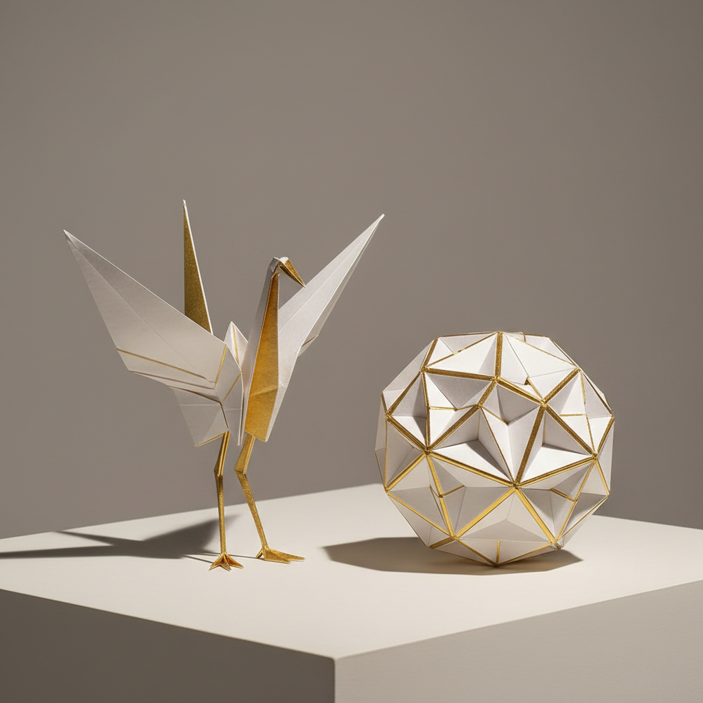

# Paper Folding Art 折纸艺术

> "Paper folding is geometry made tangible — a single flat sheet, through nothing more than a sequence of folds, becomes a crane, a dragon, a mathematical surface, or an architectural form. No cuts, no glue, no additions — only the transformation of a plane into space through the ancient logic of the crease. Every origami model is a proof that complexity can emerge from the simplest of constraints." — Unknown

## 概述

折纸艺术（Paper Folding Art）是一种仅通过折叠纸张（传统上不使用剪刀或胶水）来创造各种造型的纸艺形式——从简单的纸鹤到极其复杂的数学曲面和超写实动物模型。折纸（Origami，日语"折り紙"）虽然以日本传统最为著名，但纸张折叠在世界各地都有独立的传统。当代折纸已发展为融合数学、工程和艺术的跨学科领域。

折纸艺术的实践包括：1）传统折纸——经典的纸鹤、纸船等传统模型；2）现代创作折纸——当代设计师创作的复杂模型；3）模块折纸——多个相同单元组合的几何体；4）湿折——用湿纸折叠创造曲面效果；5）折纸镶嵌——重复折叠图案覆盖平面；6）数学折纸——探索折叠的数学原理；7）工程折纸——折纸原理在工程中的应用。

## 核心特征

| 特征 | 描述 |
|------|------|
| 折叠 | 仅通过折叠变形 |
| 约束 | 传统不剪不粘 |
| 数学 | 深厚的数学基础 |
| 变换 | 从平面到立体 |
| 精确 | 需要精确的折叠 |
| 普世 | 全球性的传统 |

## 视觉特征

- **几何**：精确的几何形态
- **折痕**：可见的折痕线条
- **立体**：从平面到立体的转化
- **简洁**：简洁优雅的造型
- **对称**：对称的结构美
- **纯粹**：纯粹的材料表达

## 代表作品

| 作品 | 艺术家/文化 | 年代 | 意义 |
|------|-------------|------|------|
| *Thousand cranes* | 日本 | 传统 | 千纸鹤传统 |
| *Akira Yoshizawa works* | 日本 | 20世纪 | 现代折纸之父 |
| *Robert Lang designs* | 美国 | 当代 | 数学折纸大师 |
| *Eric Joisel sculptures* | 法国 | 当代 | 折纸雕塑大师 |
| *Modular origami* | 国际 | 当代 | 模块折纸发展 |

## 历史时间线

| 时期 | 事件 |
|------|------|
| 6世纪 | 纸张传入日本，折纸起源 |
| 江户时代 | 日本折纸传统的成熟 |
| 20世纪 | 吉�的章创立现代折纸体系 |
| 1960年代起 | 折纸的数学化和科学化 |
| 当代 | 折纸的跨学科发展 |

## 中国语境

折纸艺术在中国有深厚的传统和广泛的当代发展。中国是纸张的发明者——折纸的历史可能与纸张的发明同样古老。中国传统的纸折叠包括元宝、纸船、纸飞机等民间形式——虽然不如日本折纸那样系统化但同样丰富。中国当代的折纸艺术家在国际折纸界有重要地位——如刘通、陈晓等在复杂折纸设计方面的贡献。中国的STEM教育中，折纸作为培养空间思维和数学能力的工具——在中小学广泛应用。中国的航天工程中，折纸原理被应用于太阳能帆板的折叠设计——展示了折纸的工程价值。中国的一些博物馆和文化机构举办折纸展览——推广这一融合传统与现代的艺术形式。

## AI生成概念图

## 与其他风格的关系

- **Origami** → 日本折纸
- **Paper Art** → 纸艺
- **Kirigami** → 剪纸折纸
- **Mathematics** → 数学艺术
- **Modular Design** → 模块设计
- **Engineering** → 工程应用

---

*浮光艺志 | Chronicle of Artistry*
