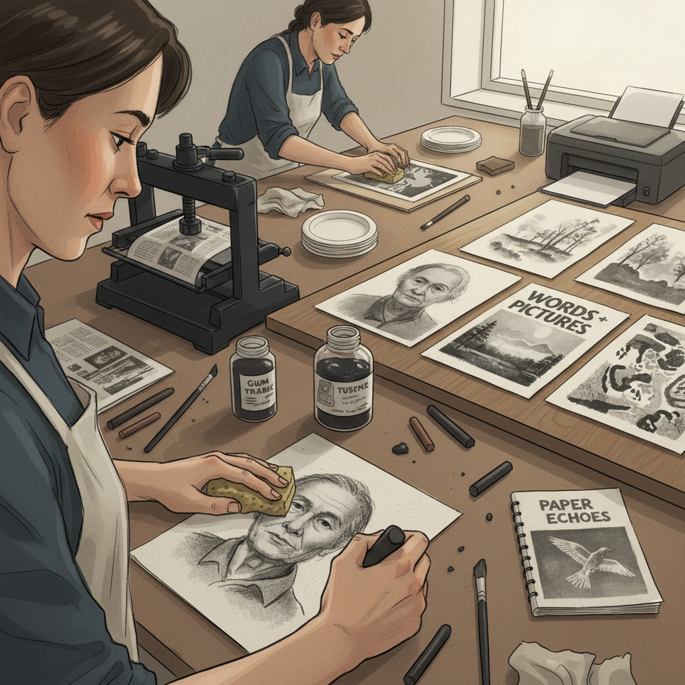

# Paper Lithography 纸版石印

> "Paper lithography democratizes the ancient art of stone printing — replacing heavy limestone with humble paper plates, making the magic of planographic printing accessible to anyone with a photocopier and a press." — Unknown

## 概述

纸版石印（Paper Lithography）是一种使用纸质版面代替传统石版或金属版的平版印刷技法。其原理与传统石版画相同——基于油水不相容的化学原理——但使用特殊处理的纸张或铝箔纸作为版面，大大降低了设备和材料的门槛。纸版石印有多种方法：使用激光打印机将图像打印在特殊纸张上作为版面、使用油性材料直接在纸版上绘画、使用转印法将图像转移到纸版上。

纸版石印的优势在于：不需要昂贵的石版或金属版、不需要大型研磨设备、可以使用普通的蚀刻印刷机、适合小型工作室和教育环境。纸版石印虽然印数有限（通常只能印制少量版数），但其便捷性和低成本使其成为版画教育和实验性创作的理想选择。

## 核心特征

| 特征 | 描述 |
|------|------|
| 纸版 | 使用纸质版面 |
| 平版 | 平版印刷原理 |
| 低成本 | 低成本低门槛 |
| 便捷 | 操作便捷 |
| 教育 | 适合教育环境 |
| 实验 | 适合实验创作 |

## 视觉特征

- **柔和**：柔和的印迹质量
- **质感**：纸张的质感
- **有机**：有机的边缘
- **层次**：灰度的层次
- **手工**：手工的温度
- **实验**：实验性的效果

## 代表作品

| 作品 | 艺术家 | 年代 | 意义 |
|------|--------|------|------|
| *Educational prints* | Various | 当代 | 教育环境中的应用 |
| *Experimental lithographs* | Various | 当代 | 实验性纸版石印 |
| *Small edition prints* | Various | 当代 | 小版数创作 |
| *Mixed media works* | Various | 当代 | 混合媒介中的应用 |
| *Artist zines* | Various | 当代 | 艺术家小册子 |

## 历史时间线

| 时期 | 事件 |
|------|------|
| 1798 | 石版画的发明（Senefelder） |
| 20世纪中期 | 纸版石印概念的探索 |
| 1970s | 纸版石印技法的发展 |
| 1980s | 激光打印机带来的新可能 |
| 1990s | 纸版石印在教育中的普及 |
| 当代 | 纸版石印的持续创新 |

## 中国语境

纸版石印在中国的版画教育中有广泛的应用——特别是在中小学美术教育和社区艺术教育中。中国的美术教师使用纸版石印作为向学生介绍版画原理的入门方法。中国的一些独立版画工作室和艺术家使用纸版石印进行实验性创作。中国的艺术院校在版画基础课程中也会介绍纸版石印作为平版印刷的简化版本。

## AI生成概念图

## 与其他风格的关系

- **Lithography** → 石版画
- **Screen Printing** → 丝网印刷
- **Monotype** → 独幅版画
- **Transfer Printing** → 转印
- **Offset Printing** → 胶印
- **Zine Making** → 小册子制作

---

*浮光艺志 | Chronicle of Artistry*
