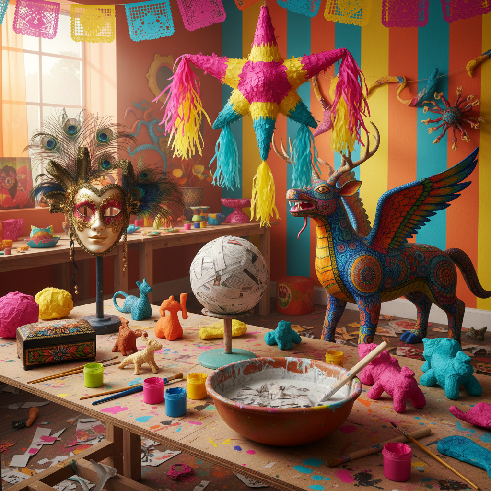

# Paper Mache Art 纸浆艺术

> "Paper mache is transformation twice over — first, paper is destroyed, torn and soaked until it loses all memory of being a page. Then from this pulpy chaos, new forms arise: masks and puppets, bowls and sculptures, entire worlds built from nothing but paper, water, and glue. It is the art of resurrection, proving that destruction can be the first step toward creation." — Unknown

## 概述

纸浆艺术（Paper Mache Art）是以纸浆或纸条与粘合剂混合物为材料进行造型创作的艺术形式——通过将纸撕碎浸泡成浆，或将纸条蘸胶水层层叠加在模具上，创造出轻盈但坚固的三维造型。纸浆艺术是世界上最普及的造型工艺之一。

纸浆艺术的实践包括：1）纸浆面具——用纸浆制作的面具；2）纸浆雕塑——用纸浆创造的雕塑作品；3）纸浆人偶——用纸浆制作的大型人偶（如墨西哥的piñata）；4）纸浆器皿——用纸浆制作的碗、盘等器具；5）纸浆建筑模型——用纸浆制作的建筑模型；6）纸浆装饰——节日和家居装饰品；7）当代纸浆艺术——将纸浆作为当代艺术媒介的实验性创作。

## 核心特征

| 特征 | 描述 |
|------|------|
| 轻盈 | 极其轻盈 |
| 可塑 | 高度可塑性 |
| 廉价 | 材料极其廉价 |
| 坚固 | 干燥后相当坚固 |
| 环保 | 废纸再利用 |
| 普及 | 全世界普及的工艺 |

## 视觉特征

- **纹理**：纸浆的粗糙纹理
- **色彩**：可涂绑任何色彩
- **有机**：有机的不规则形态
- **轻盈**：轻盈的视觉感受
- **层次**：层叠的纸张纹理
- **彩绘**：表面的彩绘装饰

## 代表作品

| 作品 | 艺术家 | 年代 | 意义 |
|------|--------|------|------|
| *Mexican piñatas* | 墨西哥传统 | 16世纪至今 | 墨西哥纸浆人偶 |
| *Venetian masks* | 威尼斯传统 | 中世纪至今 | 威尼斯纸浆面具 |
| *Indian paper mache* | 克什米尔传统 | 古代至今 | 印度纸浆工艺 |
| *Contemporary paper mache* | Various | 当代 | 当代纸浆艺术 |
| *Giant puppets* | Various | 当代 | 大型纸浆人偶 |

## 历史时间线

| 时期 | 事件 |
|------|------|
| 古代 | 中国最早的纸浆技术 |
| 中世纪 | 纸浆技术传入欧洲 |
| 16世纪 | 墨西哥piñata传统 |
| 18-19世纪 | 纸浆家具和装饰的流行 |
| 当代 | 纸浆作为当代艺术媒介 |

## 中国语境

纸浆艺术在中国有悠久的历史——中国是造纸术的发明国，也是最早使用纸浆进行造型的文明之一。中国传统的"纸扎"工艺——用纸和竹架制作各种造型（如灯笼、祭祀用品）——与纸浆艺术有密切的关系。中国的一些传统工艺使用纸浆技术——如脱胎漆器的内胎就是用纸浆制作的。中国当代的一些艺术家将纸浆作为创作媒介——用废纸浆创造大型雕塑和装置，探索回收利用和可持续发展的主题。中国的儿童美术教育中，纸浆造型是非常受欢迎的课程——培养孩子的空间感和创造力。中国的一些设计师也在探索纸浆材料的现代应用——如纸浆家具、纸浆灯具和纸浆包装设计。

## AI生成概念图

## 与其他风格的关系

- **Paper Art** → 纸艺术
- **Sculpture** → 雕塑
- **Mask Art** → 面具艺术
- **Folk Art** → 民间艺术
- **Eco Art** → 生态艺术
- **Puppet Art** → 木偶艺术

---

*浮光艺志 | Chronicle of Artistry*
