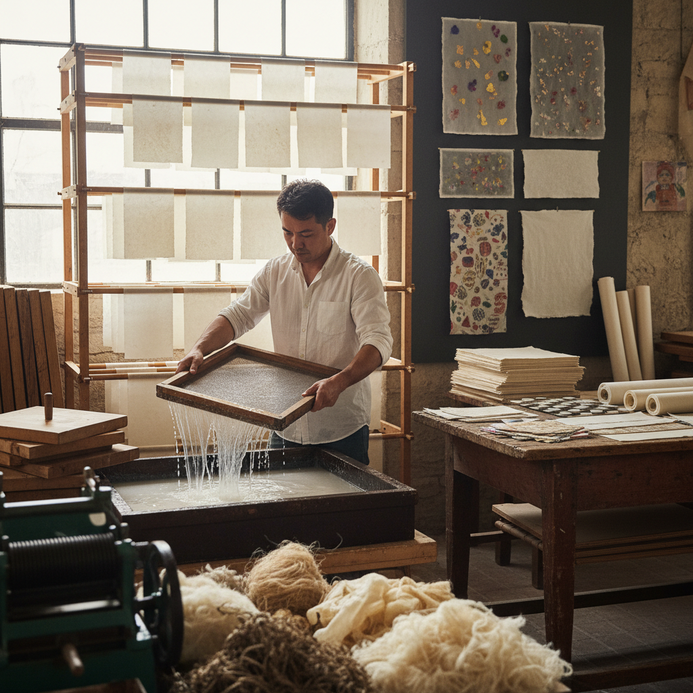

# Paper Making 造纸

> "Paper making is transformation at its purest — plant fibers suspended in water, lifted on a screen, and dried into sheets that carry the weight of civilization." — Unknown

## 概述

造纸（Paper Making）是将植物纤维（木浆、棉、麻、楮皮等）通过打浆、抄纸和干燥等工序制作成纸张的工艺。造纸术是中国四大发明之一——蔡伦在公元105年改进了造纸工艺，使纸张成为人类文明最重要的信息载体。手工造纸不仅是一门实用工艺，更是一门艺术——从日本和纸（washi）的精致透光到尼泊尔洛克塔纸的粗犷质感，从中国宣纸的"墨韵万变"到西方棉纸的厚实手感。当代手工造纸融合了传统技法和艺术创作——纸浆铸造、纸浆绘画、嵌入式装饰和纸雕塑。

造纸的哲学在于：从无到有——将散乱的纤维通过水的媒介重新组织成一个完整的平面，承载人类的思想和创造。

## 核心特征

| 特征 | 描述 |
|------|------|
| 纤维 | 植物纤维为原料 |
| 水 | 水作为媒介 |
| 抄纸 | 纸帘抄纸成型 |
| 质感 | 独特的纸张质感 |
| 多样 | 纤维来源多样 |
| 古老 | 极其古老的工艺 |

## 视觉特征

- **质感**：纤维的自然质感
- **透光**：薄纸的透光性
- **边缘**：自然的毛边
- **纹理**：纸帘的纹理
- **色调**：天然的色调
- **嵌入**：嵌入的花瓣或纤维

## 代表作品

| 作品 | 艺术家 | 年代 | 意义 |
|------|--------|------|------|
| *Chinese Xuan paper* | 匿名 | 唐代+ | 中国宣纸 |
| *Japanese Washi* | 匿名 | 传统 | 日本和纸 |
| *Korean Hanji* | 匿名 | 传统 | 韩国韩纸 |
| *Dard Hunter papers* | Dard Hunter | 1920s+ | 西方手工纸先驱 |
| *Contemporary paper art* | Various | 当代 | 当代纸艺术 |

## 历史时间线

| 时期 | 事件 |
|------|------|
| 公元前2世纪 | 中国最早的纸 |
| 105年 | 蔡伦改进造纸术 |
| 7世纪 | 造纸术传入日本 |
| 8世纪 | 造纸术传入阿拉伯 |
| 12世纪 | 造纸术传入欧洲 |
| 当代 | 手工造纸的艺术复兴 |

## 中国语境

造纸是中国对世界文明最重要的贡献之一。中国的手工造纸传统至今仍在延续——安徽泾县的宣纸、浙江富阳的竹纸、四川夹江的书画纸等都是国家级非物质文化遗产。宣纸因其"墨韵万变、纸寿千年"的特性，是中国书画最重要的载体。当代中国的手工造纸不仅是传统工艺的传承，也是当代艺术创作的媒介——一些艺术家用纸浆铸造、纸浆绘画等方式进行创作。中国的造纸博物馆和体验工坊让公众了解这一古老工艺。

## AI生成概念图

## 与其他风格的关系

- **Calligraphy** → 书法（纸的用途）
- **Printmaking** → 版画（纸的用途）
- **Origami** → 折纸
- **Paper Cutting** → 剪纸
- **Bookbinding** → 装帧
- **Pulp Painting** → 纸浆画

---

*浮光艺志 | Chronicle of Artistry*
