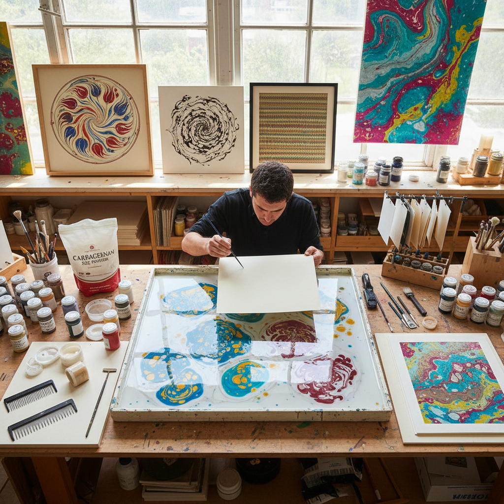

# Paper Marbling Art 水拓画艺术

> "Marbling is controlled chaos — pigments floated on a viscous bath, combed and swirled into patterns that are never quite the same twice, then captured on paper in a single irreversible moment of contact. The marbler works at the boundary between intention and accident, guiding colors into patterns that obey the laws of fluid dynamics more than the laws of design. Each sheet is a unique record of a moment that can never be repeated." — Unknown

## 概述

水拓画艺术（Paper Marbling Art）是将颜料漂浮在增稠的水面上，通过梳理、搅动和吹拂等方式形成图案，然后将纸张覆盖在水面上转印图案的装饰工艺——利用油水不相溶的原理和流体力学，创造出独特的大理石纹理和各种装饰图案。每一张水拓画都是独一无二的。

水拓画艺术的实践包括：1）土耳其Ebru——传统的土耳其水拓画；2）日本墨流し——日本传统的墨流技法；3）书籍装帧——水拓纸用于书籍封面和扉页；4）织物水拓——在织物上进行水拓；5）自由水拓——自由流动的抽象图案；6）梳纹水拓——用梳子创造规律图案；7）当代水拓——将传统技法与现代艺术结合的创作。

## 核心特征

| 特征 | 描述 |
|------|------|
| 唯一 | 每张都独一无二 |
| 流动 | 流体的自然运动 |
| 偶然 | 偶然性与控制的平衡 |
| 色彩 | 丰富的色彩混合 |
| 纹理 | 大理石般的纹理 |
| 即时 | 瞬间捕捉的图案 |

## 视觉特征

- **流动**：流体运动的痕迹
- **漩涡**：优美的漩涡图案
- **梳纹**：规律的梳理纹路
- **色彩**：多色的自然混合
- **纹理**：大理石般的纹理
- **有机**：有机的自然形态

## 代表作品

| 作品 | 艺术家/文化 | 年代 | 意义 |
|------|-------------|------|------|
| *Turkish Ebru* | 土耳其传统 | 15世纪至今 | 土耳其水拓画 |
| *Japanese suminagashi* | 日本传统 | 12世纪至今 | 日本墨流 |
| *European marbled papers* | 欧洲传统 | 17世纪至今 | 欧洲装帧水拓纸 |
| *Hikmet Barutçugil* | Hikmet Barutçugil | 当代 | 当代Ebru大师 |
| *Contemporary marbling* | Various | 当代 | 当代水拓艺术 |

## 历史时间线

| 时期 | 事件 |
|------|------|
| 10世纪 | 日本墨流し的起源 |
| 15世纪 | 土耳其Ebru的发展 |
| 17世纪 | 水拓纸传入欧洲 |
| 18-19世纪 | 欧洲书籍装帧水拓纸的繁荣 |
| 当代 | 水拓画的全球艺术复兴 |

## 中国语境

水拓画艺术在中国有独特的传统和快速的当代发展。中国古代有"流沙笺"等类似水拓的装饰纸制作传统——利用颜料在水面上的流动创造装饰效果。中国当代的水拓画（特别是土耳其Ebru风格）在近年来快速流行——各种水拓画体验工作室在城市中涌现。中国的儿童艺术教育中，水拓画是非常受欢迎的课程——因为其操作简单且效果惊艳。中国的一些艺术家将水拓技法与中国传统美学相结合——如在水拓底纹上进行书法或绘画创作。中国的文创产品市场中，水拓纹理被广泛应用——从手机壳到笔记本封面。中国的一些设计师将水拓技法应用于织物设计——创造独特的面料图案。

## AI生成概念图

## 与其他风格的关系

- **Ebru** → 土耳其水拓
- **Suminagashi** → 日本墨流
- **Bookbinding** → 书籍装帧
- **Abstract Art** → 抽象艺术
- **Fluid Art** → 流体艺术
- **Textile Design** → 纺织设计

---

*浮光艺志 | Chronicle of Artistry*
