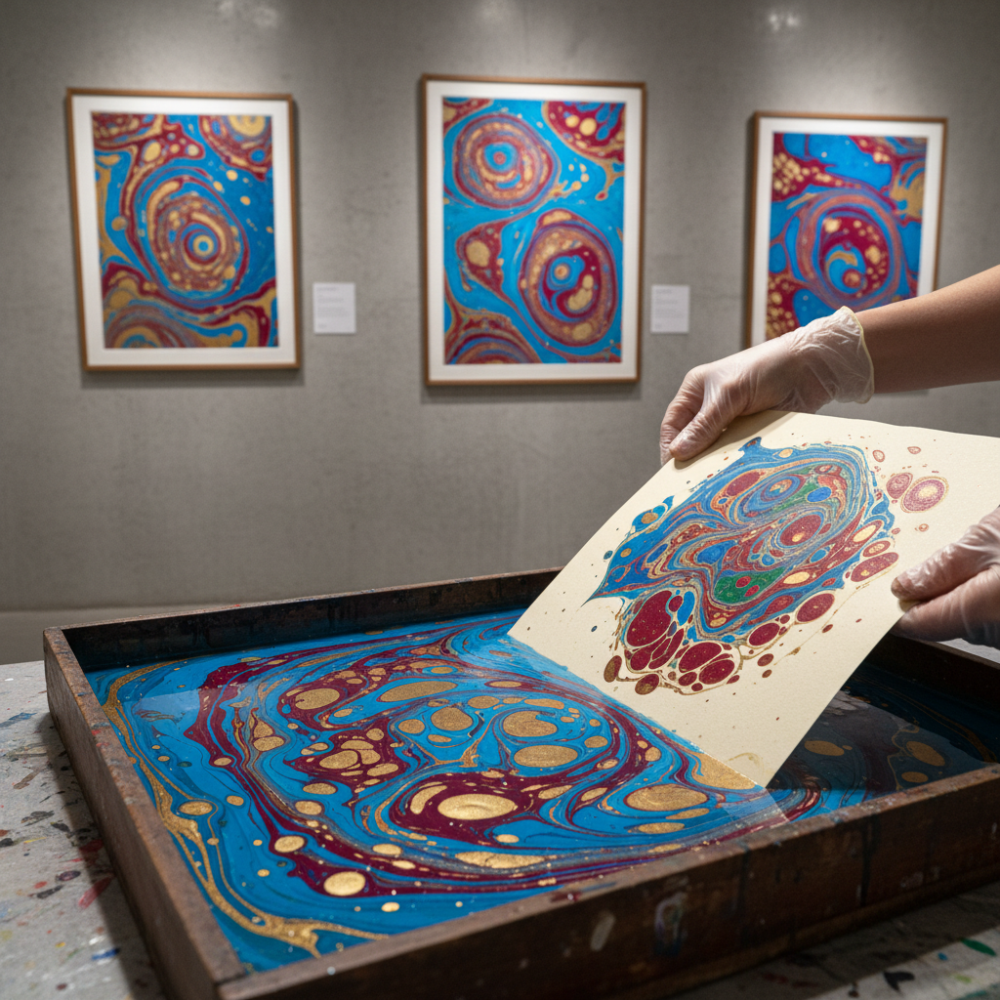

# Paper Marbling 大理石纹纸

> "Marbling is controlled chaos — ink floats on water, and the artist dances with chance." — Unknown

## 概述

大理石纹纸（Paper Marbling）是将颜料漂浮在水面或胶液表面，用工具创造图案后将纸张覆盖其上，转印出独特纹理的装饰纸工艺。每一张大理石纹纸都是独一无二的——颜料在液面上的流动受到表面张力、粘度、温度和工具操作的共同影响，产生如同大理石般的美丽纹理。从土耳其的Ebru到意大利的书籍装帧用纸，大理石纹纸是"有序的混沌"——在控制与偶然之间找到完美的平衡。

大理石纹纸的魅力在于：不可重复——每一张都是唯一的，如同指纹，永远无法精确复制。

## 核心特征

| 特征 | 描述 |
|------|------|
| 漂浮 | 颜料漂浮在液面 |
| 转印 | 纸张覆盖转印图案 |
| 唯一 | 每张都独一无二 |
| 流动 | 液体的流动图案 |
| 偶然 | 控制与偶然的平衡 |
| 装饰 | 主要用于装饰纸 |

## 视觉特征

- **流动**：液体流动的纹理
- **色彩**：多色的交织图案
- **有机**：有机的自然纹理
- **唯一**：每张不同的图案
- **大理石**：如大理石般的纹理
- **层次**：色彩的层次叠加

## 代表作品

| 作品 | 艺术家 | 年代 | 意义 |
|------|--------|------|------|
| *Turkish Ebru* | 匿名 | 15世纪+ | 土耳其水拓画 |
| *Italian marbled papers* | 匿名 | 17世纪+ | 意大利装帧用纸 |
| *Cockerell papers* | Sydney Cockerell | 19世纪 | 英国大理石纹纸 |
| *Japanese suminagashi* | 匿名 | 12世纪+ | 日本墨流 |
| *Contemporary marbling* | Various | 当代 | 当代大理石纹纸 |

## 历史时间线

| 时期 | 事件 |
|------|------|
| 10世纪 | 日本墨流（suminagashi）的起源 |
| 15世纪 | 土耳其Ebru的发展 |
| 17世纪 | 传入欧洲用于书籍装帧 |
| 18-19世纪 | 欧洲大理石纹纸的黄金时代 |
| 2014 | 土耳其Ebru列入UNESCO非遗 |
| 当代 | 当代大理石纹纸艺术 |

## 中国语境

中国有类似的水拓技法——称为"流沙笺"或"水纹纸"，在宋代已有记载。中国传统的水纹纸主要用于书画装裱和信笺。当代中国的纸艺术家正在重新探索水拓技法，将其与中国传统水墨美学结合。中国的Ebru（水拓画）爱好者社区也在增长，许多人将其作为减压和创作的方式。

## AI生成概念图

## 与其他风格的关系

- **Ebru** → 土耳其水拓画
- **Suminagashi** → 日本墨流
- **Bookbinding** → 装帧用纸
- **Abstract Art** → 抽象的流动图案
- **Fluid Art** → 流体艺术
- **Washi** → 和纸上的水拓

---

*浮光艺志 | Chronicle of Artistry*
