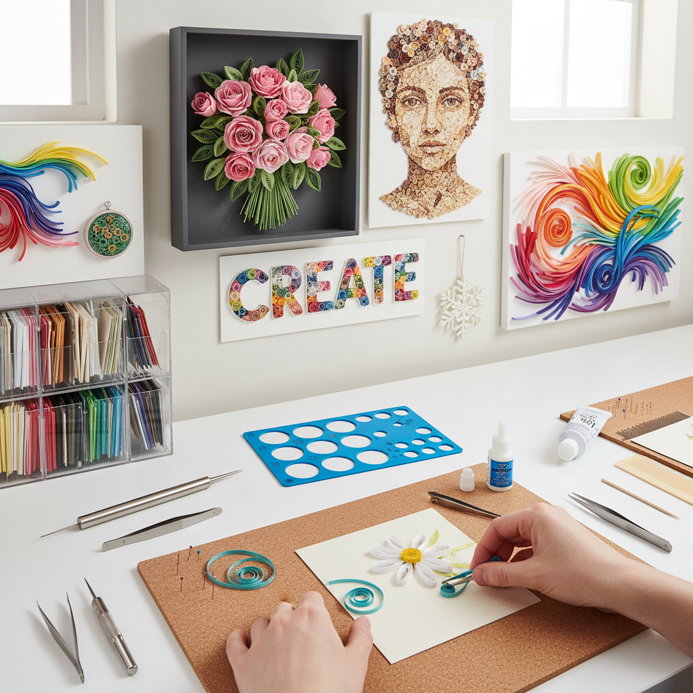

# Paper Quilling 衍纸艺术

> "Quilling is drawing with paper — thin strips rolled, shaped, and glued into coils, scrolls, and teardrops that are assembled into intricate designs, each tiny element a building block in a mosaic of paper, creating surfaces of extraordinary delicacy from the humblest of materials." — Unknown

## 概述

衍纸艺术（Paper Quilling），也称为纸卷艺术，是一种将细长的纸条卷成各种形状（圆形、泪滴形、眼形、方形等），然后将这些形状组合粘贴成装饰性图案的纸艺技法。"Quilling"一词来自早期使用鹅毛管（quill）作为卷纸工具的做法。

衍纸艺术的历史可以追溯到文艺复兴时期——修道院的修女们将镀金书籍裁切下来的纸边卷成装饰品，用于装饰宗教物品和圣物箱。18世纪，衍纸成为欧洲上流社会女性的休闲手工艺。衍纸在殖民时期传播到美洲。当代衍纸艺术从传统的平面装饰发展为三维雕塑、珠宝设计和大型装置艺术。

## 核心特征

| 特征 | 描述 |
|------|------|
| 纸条 | 使用细长纸条 |
| 卷曲 | 卷成各种形状 |
| 组合 | 形状的组合排列 |
| 精细 | 极其精细的工艺 |
| 装饰 | 强烈的装饰性 |
| 立体 | 可创造立体效果 |

## 视觉特征

- **卷曲**：优美的卷曲线条
- **精细**：极其精细的细节
- **层次**：纸条边缘的层次
- **色彩**：纸条的丰富色彩
- **轻盈**：纸的轻盈质感
- **花卉**：常见的花卉图案

## 代表作品

| 作品 | 艺术家 | 年代 | 意义 |
|------|--------|------|------|
| *Renaissance reliquaries* | 修道院修女 | 文艺复兴 | 宗教衍纸装饰 |
| *Georgian quilling* | 英国女性 | 18世纪 | 乔治时代衍纸 |
| *Contemporary quilling art* | Various | 当代 | 当代衍纸艺术 |
| *3D quilling sculpture* | Various | 当代 | 三维衍纸雕塑 |
| *Quilling jewelry* | Various | 当代 | 衍纸首饰 |

## 历史时间线

| 时期 | 事件 |
|------|------|
| 文艺复兴 | 修道院衍纸的起源 |
| 18世纪 | 衍纸在欧洲上流社会的流行 |
| 殖民时期 | 衍纸传播到美洲 |
| 20世纪 | 衍纸的衰落和复兴 |
| 当代 | 衍纸的艺术化和多样化 |

## 中国语境

衍纸艺术在中国有广泛的流行——中国的手工社区中衍纸是非常受欢迎的纸艺形式。中国的电商平台上有大量的衍纸材料包和工具。中国的手工工作室和社区中心经常开设衍纸课程。中国的衍纸爱好者在社交媒体上分享作品。中国传统的纸艺（剪纸、折纸）为衍纸的接受提供了文化基础。当代中国的一些艺术家将衍纸发展为大型装置艺术和商业设计。

## AI生成概念图

## 与其他风格的关系

- **Paper Art** → 纸艺
- **Origami** → 折纸
- **Paper Cutting** → 剪纸
- **Filigree** → 金银丝工艺
- **Miniature Art** → 微型艺术
- **Mixed Media** → 混合媒介

---

*浮光艺志 | Chronicle of Artistry*
