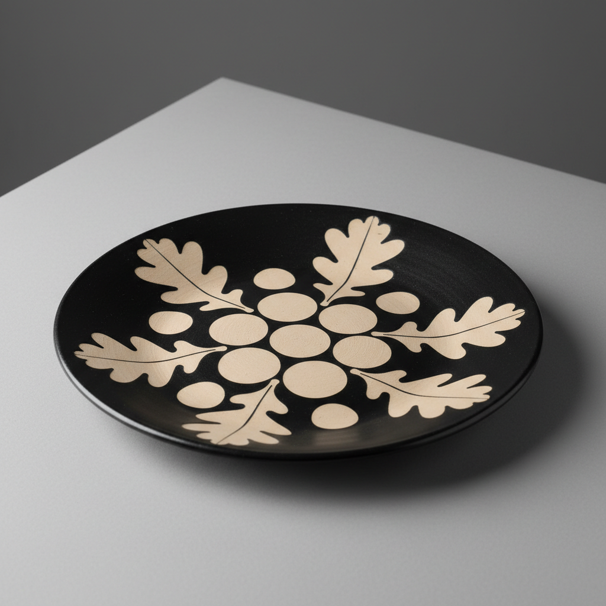

# Paper Resist Art 纸防艺术

> "Paper resist is stencil and surprise — shapes cut from newspaper or masking tape pressed onto clay or bisque before glazing, the paper blocking the glaze from reaching the surface beneath, then peeling away after dipping to reveal crisp-edged silhouettes of bare clay against the glazed ground, each torn edge and overlapping layer creating compositions that balance the precision of cut paper with the fluidity of liquid glaze." — Unknown

## 概述

纸防艺术（Paper Resist Art）是一种利用纸张（报纸、胶带、专用防水纸等）遮挡特定区域来创造装饰图案的陶瓷技法。将剪切的纸形贴在坯体表面，然后施釉或施化妆土——纸覆盖的区域不会被釉料覆盖，形成清晰的"留白"图案。与蜡防相比，纸防的边缘更加清晰锐利，可以创造出精确的几何图案和剪影效果。

纸防艺术的核心要素包括：1）纸形剪切——将纸剪成所需图案形状；2）贴附——将纸形贴在坯体表面；3）施釉——在纸形上方施釉；4）揭除——施釉后揭去纸形；5）清晰边缘——纸防产生的锐利边缘；6）多层叠加——可多次贴纸和施釉形成层次；7）正负形——可利用正形或负形效果。

## 核心特征

| 特征 | 描述 |
|------|------|
| 纸张遮挡 | 用纸遮挡不需要釉的区域 |
| 清晰边缘 | 比蜡防更锐利的边缘 |
| 几何精确 | 可创造精确的几何图案 |
| 剪影效果 | 清晰的正负形剪影 |
| 多层可能 | 多次贴纸形成层次 |
| 易于操作 | 比蜡防更容易控制 |

## 视觉特征

- **锐利边缘**：清晰精确的图案边缘
- **剪影图案**：如剪纸般的图案效果
- **几何形状**：精确的几何图案
- **层次叠加**：多层纸防的层次效果
- **正负对比**：图案与背景的鲜明对比
- **平面感**：如平面设计般的视觉效果

## 代表作品

| 作品 | 艺术家/文化 | 年代 | 意义 |
|------|-------------|------|------|
| *当代纸防陶瓷* | 各地陶艺家 | 当代 | 当代纸防创作 |
| *几何纸防花瓶* | 当代陶艺家 | 当代 | 几何图案探索 |
| *纸防与多层釉* | 当代陶艺家 | 当代 | 多层纸防技法 |
| *纸防瓷砖* | 当代设计师 | 当代 | 纸防在瓷砖设计中 |
| *大型纸防装置* | 当代陶艺家 | 当代 | 纸防的大型应用 |

## 历史时间线

| 时期 | 事件 |
|------|------|
| 传统时期 | 各种遮挡技法的早期应用 |
| 20世纪 | 纸防在工作室陶艺中的发展 |
| 1960年代 | 纸防技法的系统化 |
| 当代 | 纸防作为基础装饰技法的普及 |
| 数字时代 | 激光切割纸模的应用 |

## 中国语境

纸防技法与中国传统的剪纸艺术有天然的联系。中国剪纸——作为世界非物质文化遗产——的图案语言可以直接应用到陶瓷纸防装饰中。中国当代陶艺家将传统剪纸图案与纸防技法结合，创造出具有中国文化特色的陶瓷作品。在中国陶瓷教育中，纸防是最容易上手的装饰技法之一——学生可以利用剪纸技能直接进行陶瓷装饰。纸防的"留白"概念也与中国传统美学中的"计白当黑"相通。

## AI生成概念图

## 与其他风格的关系

- **Wax Resist** → 蜡防
- **Stencil Art** → 模板艺术
- **Paper Cutting** → 剪纸
- **Sgraffito** → 刮花
- **Screen Printing** → 丝网印刷
- **Graphic Design** → 平面设计

---

*浮光艺志 | Chronicle of Artistry*
