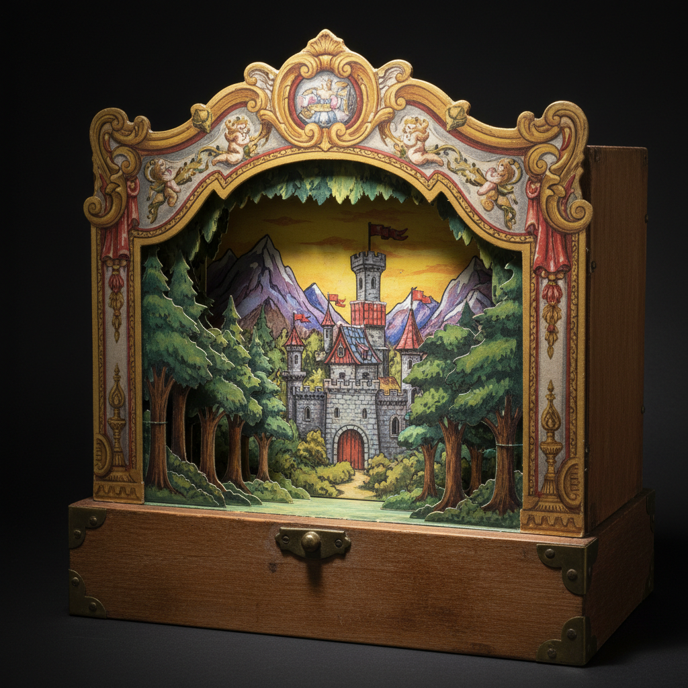

# Paper Theater Art 纸剧场艺术

> "Paper theater is cinema before cinema — layered paper scenery slides into a miniature proscenium arch, creating depth and drama through nothing more than flat cutouts arranged in space. Characters on sticks move between painted wings and backdrops, telling stories in a box small enough to sit on a table yet vast enough to contain entire worlds. It is theater democratized, brought into the home, made intimate and personal." — Unknown

## 概述

纸剧场艺术（Paper Theater Art）是一种使用纸质舞台、布景和人物在微型剧场框架中进行表演或展示的纸艺形式——也称为"玩具剧场"（Toy Theater）或"便士剧场"（Penny Plain）。纸剧场通过多层纸质布景创造空间深度，将戏剧的魅力浓缩在桌面尺寸的微型舞台中。这一形式在19世纪的欧洲极为流行，现已发展为独立的艺术表达形式。

纸剧场艺术的实践包括：1）舞台框架——制作微型的拱形舞台框架；2）多层布景——制作可滑动的多层纸质布景；3）人物制作——制作可操控的纸质人物；4）光影效果——利用光线创造戏剧效果；5）叙事表演——在纸剧场中进行故事表演；6）静态展示——作为装饰艺术品的静态纸剧场；7）当代纸剧场——将传统形式与现代设计结合的创作。

## 核心特征

| 特征 | 描述 |
|------|------|
| 微型 | 桌面尺寸的微型剧场 |
| 层次 | 多层布景的空间深度 |
| 叙事 | 讲述故事的能力 |
| 戏剧 | 戏剧性的视觉效果 |
| 互动 | 可操控的表演 |
| 亲密 | 亲密个人的体验 |

## 视觉特征

- **深度**：多层布景的空间深度
- **框架**：拱形舞台框架
- **色彩**：丰富的手绘色彩
- **戏剧**：戏剧性的光影
- **微型**：精致的微型世界
- **叙事**：叙事性的场景

## 代表作品

| 作品 | 艺术家/文化 | 年代 | 意义 |
|------|-------------|------|------|
| *Pollock's Toy Theatre* | 英国 | 19世纪 | 波洛克玩具剧场 |
| *German paper theaters* | 德国 | 19世纪 | 德国纸剧场传统 |
| *Danish paper theaters* | 丹麦 | 19世纪 | 丹麦纸剧场 |
| *Contemporary paper theater* | 国际 | 当代 | 当代纸剧场艺术 |
| *Artist paper theaters* | 国际 | 当代 | 艺术家纸剧场 |

## 历史时间线

| 时期 | 事件 |
|------|------|
| 18世纪末 | 纸剧场在欧洲的起源 |
| 19世纪 | 纸剧场的黄金时代 |
| 20世纪初 | 被电影和广播取代 |
| 1960年代 | 纸剧场的收藏和复兴 |
| 当代 | 纸剧场的艺术化发展 |

## 中国语境

纸剧场艺术在中国有独特的文化对应和当代发展。中国传统的皮影戏是世界上最精致的"纸/皮剧场"形式——虽然使用皮革而非纸张，但原理相似。中国的纸扎艺术中有类似的微型场景制作传统——如丧葬纸扎中的微型建筑和人物。中国当代的一些艺术家和设计师开始创作纸剧场作品——将西方纸剧场传统与中国故事结合。中国的儿童教育中，纸剧场作为一种创意表达和故事讲述的工具——在幼儿园和小学中有所应用。中国的文创产业中，纸剧场作为一种独特的装饰品和礼品——正在获得年轻消费者的关注。中国的一些出版社开始出版纸剧场套装——将经典故事以纸剧场的形式呈现。

## AI生成概念图

## 与其他风格的关系

- **Shadow Puppet** → 皮影戏
- **Pop-up Art** → 立体书
- **Diorama** → 透视模型
- **Miniature Art** → 微型艺术
- **Theater Design** → 舞台设计
- **Paper Art** → 纸艺

---

*浮光艺志 | Chronicle of Artistry*
