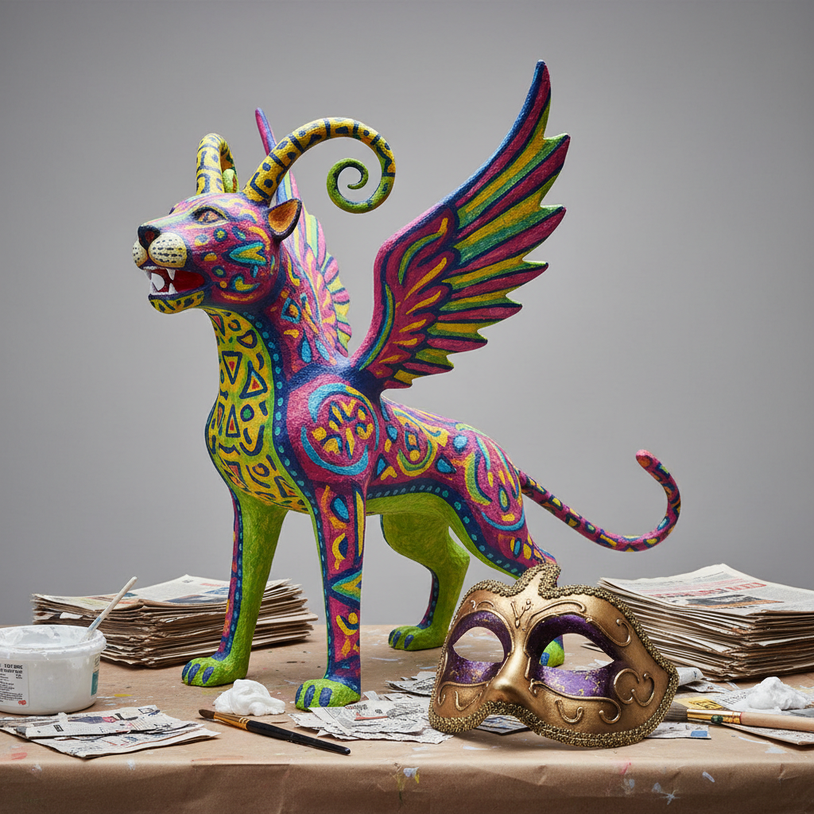

# Papier-mâché 纸浆塑形

> "Papier-mâché proves that the humblest material — waste paper — can become monumental art." — Unknown

## 概述

纸浆塑形（Papier-mâché，法语"嚼碎的纸"）是将纸张撕碎浸泡成纸浆，或将纸条层层粘贴在模具上，干燥后形成轻质坚固的立体造型的艺术和工艺技法。从中国汉代的漆器内胎到波斯的精美漆盒，从墨西哥的彩色骷髅到威尼斯的狂欢节面具，纸浆塑形以其轻便、廉价和无限的造型可能性成为全世界最普及的立体创作媒介之一。

纸浆塑形的魅力在于它的民主性——任何人都可以用旧报纸和浆糊创造出令人惊叹的立体作品。

## 核心特征

| 特征 | 描述 |
|------|------|
| 纸浆 | 用纸浆或纸条层叠 |
| 轻质 | 干燥后轻质坚固 |
| 可塑 | 可以塑造任何形状 |
| 廉价 | 材料极其廉价 |
| 可涂装 | 干燥后可以涂色装饰 |
| 民主 | 人人都可以创作 |

## 视觉特征

- **立体**：三维的立体造型
- **轻质**：看起来坚实但实际轻便
- **色彩**：涂装后的鲜艳色彩
- **质感**：纸张纤维的质感
- **有机**：适合有机的曲面造型
- **大尺度**：可以创造大型作品

## 代表作品

| 作品 | 艺术家 | 年代 | 意义 |
|------|--------|------|------|
| *Chinese lacquer cores* | 匿名 | 汉代+ | 中国漆器的纸胎 |
| *Persian lacquer boxes* | 匿名 | 15世纪+ | 波斯纸浆漆盒 |
| *Venetian masks* | 匿名 | 传统 | 威尼斯狂欢节面具 |
| *Mexican alebrijes* | Pedro Linares | 1936+ | 墨西哥彩色幻想动物 |
| *Carnival floats* | 匿名 | 传统 | 狂欢节花车 |
| *Contemporary sculpture* | Various | 2000s+ | 当代纸浆雕塑 |

## 历史时间线

| 时期 | 事件 |
|------|------|
| 汉代 | 中国——最早的纸浆塑形 |
| 8世纪 | 传入中东和波斯 |
| 15世纪 | 波斯纸浆漆盒的黄金时代 |
| 17世纪 | 传入欧洲 |
| 18-19世纪 | 欧洲的纸浆家具和装饰 |
| 当代 | 纸浆塑形的艺术复兴 |

## 中国语境

纸浆塑形在中国有最古老的历史——中国是造纸术的发明国，也是最早使用纸浆塑形的文明。中国传统的"夹纻"（纸胎漆器）技法可追溯到汉代。当代中国的民间艺术中，纸浆塑形用于制作面具、玩具和节庆装饰。中国的纸浆塑形传统为世界纸艺术提供了最早的技术基础。

## AI生成概念图

## 与其他风格的关系

- **Sculpture** → 雕塑的轻质替代
- **Mask Art** → 面具制作的主要材料
- **Folk Art** → 民间艺术的重要媒介
- **Carnival Art** → 狂欢节艺术的核心材料
- **Craft** → 工艺美术的基础技法
- **Recycled Art** → 回收材料艺术的先驱

---

*浮光艺志 | Chronicle of Artistry*
