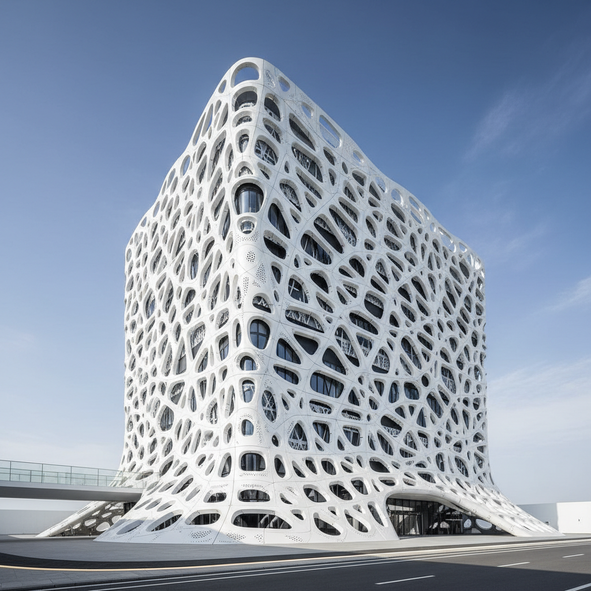

# Parametric Design 参数化设计

> **时期：** 1990年代–至今  
> **关键词：** 算法生成、数据驱动、有机曲面、数字建造、复杂几何

## 概述

Parametric Design（参数化设计）是通过算法和参数关系生成形态的设计方法。设计师不再直接绘制形状，而是定义规则和参数——改变一个数值，整个形态随之演化。从扎哈·哈迪德的流动建筑到Grasshopper生成的复杂表皮，参数化设计让计算机成为创造力的延伸，产生人手难以想象的有机复杂形态。

## 风格特征

- **算法生成**：由数学规则驱动的形态演化
- **有机曲面**：连续流动的非欧几何表面
- **复杂图案**：Voronoi、分形等数学图案
- **数据响应**：环境数据影响设计形态
- **数字建造**：3D打印和CNC加工实现

## 代表人物与作品

- 扎哈·哈迪德建筑事务所
- 帕特里克·舒马赫（参数主义宣言）
- Marc Fornes / THEVERYMANY
- Neri Oxman（材料生态学）

## 概念图

