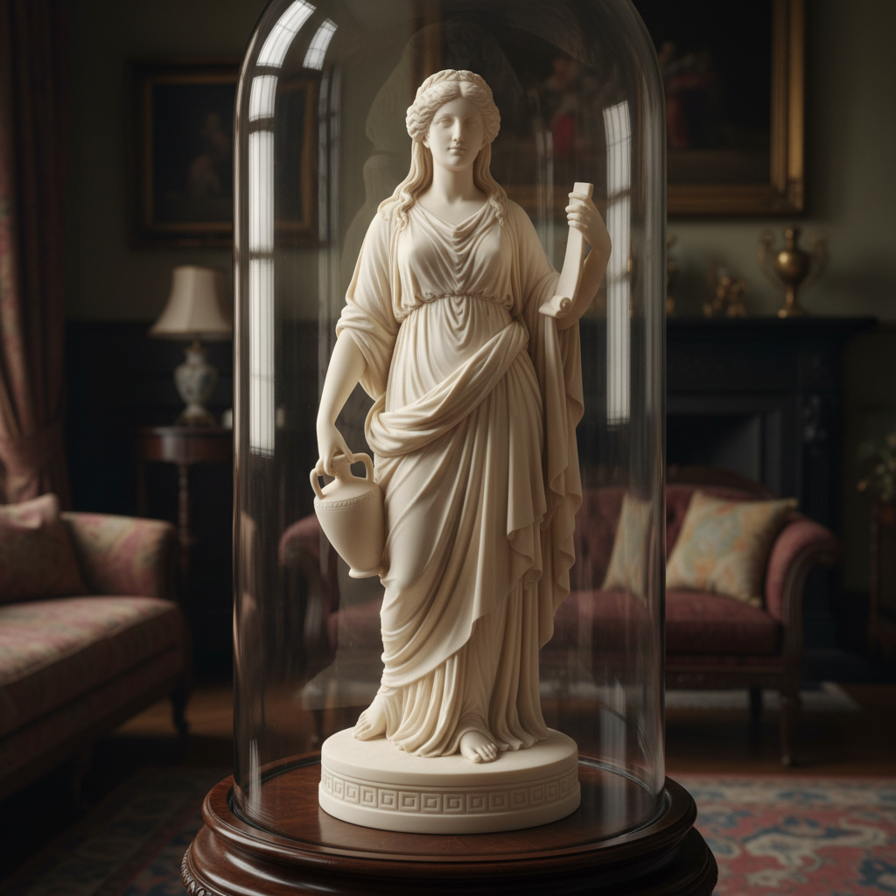

# Parian Ware Art 帕里安瓷艺术

> "Parian brought the marble of Greece into the parlours of England — sculpture for the people." — Victorian ceramic tradition

## 概述

帕里安瓷艺术（Parian Ware Art）是19世纪英国发明的一种无釉白色瓷器——其质感和外观模仿古希腊帕罗斯岛（Paros）的大理石，因此得名"帕里安"（Parian）。帕里安瓷是维多利亚时代最重要的陶瓷创新之一——它使得原本只有富人才能拥有的大理石雕塑可以以陶瓷的形式廉价复制，让普通中产阶级家庭也能拥有"古典雕塑"。

帕里安瓷由英国科普兰（Copeland）工厂于1842年首次商业化生产——其配方含有大量长石，烧成后呈现出温润的半透明白色，表面有微微的光泽，极似大理石的质感。帕里安瓷主要用于制作小型雕塑——复制古典雕塑、当代雕塑家的作品、名人半身像等。它也被用于制作花瓶、水壶等装饰器物，有时会加入浮雕装饰。

帕里安瓷艺术的核心要素包括：1）大理石质感——模仿帕罗斯大理石的白色质感；2）无釉表面——不施釉的哑光表面；3）雕塑复制——古典和当代雕塑的陶瓷复制；4）维多利亚时代——19世纪英国的产物；5）民主化——将雕塑艺术带给中产阶级；6）精细模具——精密的模具制作技术；7）半透明——薄壁处的半透明效果。

## 核心特征

| 特征 | 描述 |
|------|------|
| 大理石质感 | 模仿帕罗斯大理石白色 |
| 无釉表面 | 不施釉哑光表面 |
| 雕塑复制 | 古典当代雕塑陶瓷复制 |
| 维多利亚时代 | 19世纪英国产物 |
| 民主化 | 雕塑艺术带给中产阶级 |
| 半透明 | 薄壁处半透明效果 |

## 视觉特征

- **温润白色**：如大理石般的温润白色
- **哑光表面**：无釉的柔和哑光质感
- **精细雕塑**：人物雕塑的精细表现
- **古典题材**：希腊罗马神话题材
- **浮雕装饰**：花瓶上的浮雕装饰
- **半透明光泽**：薄壁处的微微透光

## 代表作品

| 作品 | 年代 | 意义 |
|------|------|------|
| *希腊奴隶* (Greek Slave复制) | 1840年代 | 早期经典 |
| *科普兰帕里安雕塑* | 1842至今 | 商业先驱 |
| *明顿帕里安花瓶* | 1850年代 | 装饰器物 |
| *维多利亚女王半身像* | 19世纪中期 | 名人肖像 |
| *贝尔利克帕里安* (Belleek) | 1857至今 | 爱尔兰发展 |
| *当代帕里安* | 21世纪 | 现代复兴 |

## 历史时间线

| 时期 | 事件 |
|------|------|
| 1842年 | 科普兰工厂首次生产帕里安瓷 |
| 1840-50年代 | 多家英国工厂开始生产 |
| 1851年 | 伦敦万国博览会展出 |
| 1857年 | 贝尔利克工厂开始生产 |
| 19世纪后期 | 帕里安瓷在美国流行 |
| 20世纪 | 生产减少，成为收藏品 |
| 当代 | 艺术家重新探索 |

## 中国语境

帕里安瓷与中国德化白瓷有着惊人的相似性。德化白瓷——尤其是明代何朝宗的观音像——以其温润如玉的白色质感和精湛的雕塑技艺闻名于世。17-18世纪大量出口到欧洲的德化白瓷（欧洲人称之为"blanc de Chine"）很可能是帕里安瓷的灵感来源之一——英国陶瓷工匠试图用本土材料复制中国白瓷的温润质感。帕里安瓷的"雕塑民主化"理念与中国德化白瓷的"佛像普及化"有着平行的社会功能——两者都将原本昂贵的雕塑艺术以陶瓷的形式带给了更广泛的社会阶层。

## 概念图

## 与其他风格的关系

- **Dehua White** → 德化白瓷（灵感来源）
- **Wedgwood** → 韦奇伍德（同时代）
- **Neoclassicism** → 新古典主义
- **Victorian Art** → 维多利亚艺术
- **Bisque Porcelain** → 素瓷
- **Belleek** → 贝尔利克瓷

---

*浮光艺志 | Chronicle of Artistry*
