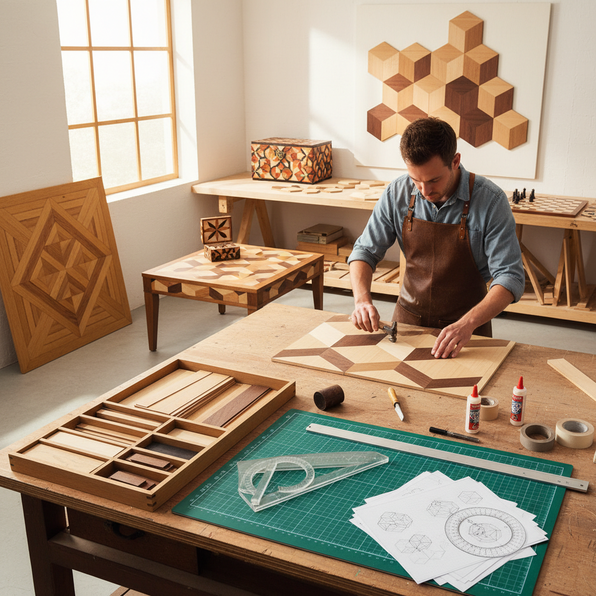

# Parquetry Art 拼花艺术

> "Parquetry is geometry made warm — triangles, diamonds, hexagons, and cubes assembled from wood veneers of contrasting colors to create patterns that play tricks on the eye. Unlike marquetry's pictorial ambitions, parquetry is pure pattern: repeating geometric shapes that tessellate across a surface, creating optical illusions of depth and movement through nothing more than the careful arrangement of light and dark wood." — Unknown

## 概述

拼花艺术（Parquetry Art）是使用不同颜色和纹理的木材薄片按照几何图案拼合的装饰木工艺术——与镶嵌细工（marquetry）不同，拼花专注于几何图案的重复和组合，而非图画性的表现。拼花最常见于地板（拼花地板）和家具表面装饰，以其精确的几何美感和视觉错觉效果著称。

拼花艺术的实践包括：1）拼花地板——经典的人字形、鱼骨形等地板图案；2）家具拼花——桌面和柜面的几何装饰；3）立方体错觉——三色木材创造的3D立方体效果；4）星形拼花——放射状的星形图案；5）棋盘拼花——黑白交替的棋盘格；6）当代拼花——将传统技法与现代设计结合的创作。

## 核心特征

| 特征 | 描述 |
|------|------|
| 几何 | 纯几何图案 |
| 重复 | 图案的精确重复 |
| 错觉 | 视觉错觉效果 |
| 对比 | 深浅木材的对比 |
| 精确 | 极其精确的切割 |
| 地板 | 经典的地板装饰 |

## 视觉特征

- **几何**：精确的几何形状
- **重复**：规律重复的图案
- **错觉**：3D视觉错觉
- **对比**：深浅木材的色彩对比
- **纹理**：木纹方向的变化
- **节奏**：图案的视觉节奏

## 代表作品

| 作品 | 艺术家/文化 | 年代 | 意义 |
|------|-------------|------|------|
| *Versailles parquet* | 法国 | 17世纪 | 凡尔赛宫拼花地板 |
| *Herringbone floors* | 欧洲 | 16世纪至今 | 人字形拼花 |
| *Tumbling blocks* | 欧洲 | 18世纪至今 | 立方体错觉 |
| *Japanese yosegi-zaiku* | 日本 | 江户时代至今 | 日本寄木细工 |
| *Contemporary parquetry* | 当代 | 当代 | 当代拼花设计 |

## 历史时间线

| 时期 | 事件 |
|------|------|
| 古代 | 早期的几何木拼花 |
| 16世纪 | 欧洲拼花地板的发展 |
| 17世纪 | 凡尔赛宫拼花的巅峰 |
| 18-19世纪 | 拼花在家具中的广泛应用 |
| 当代 | 拼花的现代设计复兴 |

## 中国语境

拼花艺术在中国有独特的传统形式。中国传统建筑中的"花窗"和"花格"是木材几何拼花的重要形式——苏州园林的花窗图案是中国几何拼花的经典。中国传统家具中的"攒斗"技法与拼花有直接关系——将小块木材按几何图案拼合用于家具装饰。中国的明清家具中，桌面和柜面的几何拼花装饰是常见的装饰手法——如冰裂纹、万字纹等。中国当代的室内设计中，拼花地板（如人字形、鱼骨形）正在流行——将欧洲传统拼花与中国室内美学结合。中国的一些高端家具品牌将传统攒斗技法与现代拼花设计结合——创造具有中国特色的几何拼花家具。中国的木工教育中，拼花是重要的装饰技法课程——培养学生的几何设计和精密加工能力。

## AI生成概念图

## 与其他风格的关系

- **Marquetry** → 镶嵌细工
- **Tunbridge Ware** → 坦布里奇镶嵌
- **Geometric Art** → 几何艺术
- **Floor Design** → 地板设计
- **Op Art** → 欧普艺术
- **Tessellation** → 密铺艺术

---

*浮光艺志 | Chronicle of Artistry*
