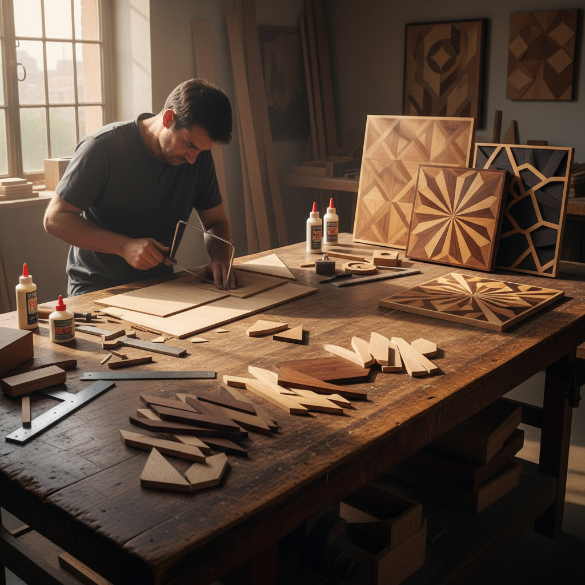

# Parquetry 镶木细工

> "Parquetry is geometry made warm — wood's natural grain becomes the palette, and mathematical precision becomes the design language of the floor beneath our feet." — Unknown

## 概述

镶木细工（Parquetry）是使用不同颜色和纹理的木材薄片，按照几何图案拼合成装饰性表面的工艺。与Marquetry（木镶嵌）使用自由形态的图案不同，Parquetry严格使用几何形状——正方形、三角形、菱形、六边形等——通过精确的切割和拼合创造出重复的几何图案。最著名的Parquetry应用是镶木地板（parquet flooring）——从凡尔赛宫的"凡尔赛拼花"到各种人字形、篮编形和星形图案。Parquetry也用于家具表面、盒子和装饰面板。

镶木细工的哲学在于：几何的温暖——用最理性的几何形式和最温暖的天然材料，创造出既有秩序又有生命力的表面。

## 核心特征

| 特征 | 描述 |
|------|------|
| 几何 | 严格的几何图案 |
| 木材 | 不同木材的色差 |
| 精确 | 极其精确的切割 |
| 重复 | 重复的图案单元 |
| 平面 | 平面拼合 |
| 实用 | 地板和家具装饰 |

## 视觉特征

- **几何**：严格的几何图案
- **木纹**：不同木材的纹理
- **色差**：深浅木材的对比
- **重复**：规律的重复节奏
- **温暖**：木材的温暖色调
- **精确**：精确的接缝

## 代表作品

| 作品 | 艺术家 | 年代 | 意义 |
|------|--------|------|------|
| *Versailles parquet* | 匿名 | 1684 | 凡尔赛拼花地板 |
| *Herringbone floors* | Various | 17世纪+ | 人字形地板 |
| *Tunbridge ware* | Various | 17-19世纪 | 英国镶木小品 |
| *Art Deco parquetry furniture* | Various | 1920s-30s | 装饰艺术家具 |
| *Contemporary parquetry* | Various | 当代 | 当代镶木艺术 |

## 历史时间线

| 时期 | 事件 |
|------|------|
| 古代 | 古埃及的木镶嵌 |
| 16世纪 | 欧洲镶木地板的兴起 |
| 1684 | 凡尔赛宫的镶木地板 |
| 18-19世纪 | 镶木地板的普及 |
| 20世纪 | 工业化生产 |
| 当代 | 手工镶木的艺术复兴 |

## 中国语境

镶木细工在中国传统家具中有对应——中国明清家具中的"攒斗"工艺（将小块木材按几何图案拼合成面板）与Parquetry原理相同。中国传统建筑中的花窗格栅也使用类似的几何拼合原理。当代中国的室内设计中，镶木地板（特别是人字形和鱼骨形拼花）越来越流行。中国的一些传统木工艺人仍在制作精美的手工镶木作品，将传统的攒斗技法与现代设计结合。

## AI生成概念图

## 与其他风格的关系

- **Marquetry** → 木镶嵌（自由图案）
- **Woodworking** → 木工
- **Intarsia** → 木拼花
- **Geometric Art** → 几何艺术
- **Flooring** → 地板工艺
- **Veneering** → 贴面工艺

---

*浮光艺志 | Chronicle of Artistry*
