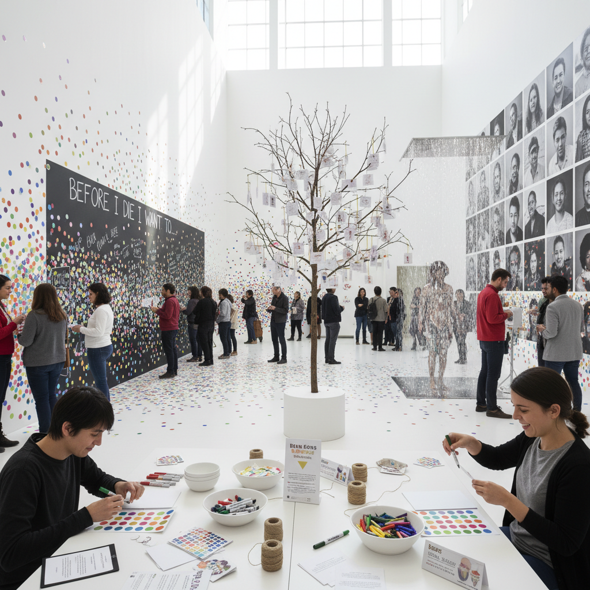

# Participatory Art 参与式艺术

> "Participatory art dissolves the boundary between artist and audience — the viewer becomes co-creator, the spectator becomes actor, the passive consumer becomes active producer, each participant bringing their own story, skill, and perspective into a collective creative act that no single author could have imagined alone, a practice that insists art is not something to look at but something to do together." — Unknown

## 概述

参与式艺术（Participatory Art）是一种将观众/公众的积极参与作为作品核心构成要素的艺术实践。在参与式艺术中，观众不再是被动的观看者，而是作品的共同创作者——他们的行动、选择、贡献和互动构成了作品本身。没有参与者的参与，作品就不完整甚至不存在。

参与式艺术的理论根基可以追溯到居伊·德波（Guy Debord）对"景观社会"的批判和雅克·朗西埃（Jacques Rancière）的"被解放的观众"理论。克莱尔·毕晓普（Claire Bishop）在2012年的著作《人造地狱：参与式艺术与观看的政治》中对参与式艺术进行了系统的批判性分析。参与式艺术涵盖了从社区项目、公共干预、互动装置到数字平台等多种形式。

## 核心特征

| 特征 | 描述 |
|------|------|
| 参与 | 观众的积极参与 |
| 共创 | 集体的共同创作 |
| 开放 | 开放的创作过程 |
| 民主 | 民主化的艺术生产 |
| 过程 | 过程优先于产品 |
| 社会 | 社会性的实践 |

## 视觉特征

- **集体**：集体创作的痕迹
- **多样**：多样的参与者贡献
- **过程**：过程的记录和展示
- **互动**：互动的装置和界面
- **公共**：公共空间的介入
- **临时**：临时性和事件性

## 代表作品

| 作品 | 艺术家 | 年代 | 意义 |
|------|--------|------|------|
| *Wish Tree* | Yoko Ono | 1996起 | 小野洋子的许愿树 |
| *The Obliteration Room* | Yayoi Kusama | 2002 | 草间弥生的消融房间 |
| *Before I Die* | Candy Chang | 2011 | 张思琳的死前愿望墙 |
| *Rain Room* | Random International | 2012 | 雨屋互动装置 |
| *Inside Out* | JR | 2011起 | JR的全球肖像项目 |

## 历史时间线

| 时期 | 事件 |
|------|------|
| 1960年代 | 偶发艺术和Fluxus的参与 |
| 1990年代 | 关系美学的兴起 |
| 2000年代 | 参与式艺术的制度化 |
| 2012 | Bishop《人造地狱》出版 |
| 当代 | 数字参与式艺术的发展 |

## 中国语境

参与式艺术在中国有丰富的实践。中国的社区艺术项目、乡村建设运动和公共艺术计划中都包含大量参与式元素。如"碧山计划"邀请村民参与艺术创作、"大地艺术节"让农民成为艺术的共同创作者。中国传统文化中的"众筹"修庙、集体劳动中的"号子"、以及民间的"社火"表演都可以被视为古老的参与式艺术形式。当代中国的互联网文化（如弹幕、众创、UGC内容）也创造了新的数字参与式艺术可能性。

## AI生成概念图

## 与其他风格的关系

- **Relational Aesthetics** → 关系美学
- **Social Practice** → 社会实践艺术
- **Community Art** → 社区艺术
- **Interactive Art** → 互动艺术
- **Happening** → 偶发艺术
- **Fluxus** → 激浪派

---

*浮光艺志 | Chronicle of Artistry*
