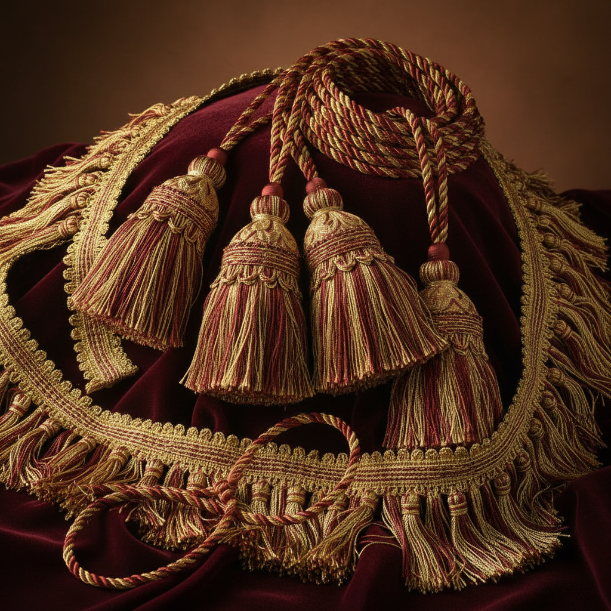

# Passementerie Art 花边饰带艺术

> "Passementerie is the art of ornamental trimming — braids, fringes, tassels, cords, and gimp that transform plain fabric into something regal. The passementier works with silk, gold thread, and sometimes precious metals, creating three-dimensional embellishments that catch light and add weight, movement, and luxury to curtains, upholstery, and garments. Every tassel is a small sculpture, every fringe a cascade of controlled movement." — Unknown

## 概述

花边饰带艺术（Passementerie Art）是制作装饰性编织饰带、流苏、穗子、绳索和各种织物边饰的传统手工艺——包括所有用于装饰家具、窗帘、服装和室内装饰的编织和缠绕装饰物。花边饰带是欧洲宫廷装饰和高级室内设计中不可或缺的元素。

花边饰带艺术的实践包括：1）流苏——悬挂的装饰穗子；2）绳索——装饰性的编织绳；3）编带——平面的编织装饰带；4）穗边——织物边缘的穗状装饰；5）球穗——球形的装饰穗子；6）金银线饰——使用金银线的装饰；7）当代花边饰带——将传统技法与现代设计结合的创作。

## 核心特征

| 特征 | 描述 |
|------|------|
| 装饰 | 纯装饰性的功能 |
| 立体 | 三维的装饰效果 |
| 奢华 | 极其奢华的视觉 |
| 手工 | 精细的手工制作 |
| 多样 | 形式极其多样 |
| 宫廷 | 宫廷装饰传统 |

## 视觉特征

- **流动**：流苏和穗边的动感
- **光泽**：丝绸和金线的光泽
- **立体**：三维的装饰效果
- **色彩**：丰富的色彩搭配
- **重复**：规律重复的装饰单元
- **奢华**：极其奢华的整体感

## 代表作品

| 作品 | 艺术家/文化 | 年代 | 意义 |
|------|-------------|------|------|
| *Versailles trimmings* | 法国 | 17-18世纪 | 凡尔赛宫装饰 |
| *Military braiding* | 欧洲 | 18-19世纪 | 军装编饰 |
| *Ecclesiastical trimmings* | 教会 | 中世纪至今 | 教会装饰 |
| *Scalamandré trimmings* | 美国 | 20世纪至今 | 高端室内装饰 |
| *Contemporary passementerie* | 当代 | 当代 | 当代花边饰带 |

## 历史时间线

| 时期 | 事件 |
|------|------|
| 中世纪 | 花边饰带行会的建立 |
| 17世纪 | 法国宫廷花边饰带的黄金时代 |
| 18-19世纪 | 花边饰带的工业化 |
| 20世纪 | 现代室内设计中的应用 |
| 当代 | 花边饰带的奢华复兴 |

## 中国语境

花边饰带艺术在中国有丰富的传统形式。中国传统的"络子"（装饰编绳和流苏）是中国版的花边饰带——用于装饰扇子、玉佩、香囊等物品。中国宫廷服饰中的"宫绦"（装饰绳带）是重要的花边饰带——用于系挂各种佩饰。中国传统建筑中的"挂落"和"流苏"是建筑装饰中的花边饰带——用于门窗和帷幔的装饰。中国的戏曲服装中大量使用花边饰带——流苏、绒球、编带等装饰增添了舞台效果。中国当代的室内设计中，花边饰带作为高端装饰元素正在回归——将中国传统编织与西方花边饰带美学结合。中国的一些手工艺人专门制作传统中式流苏和编绳——为古建筑修复和传统服饰提供配件。

## AI生成概念图

## 与其他风格的关系

- **Kumihimo** → 组纽艺术
- **Macrame** → 编结艺术
- **Textile Art** → 纺织艺术
- **Interior Design** → 室内设计
- **Fashion Design** → 时装设计
- **Decorative Art** → 装饰艺术

---

*浮光艺志 | Chronicle of Artistry*
