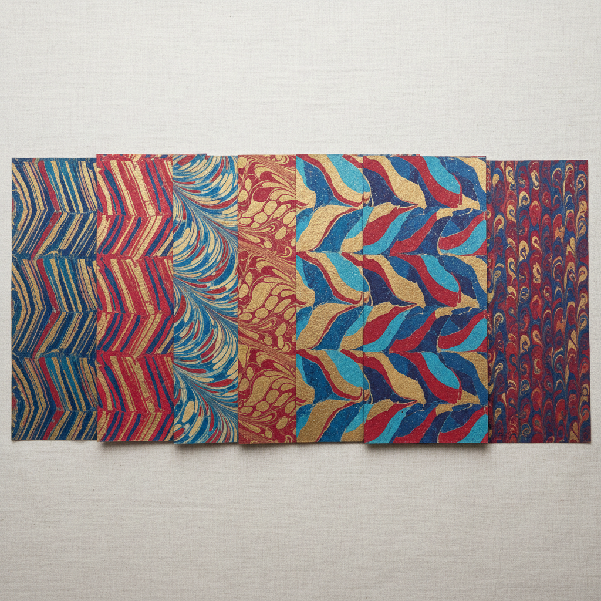

# Paste Paper Art 浆糊纸艺术

> "Paste paper is finger painting elevated to fine art — a mixture of flour paste and pigment is spread onto paper and then manipulated with combs, stamps, fingers, and found objects to create textured patterns of infinite variety. Each sheet is a unique monoprint, a record of gesture and tool preserved in the drying paste. It is one of the most accessible yet endlessly inventive of all decorative paper techniques." — Unknown

## 概述

浆糊纸艺术（Paste Paper Art）是一种将着色的浆糊（通常是面粉或淀粉糊）涂覆在纸张表面，然后用各种工具在湿润的浆糊上创造纹理图案的装饰纸技法。浆糊纸起源于17世纪的欧洲，最初用于书籍装帧的封面和衬页装饰，以其丰富的纹理变化和独特的手工质感著称。

浆糊纸艺术的实践包括：1）浆糊制备——调配着色的面粉或淀粉糊；2）涂覆——将浆糊均匀涂覆在纸上；3）梳理——用梳子创造规律的纹理；4）印压——用各种工具印压图案；5）手指绘画——用手指在浆糊中绘画；6）多层——在干燥后叠加新的浆糊层；7）当代浆糊纸——将传统技法与现代设计结合的创作。

## 核心特征

| 特征 | 描述 |
|------|------|
| 浆糊 | 使用着色浆糊 |
| 纹理 | 丰富的纹理变化 |
| 工具 | 各种工具创造图案 |
| 唯一 | 每张都是唯一的 |
| 简单 | 材料和技法简单 |
| 装帧 | 传统用于书籍装帧 |

## 视觉特征

- **纹理**：丰富的表面纹理
- **规律**：梳理的规律图案
- **色彩**：浆糊的色彩层次
- **手工**：明显的手工痕迹
- **有机**：有机自然的图案
- **触感**：可触摸的纹理感

## 代表作品

| 作品 | 艺术家/文化 | 年代 | 意义 |
|------|-------------|------|------|
| *German Kleisterpapier* | 德国 | 17世纪 | 德国浆糊纸传统 |
| *Italian paste papers* | 意大利 | 18世纪 | 意大利浆糊纸 |
| *Bookbinding paste papers* | 欧洲 | 17-19世纪 | 书籍装帧浆糊纸 |
| *Claire Maziarczyk works* | 法国 | 当代 | 当代浆糊纸大师 |
| *Contemporary paste paper* | 国际 | 当代 | 当代浆糊纸发展 |

## 历史时间线

| 时期 | 事件 |
|------|------|
| 17世纪 | 德国浆糊纸的起源 |
| 18世纪 | 浆糊纸在欧洲的传播 |
| 19世纪 | 书籍装帧中的广泛应用 |
| 20世纪 | 浆糊纸的艺术化发展 |
| 当代 | 浆糊纸的全球化复兴 |

## 中国语境

浆糊纸艺术在中国有一定的认知和发展潜力。中国传统的纸张装饰技法中有类似的工艺——如粉蜡笺、洒金纸等传统装饰纸。中国的书籍装帧传统中，虽然不使用西方式的浆糊纸，但有丰富的封面装饰传统——如锦缎封面和手绘封面。中国当代的手工书和艺术书创作者开始学习浆糊纸技法——将其作为书籍装帧的装饰手段。中国的美术教育中，浆糊纸作为一种简单有效的纹理创作方法——在基础设计课程中有所应用。中国的一些手工工作坊开始提供浆糊纸体验课程——作为一种放松和创意的手工活动。中国的文创产业中，手工装饰纸作为一种独特的包装和装饰材料——正在获得更多关注。

## AI生成概念图

## 与其他风格的关系

- **Paper Marbling** → 大理石纸
- **Bookbinding** → 书籍装帧
- **Decorative Paper** → 装饰纸
- **Printmaking** → 版画
- **Texture Art** → 纹理艺术
- **Monoprint** → 单版画

---

*浮光艺志 | Chronicle of Artistry*
