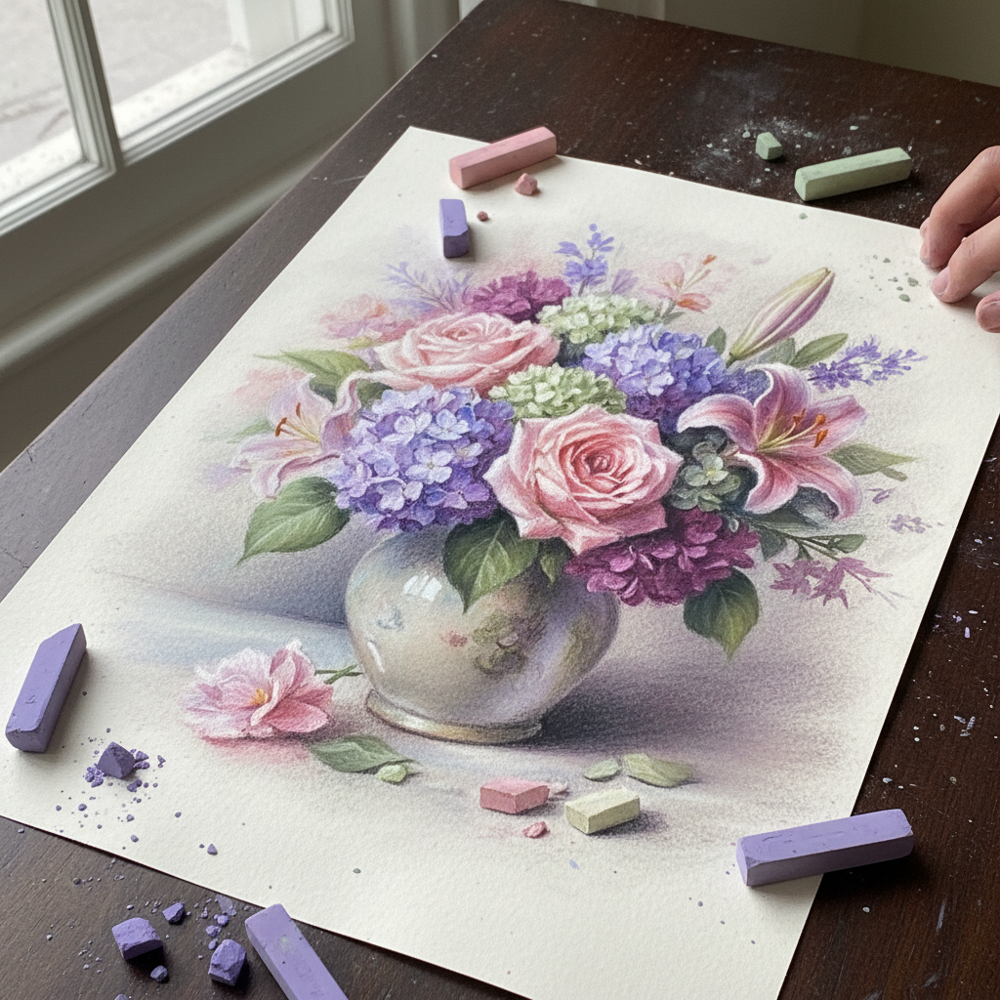

# Pastel Art 色粉画

> "Pastel is the most direct medium — nothing stands between the artist's hand and the color." — Edgar Degas

## 概述

色粉画（Pastel Art）是使用干燥的纯色粉笔（pastel sticks）在纸上作画的艺术形式。色粉颜料几乎是纯颜料——只有极少的粘合剂，因此色彩极其鲜艳和饱和。色粉画兼具绘画和素描的特质——既可以像油画一样厚涂覆盖，也可以像素描一样用线条表现。

德加（Degas）将色粉画提升到与油画同等的地位——他的芭蕾舞者和浴女系列证明了色粉可以达到任何其他媒介的表现力。

## 核心特征

| 特征 | 描述 |
|------|------|
| 纯颜料 | 几乎是纯色粉——极高饱和度 |
| 直接性 | 手指直接接触颜料和纸面 |
| 柔和性 | 可以揉擦出柔和的过渡 |
| 即时性 | 不需要干燥时间 |
| 脆弱性 | 表面脆弱——需要固定和保护 |
| 可叠加 | 可以层层叠加色彩 |

## 视觉特征

- **色彩**：极其鲜艳和饱和的色彩
- **柔和**：揉擦产生的柔和过渡
- **质感**：粉质的、天鹅绒般的表面
- **光线**：色粉特有的发光感
- **笔触**：从精细线条到宽阔色块
- **纸纹**：纸张纹理透过色粉层

## 代表作品

| 作品 | 艺术家 | 年代 | 意义 |
|------|--------|------|------|
| *Rosalba Carriera portraits* | Rosalba Carriera | 1720s | 色粉肖像画的先驱 |
| *Chocolate Girl* | Jean-Étienne Liotard | 1744 | 色粉写实的巅峰 |
| *Ballet Dancers* | Edgar Degas | 1870s-1900s | 色粉画的现代革命 |
| *Mother and Child* | Mary Cassatt | 1890s | 色粉的亲密感 |
| *Pastels* | Odilon Redon | 1890s-1910s | 色粉的象征主义表达 |
| *Self-Portrait* | Käthe Kollwitz | 1930s | 色粉的表现力 |

## 历史时间线

| 时期 | 事件 |
|------|------|
| 15世纪 | Leonardo da Vinci使用色粉 |
| 1720s | Rosalba Carriera——色粉肖像的流行 |
| 18世纪 | 色粉画的第一个黄金时代——洛可可 |
| 1870s-1900s | Degas——色粉画的现代革命 |
| 1880s | 色粉画家协会成立（巴黎、纽约） |
| 20世纪 | 色粉在各种风格中的应用 |
| 2000s-至今 | 色粉画的当代复兴 |

## 中国语境

色粉画在中国是相对年轻的画种，20世纪初随西方美术教育传入。中国色粉画在近年来发展迅速，中国色粉画学会等组织推动了这一画种的发展。中国色粉画家在写实和表现两个方向都有出色的探索，一些作品在国际色粉画展中获奖。

## AI生成概念图

## 与其他风格的关系

- **Impressionism** → 印象派大量使用色粉——Degas、Cassatt
- **Watercolor Art** → 水彩与色粉都是纸上媒介
- **Drawing** → 色粉兼具绘画和素描的特质
- **Realism** → 色粉可以达到极高的写实精度
- **Symbolism** → Redon的色粉象征主义
- **Expressionism** → 色粉的直接性适合表现主义

---

*浮光艺志 | Chronicle of Artistry*
