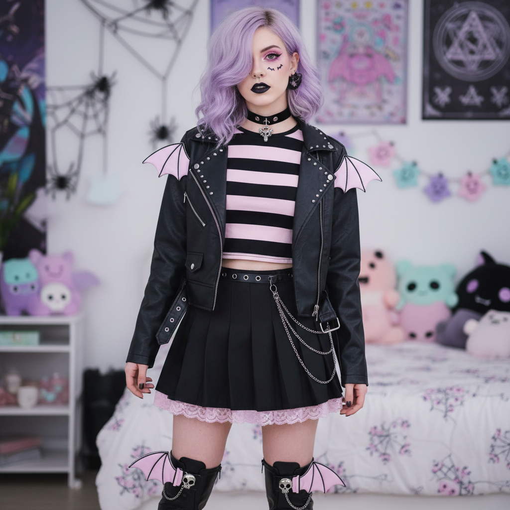

# Pastel Goth 粉彩哥特




> **"把哥特的骷髅和十字架涂成粉色——黑暗也可以是甜的。"**

## 概述

| 维度 | 描述 |
|------|------|
| 时期 | 2010–2015（高峰）/ 持续至今 |
| 别名 | Pastel Goth, Soft Goth, Creepy Cute, Kawaii Goth |
| 核心色彩 | 粉紫、薰衣草、薄荷绿、粉色——全部搭配黑色 |
| 关键元素 | 粉色骷髅、倒十字、蝙蝠、独角兽、黑色蝴蝶结 |
| 代表人物 | Kerli、Grimes (早期)、Amy Valentine |
| 关联风格 | Goth, Kawaii, Soft Grunge, Tumblr Aesthetic, Witchcore |

---

## 历史脉络

### 2010：Tumblr 的混搭实验

Pastel Goth 在 2010 年左右出现在 Tumblr 上，是两种看似矛盾的美学的**刻意碰撞**：

- **哥特** = 黑色、死亡、暗黑、叛逆
- **Kawaii/Pastel** = 粉色、可爱、甜美、天真

将两者混合的逻辑：
- 骷髅 → 但是粉色的
- 十字架 → 但是薰衣草色的
- 蝙蝠 → 但是戴着蝴蝶结的
- 棺材 → 但是里面装满了糖果

### 文化背景

| 来源 | 贡献 |
|------|------|
| 哥特亚文化 | 暗黑符号、死亡意象 |
| 日本 Kawaii 文化 | 粉色、可爱、圆润造型 |
| Tumblr 混搭文化 | 打破美学边界的实验精神 |
| Harajuku 街头 | Fairy Kei + Gothic Lolita 的交叉 |
| 爱丽丝梦游仙境 | 甜美与诡异的并存 |

### 2012–2015：主流化

- 快时尚品牌开始生产"粉色骷髅"T恤
- Hot Topic 大量上架 Pastel Goth 商品
- Instagram 上的 Pastel Goth 穿搭博主
- 与 Soft Grunge 的交叉和混淆

### 核心哲学

Pastel Goth 的吸引力在于它**拒绝二元对立**：
- 你不必在"可爱"和"暗黑"之间选择
- 你可以同时是甜美的和叛逆的
- 死亡和可爱可以共存
- 这是一种对"女孩只能选一种风格"的反抗

---

## 视觉语法

### 色彩系统

```
主色（粉彩色 + 黑色的对比）：
  粉紫 (#DDA0DD) — 最核心的 Pastel Goth 色
  薰衣草 (#E6E6FA) — 神秘但柔和
  薄荷绿 (#98FB98) — 诡异的清新
  粉色 (#FFB6C1) — 甜美的暗黑
  黑色 (#000000) — 哥特的根基

辅色：
  灰色 (#808080) — 过渡色
  白色 (#FFFFFF) — 高光
  深紫 (#4B0082) — 连接粉彩和哥特

质感：
  哑光 — 粉彩色通常是哑光的
  光泽 — 黑色部分可以有光泽
  透明/网纱 — 层叠效果
  闪粉 — 少量点缀
```

### 标志性元素

| 类别 | 元素 |
|------|------|
| 哥特符号（粉色化） | 骷髅、十字架、蝙蝠、棺材、蜘蛛网 |
| 可爱符号（暗黑化） | 独角兽、猫咪、星星、心形、蝴蝶结 |
| 服装 | 黑色+粉色配色、平台鞋、渔网袜、choker |
| 配饰 | 粉色假发、黑色蝴蝶结、骷髅耳环 |
| 妆容 | 粉色眼影+黑色眼线、紫色唇色 |
| 图案 | 滴血心形、哭泣的眼睛、月亮、星座 |

---

## 与千禧怀旧的关系

### Tumblr 时代的产物
- Pastel Goth 是 Tumblr 2010–2015 黄金时代的标志性美学之一
- 与 Soft Grunge、Pale Grunge 共同构成了"Tumblr 美学三巨头"
- 代表了一种"在网上找到自己部落"的体验

### 与 Scene/Emo 的传承
- Scene (2005–2010) → Pastel Goth (2010–2015)
- 很多 Scene Kid 在长大后转向了 Pastel Goth
- 保留了"混搭"和"极端化"的精神，但更成熟

---

## 中国语境

- "暗黑少女"/"病娇"风格
- Lolita 圈中的"甜哥"（甜系哥特）
- JK/Lolita/汉服之外的第四种亚文化穿搭
- 淘宝"暗黑可爱"关键词
- 与"地雷系"/"量产型"的交叉

---

## 设计应用

| 场景 | 应用方式 |
|------|----------|
| 品牌 | 粉紫+黑色+哥特字体+可爱插画 |
| 包装 | 黑色底+粉色骷髅/蝙蝠图案 |
| 空间 | 粉色霓虹+黑色墙面+可爱暗黑装饰 |
| 数字 | 粉紫渐变+像素风+哥特元素 |

---

## 延伸阅读

- Aesthetics Wiki: [Pastel Goth](https://aesthetics.fandom.com/wiki/Pastel_Goth)
- "The Rise of Pastel Goth on Tumblr" (i-D, 2013)
- Kerli 的音乐视觉美学分析

---

## 相关风格

← [Soft Grunge 软垃圾摇滚](soft-grunge.md) | [Witchcore 巫术核](witchcore.md) →

↑ [返回千禧怀旧目录](README.md) | [返回总目录](../README.md)
