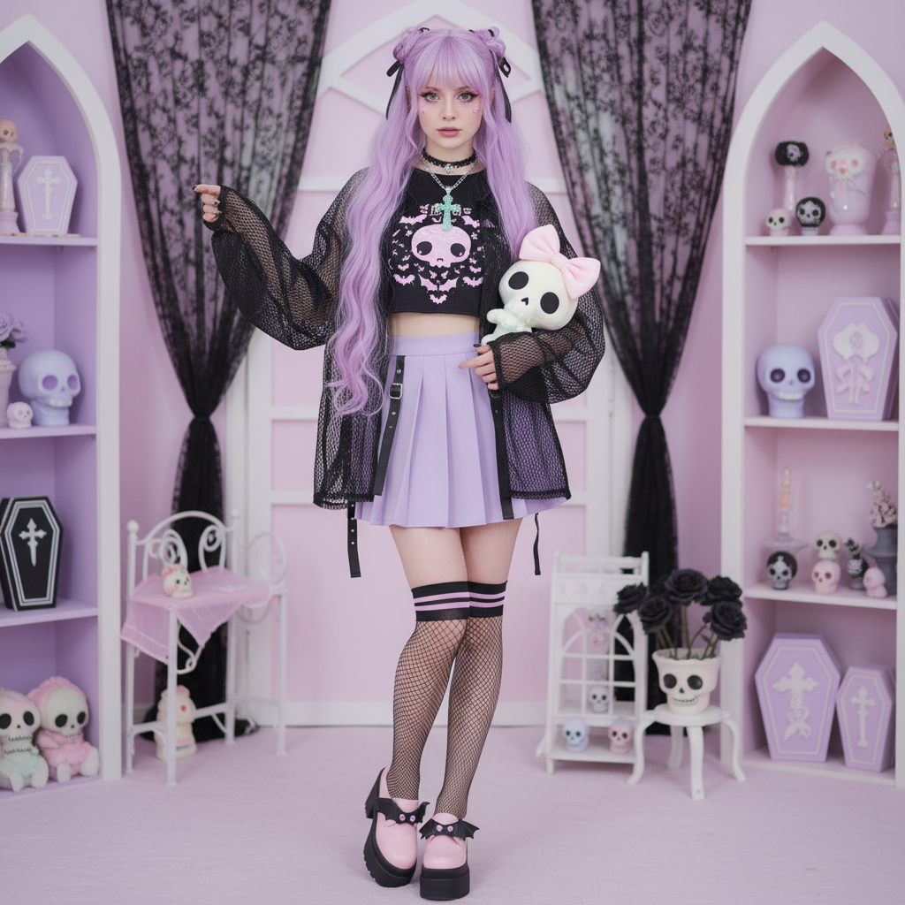

# Pastel Goth 粉彩哥特



> **"把死亡染成粉色——当哥特遇见 Kawaii。"**

## 概述

| 维度 | 描述 |
|------|------|
| 时期 | 2010–2016（鼎盛期）/ 持续影响至今 |
| 别名 | Pastel Goth, Soft Goth, Kawaii Goth |
| 核心色彩 | 粉彩色（薰衣草、婴儿粉、薄荷绿）+ 黑色 |
| 关键元素 | 十字架、骷髅、蝙蝠——但都是粉色的 |
| 代表人物 | Pastel-goth Tumblr 社区、Kerli、Grimes 早期 |
| 关联风格 | Mall Goth, Kidcore, Harajuku Y2K, Emo |

---

## 历史脉络

### 2010：Tumblr 的炼金术

Pastel Goth 是 Tumblr 平台上诞生的最具代表性的视觉风格之一。它的配方极其简单：**取哥特文化的所有暗黑符号，然后把它们全部染成粉彩色**。

这不是一个偶然的混搭，而是一种有意识的美学实验：
- 骷髅 → 粉色骷髅
- 十字架 → 薰衣草色十字架
- 蝙蝠 → 薄荷绿蝙蝠
- 五芒星 → 闪光粉五芒星

### 文化逻辑

Pastel Goth 的核心张力在于**矛盾的并置**：
- 死亡符号 + 可爱色彩 = 对两种文化的同时致敬和解构
- 哥特的严肃 + Kawaii 的天真 = 一种新的情感空间
- 黑暗主题 + 柔和表达 = 对"女孩不能喜欢暗黑"的反驳

### 鼎盛与扩散

2012–2015 年是 Pastel Goth 的黄金期：
- Tumblr 上 #pastelgoth 标签积累数百万帖子
- Lazy Oaf、Killstar 等品牌推出 Pastel Goth 产品线
- 独立音乐人（Grimes、Crystal Castles）的视觉风格与之重合
- 日本原宿的 "Yami Kawaii"（病み可愛い）风格与之呼应

---

## 视觉语法

### 色彩系统

```
粉彩层：
  - 薰衣草 (#E6E6FA)
  - 婴儿粉 (#FFB6C1)
  - 薄荷绿 (#98FF98)
  - 淡紫 (#DDA0DD)
  - 天蓝 (#87CEFA)
暗色层：
  - 纯黑 (#000000)
  - 深灰 (#333333)
规则：粉彩色占60-70%，黑色占30-40%
```

### 标志性符号（粉彩化处理）

| 原始哥特符号 | Pastel Goth 版本 |
|-------------|-----------------|
| 黑色十字架 | 薰衣草色十字架 |
| 骷髅头 | 粉色骷髅 + 蝴蝶结 |
| 蝙蝠 | 薄荷绿蝙蝠 |
| 棺材 | 粉色棺材形手机壳 |
| 倒五芒星 | 闪粉五芒星项链 |
| 黑猫 | 紫色猫耳头饰 |

### 时尚单品

- **上衣**：黑色 crop top + 粉彩色开衫
- **下装**：黑色百褶裙 + 粉色过膝袜
- **鞋履**：黑色厚底鞋（Creepers）
- **配饰**：粉色十字架项链、骷髅发夹、星星耳环
- **发色**：薰衣草紫、粉色、灰紫渐变
- **妆容**：黑色眼线 + 粉色腮红 + 紫色唇色

---

## 与 Yami Kawaii 的关系

日本的 "Yami Kawaii"（病み可愛い，意为"病态可爱"）与 Pastel Goth 有着深刻的精神共鸣：

| 维度 | Pastel Goth | Yami Kawaii |
|------|-------------|-------------|
| 起源 | 英语 Tumblr | 日本原宿 |
| 核心矛盾 | 哥特 × 可爱 | 心理创伤 × 可爱 |
| 符号 | 骷髅、十字架 | 药片、绷带、注射器 |
| 色彩 | 粉彩 + 黑 | 粉彩 + 红（血） |
| 态度 | 美学游戏 | 心理健康表达 |

两者都在用"可爱"的外壳包裹"不可爱"的内容，但动机不同：Pastel Goth 更偏向视觉游戏，Yami Kawaii 更偏向情感宣泄。

---

## 中国语境

Pastel Goth 在中国的影响主要通过以下渠道：
- 淘宝"暗黑少女"和"病娇"风格店铺
- Lolita 社群中的 "Gothic Lolita" 粉彩变体
- B站和小红书上的"甜酷"穿搭
- 独立插画师的粉彩暗黑风格作品

---

## 为什么它属于千禧怀旧？

虽然 Pastel Goth 的鼎盛期在 2010s 而非 2000s，但它怀念和重组的素材几乎全部来自千禧年时代：
- Mall Goth 的哥特符号库
- 2000s Kawaii 文化的色彩语言
- MySpace/早期 Tumblr 的 DIY 美学精神
- Emo 文化的情感表达方式

它是千禧怀旧的"二次创作"——用 2010s 的混搭逻辑重新编排 2000s 的视觉素材。

---

## 延伸阅读

- Aesthetics Wiki: [Pastel Goth](https://aesthetics.fandom.com/wiki/Pastel_Goth)
- 《Tumblr 美学与青年亚文化》相关研究
- Yami Kawaii 与心理健康表达

---

## 相关风格

← [Mall Goth 商场哥特](mall-goth.md) | [Kidcore 童年核](kidcore.md) →

↑ [返回千禧怀旧目录](README.md) | [返回总目录](../README.md)
