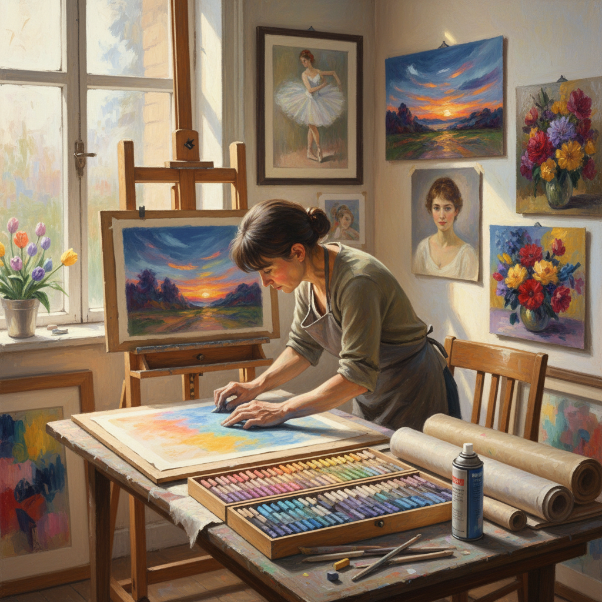

# Pastel Painting 色粉画

> "Pastel is pure pigment barely held together — no oil, no water, no varnish stands between the color and the eye. It is light itself, captured in sticks of powdered earth and pressed onto paper with the intimacy of a fingerprint." — Unknown

## 概述

色粉画（Pastel Painting）是一种使用色粉笔（pastel sticks）——由纯颜料粉末与少量粘合剂压制而成的干性绘画棒——在纸面上作画的技法。色粉画的独特之处在于：颜料几乎不含粘合剂，因此色彩极其纯净鲜艳——比任何其他绘画媒介都更接近纯颜料的原始色彩。色粉画不需要干燥时间，不会随时间变色（因为没有油脂氧化），色彩永久鲜艳。

色粉画在18世纪的法国达到第一个高峰——Rosalba Carriera和Maurice Quentin de La Tour等艺术家用色粉画创作了精美的肖像画。19世纪的印象派画家（特别是Edgar Degas）将色粉画推向了新的高度。色粉画既可以像素描一样用线条作画，也可以像绘画一样用色块覆盖——这种灵活性使其独具魅力。

## 核心特征

| 特征 | 描述 |
|------|------|
| 纯颜料 | 几乎纯颜料 |
| 干性 | 干性媒介 |
| 鲜艳 | 色彩极其鲜艳 |
| 即时 | 不需要干燥时间 |
| 永久 | 色彩永不变色 |
| 灵活 | 线条和色块兼备 |

## 视觉特征

- **鲜艳**：极其鲜艳的色彩
- **柔和**：柔和的过渡
- **粉质**：粉质的表面质感
- **发光**：内在的发光感
- **丰富**：丰富的色彩层次
- **触感**：手指触摸的痕迹

## 代表作品

| 作品 | 艺术家 | 年代 | 意义 |
|------|--------|------|------|
| *Ballet dancers series* | Edgar Degas | 1870s-1890s | 色粉画的巅峰 |
| *Pastel portraits* | Quentin de La Tour | 18世纪 | 色粉肖像画大师 |
| *Self-portraits* | Rosalba Carriera | 18世纪 | 色粉画先驱 |
| *Landscapes* | Mary Cassatt | 19世纪 | 印象派色粉画 |
| *Contemporary pastels* | Various | 当代 | 当代色粉画 |

## 历史时间线

| 时期 | 事件 |
|------|------|
| 15世纪 | Leonardo da Vinci提到色粉笔 |
| 17世纪 | 色粉画作为独立媒介的发展 |
| 18世纪 | 法国色粉肖像画的黄金时代 |
| 19世纪 | Degas等印象派画家的创新 |
| 20世纪 | 色粉画协会的成立和推广 |
| 当代 | 色粉画的全球复兴 |

## 中国语境

色粉画在中国的美术教育和创作中有一定的发展。中国的一些美术院校开设色粉画课程。中国的色粉画协会和展览活动推动了色粉画在中国的发展。中国的色粉画家在风景、人物和静物等题材上进行创作。色粉画的"即时性"和"色彩纯净"特点吸引了追求直接表达的中国画家。中国的色粉画市场正在逐步发展。

## AI生成概念图

## 与其他风格的关系

- **Soft Pastel** → 软色粉
- **Oil Pastel** → 油画棒
- **Charcoal Drawing** → 炭笔画
- **Conté Crayon** → 孔特蜡笔
- **Impressionism** → 印象派
- **Drawing** → 素描

---

*浮光艺志 | Chronicle of Artistry*
