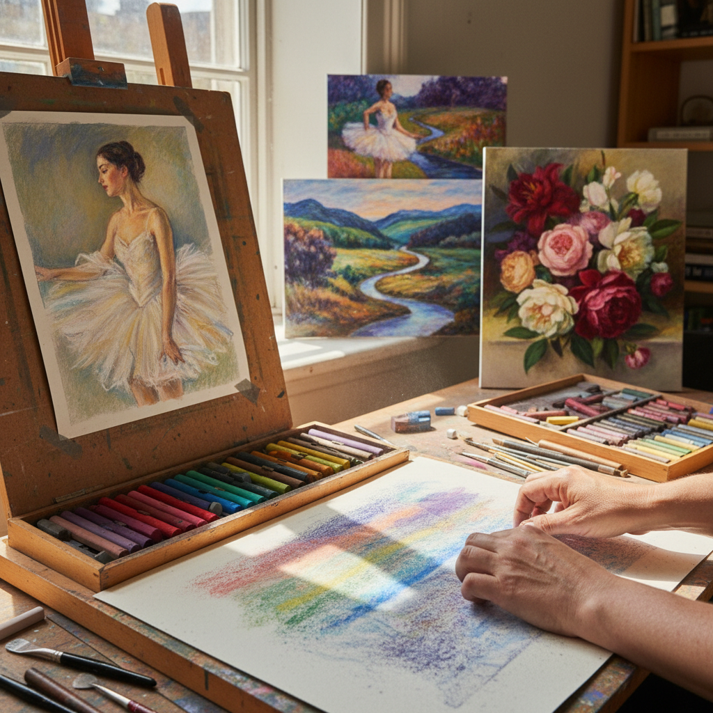

# Pastel 色粉画

> "Pastel is pure pigment touching paper — no brush, no medium, no barrier between the color and the surface, just the artist's hand and light made solid." — Unknown

## 概述

色粉画（Pastel）是使用色粉笔（pastel sticks）直接在纸面上作画的技法。色粉笔由纯颜料粉末与少量粘合剂压制而成——它是所有绘画媒介中颜料浓度最高的，因此色彩最为鲜艳饱和。色粉画的独特之处在于：颜料直接附着在纸面上，没有油或水等媒介的稀释，因此色彩保持了颜料本身的纯度和明亮度。色粉画的表面呈现柔和的天鹅绒质感，色彩可以用手指或纸笔轻柔地混合。从18世纪的洛可可肖像到德加的芭蕾舞者，色粉画以其独特的柔和、明亮和即时性著称。

色粉画的哲学在于：纯粹——最少的媒介，最纯的色彩，最直接的表达。

## 核心特征

| 特征 | 描述 |
|------|------|
| 纯颜料 | 颜料浓度最高 |
| 直接 | 直接在纸上作画 |
| 鲜艳 | 色彩极其鲜艳 |
| 柔和 | 柔和的质感 |
| 可混合 | 可以手指混合 |
| 即时 | 即时的效果 |

## 视觉特征

- **鲜艳**：极其鲜艳的色彩
- **柔和**：柔和的天鹅绒质感
- **明亮**：明亮不浑浊
- **粉质**：粉质的表面
- **渐变**：柔和的色彩渐变
- **光感**：独特的光感

## 代表作品

| 作品 | 艺术家 | 年代 | 意义 |
|------|--------|------|------|
| *Rosalba Carriera portraits* | Rosalba Carriera | 1720s | 色粉肖像先驱 |
| *Degas ballet dancers* | Edgar Degas | 1870s-90s | 色粉画巅峰 |
| *Mary Cassatt pastels* | Mary Cassatt | 1880s+ | 印象派色粉 |
| *Odilon Redon pastels* | Odilon Redon | 1890s+ | 象征主义色粉 |
| *Wolf Kahn landscapes* | Wolf Kahn | 1980s+ | 当代色粉风景 |

## 历史时间线

| 时期 | 事件 |
|------|------|
| 15世纪 | Leonardo da Vinci使用色粉 |
| 18世纪 | 洛可可时期色粉肖像的黄金时代 |
| 19世纪 | 德加将色粉推向新高度 |
| 印象派 | 印象派画家广泛使用 |
| 20世纪 | 现代色粉画的多样化 |
| 当代 | 全球色粉画的繁荣 |

## 中国语境

色粉画在中国被称为"粉画"或"色粉画"，近年来在中国发展迅速。中国粉画学会（后更名为中国色粉画学会）是全国性的专业组织。色粉画因其色彩鲜艳、操作直接的特点，吸引了越来越多的中国画家。中国的色粉画家如杭鸣时等在推广色粉画方面做出了重要贡献。色粉画的柔和质感与中国传统绘画的"气韵生动"有某种呼应。当代中国色粉画在国际色粉画展中也有越来越多的参与和获奖。

## AI生成概念图

## 与其他风格的关系

- **Drawing** → 素描
- **Chalk** → 粉笔画
- **Oil Pastel** → 油画棒
- **Charcoal** → 炭笔画
- **Impressionism** → 印象派
- **Soft Pastel** → 软色粉

---

*浮光艺志 | Chronicle of Artistry*
