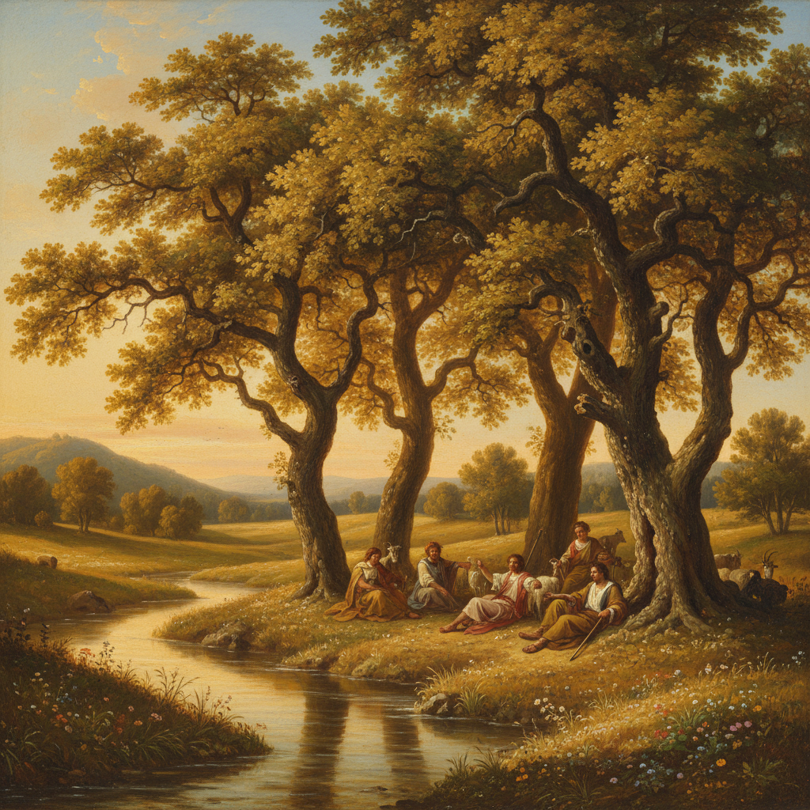

# Pastoral Painting 田园画

> **时期：** 16世纪–19世纪  
> **关键词：** 牧羊人、理想化自然、阿卡迪亚、田园诗意、黄金时代

## 概述

Pastoral Painting（田园画）描绘理想化的乡村生活——牧羊人在树荫下吹笛、仙女在溪边嬉戏、农人在金色麦田中劳作。它源自古希腊田园诗传统，在文艺复兴和巴洛克时期成为独立画种。田园画不是对真实农村的记录，而是对失落黄金时代的永恒想象——一个没有劳苦、只有诗意的阿卡迪亚。

## 风格特征

- **理想化风景**：温柔起伏的丘陵和清澈溪流
- **牧歌人物**：牧羊人、仙女、音乐家
- **金色光线**：永恒午后的温暖色调
- **古典引用**：维吉尔和忒奥克里托斯的文学传统
- **和谐氛围**：人与自然的完美共处

## 代表人物与作品

- 乔尔乔内《田园合奏》
- 尼古拉·普桑《阿卡迪亚的牧人》
- 克劳德·洛兰 理想风景系列
- 托马斯·庚斯博罗 英国田园

## 概念图

