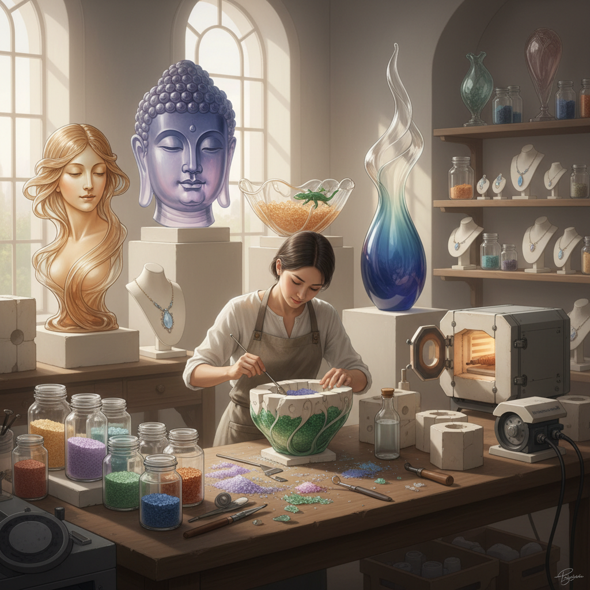

# Pâte de Verre Art 玻璃粉铸造艺术

> "Pâte de verre is glass returned to earth — ground back to powder, mixed with binders into a paste, packed into molds grain by grain, then fired until the particles fuse into a translucent solid that glows like frozen honey. Unlike blown or cast glass, pâte de verre retains a granular memory of its making — a subtle texture, a soft diffusion of light, a warmth that seems almost organic rather than mineral." — Unknown

## 概述

玻璃粉铸造艺术（Pâte de Verre Art）是将研磨成粉末或颗粒的玻璃与粘合剂混合成糊状物，填入耐火模具中，然后在窑炉中加热至玻璃颗粒烧结或熔融的玻璃工艺——这种技法可以创造出具有独特半透明质感和柔和光线效果的玻璃艺术品，表面呈现出类似宝石般的温润质感。

玻璃粉铸造艺术的实践包括：1）实心铸造——完全填充模具的实心作品；2）空心铸造——在模具内壁涂覆玻璃粉的空心作品；3）色彩分区——在模具不同区域放置不同颜色的玻璃粉；4）嵌入物——在玻璃粉中嵌入金属或其他材料；5）大型雕塑——大尺寸的玻璃粉铸造雕塑；6）首饰制作——小型精致的玻璃粉铸造首饰；7）当代创作——将传统技法与现代艺术理念结合的创作。

## 核心特征

| 特征 | 描述 |
|------|------|
| 半透明 | 独特的半透明质感 |
| 温润 | 类似宝石的温润感 |
| 精细 | 可表现极精细的细节 |
| 色彩 | 精确的色彩控制 |
| 质感 | 独特的颗粒质感 |
| 古老 | 极其古老的技法 |

## 视觉特征

- **半透明**：柔和的半透明效果
- **质感**：微妙的颗粒质感
- **色彩**：柔和渐变的色彩
- **光线**：柔和散射的光线
- **温润**：宝石般的温润感
- **细节**：精细的表面细节

## 代表作品

| 作品 | 艺术家/文化 | 年代 | 意义 |
|------|-------------|------|------|
| *Henri Cros sculptures* | Henri Cros | 1890s | 现代pâte de verre先驱 |
| *Amalric Walter* | Amalric Walter | 1900-1930 | 新艺术风格 |
| *Diana Hobson* | Diana Hobson | 当代 | 当代英国玻璃粉铸造 |
| *Egyptian pâte de verre* | 古埃及 | 公元前1500年 | 最早的玻璃粉铸造 |
| *Liuli Gongfang* | 琉璃工房 | 1987至今 | 华人玻璃艺术 |

## 历史时间线

| 时期 | 事件 |
|------|------|
| 公元前1500年 | 古埃及最早的玻璃粉铸造 |
| 古典时代 | 罗马时期的发展 |
| 中世纪 | 技术几乎失传 |
| 19世纪末 | 法国艺术家重新发现 |
| 当代 | 玻璃粉铸造的全球复兴 |

## 中国语境

玻璃粉铸造艺术在中国有独特的发展——中国的"琉璃"传统与pâte de verre有密切的关系。台湾的琉璃工房（Liuli Gongfang）是华人世界最著名的玻璃粉铸造品牌——由杨惠姗和张毅创立，将中国传统美学与脱蜡铸造技法相结合。中国大陆的玻璃艺术家也在积极探索玻璃粉铸造技法——一些艺术家将中国传统造型（如佛像、山水）用玻璃粉铸造来表现。中国的玻璃艺术教育中，玻璃粉铸造是重要的教学方向之一——清华大学美术学院、中国美术学院等都开设了相关课程。中国古代的琉璃（铅钡玻璃）制作中也有类似的粉末烧结技法——可以追溯到战国时期。中国当代的玻璃艺术市场中，琉璃作品（多为脱蜡铸造）是最受欢迎的品类之一。

## AI生成概念图

## 与其他风格的关系

- **Fused Glass** → 熔融玻璃
- **Glass Casting** → 玻璃铸造
- **Kiln Art** → 窑炉艺术
- **Sculpture** → 雕塑
- **Jewelry Art** → 珠宝艺术
- **Art Nouveau** → 新艺术运动

---

*浮光艺志 | Chronicle of Artistry*
