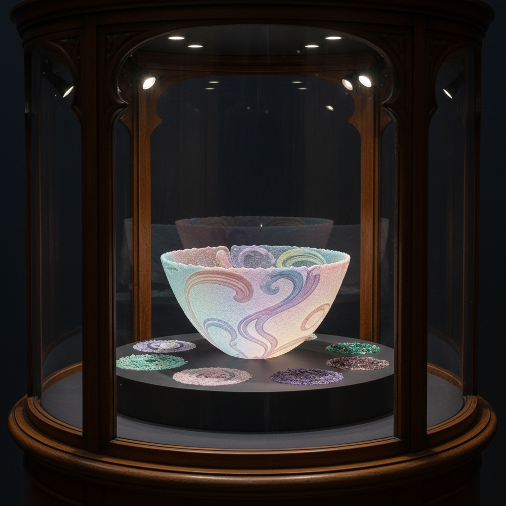

# Pâte de Verre 玻璃膏

> "Pâte de verre is painting with crushed glass — each grain melts into its neighbor, creating surfaces of impossible delicacy." — Unknown

## 概述

玻璃膏（Pâte de Verre，法语"玻璃糊"）是将研磨的玻璃粉或玻璃碎粒与粘合剂混合成糊状，涂抹在耐火模具内壁，然后在窑炉中烧制使玻璃颗粒融合的古老技法。与实心窑铸不同，玻璃膏作品通常是薄壁的、半透明的，具有独特的颗粒质感和柔和的光线透射效果。这种技法在19世纪末的法国新艺术运动中达到巅峰，创造出如同凝固的彩色光线般的精美器物。

玻璃膏的魅力在于：光的肌肤——薄薄的玻璃壁如同皮肤般透光，颗粒的融合创造出独特的散射效果，既不完全透明也不完全不透明。

## 核心特征

| 特征 | 描述 |
|------|------|
| 粉粒 | 使用玻璃粉/碎粒 |
| 薄壁 | 通常为薄壁器物 |
| 半透明 | 独特的半透明质感 |
| 模具 | 在模具内壁涂抹 |
| 颗粒 | 保留颗粒质感 |
| 精细 | 极其精细的工艺 |

## 视觉特征

- **半透明**：柔和的半透明效果
- **颗粒**：微妙的颗粒质感
- **色彩**：可精确控制色彩分布
- **薄壁**：轻盈的薄壁形态
- **柔和**：柔和散射的光线
- **精致**：极其精致的表面

## 代表作品

| 作品 | 艺术家 | 年代 | 意义 |
|------|--------|------|------|
| *Henri Cros reliefs* | Henri Cros | 1890s | 玻璃膏复兴先驱 |
| *Albert Dammouse vessels* | Albert Dammouse | 1900s | 新艺术玻璃膏 |
| *Amalric Walter pieces* | Amalric Walter | 1910s-20s | 装饰艺术玻璃膏 |
| *Diana Hobson works* | Diana Hobson | 当代 | 当代玻璃膏大师 |
| *Shin-ichi Higuchi* | Shin-ichi Higuchi | 当代 | 日本玻璃膏艺术 |

## 历史时间线

| 时期 | 事件 |
|------|------|
| 古埃及 | 最早的玻璃膏技法 |
| 古罗马 | 罗马时期的应用 |
| 中世纪 | 技法失传 |
| 1880s | Henri Cros重新发现 |
| 1900s-20s | 新艺术/装饰艺术黄金期 |
| 当代 | 全球玻璃膏艺术复兴 |

## 中国语境

中国的琉璃传统中有类似玻璃膏的技法——将玻璃粉填入模具烧制。当代中国的琉璃工房等品牌虽然主要使用脱蜡铸造，但也有艺术家探索玻璃膏技法。中国美术学院和清华美院的玻璃艺术专业都有教授这一技法。玻璃膏因其精细和可控性，特别适合表现中国传统美学中的含蓄和温润。

## AI生成概念图

## 与其他风格的关系

- **Kiln Casting** → 窑铸玻璃（实心版本）
- **Fused Glass** → 熔融玻璃
- **Art Nouveau** → 新艺术运动的载体
- **Ceramics** → 类似陶瓷的工艺流程
- **Lost-Wax Casting** → 共享脱蜡模具技术
- **Sculpture** → 雕塑性的表现

---

*浮光艺志 | Chronicle of Artistry*
