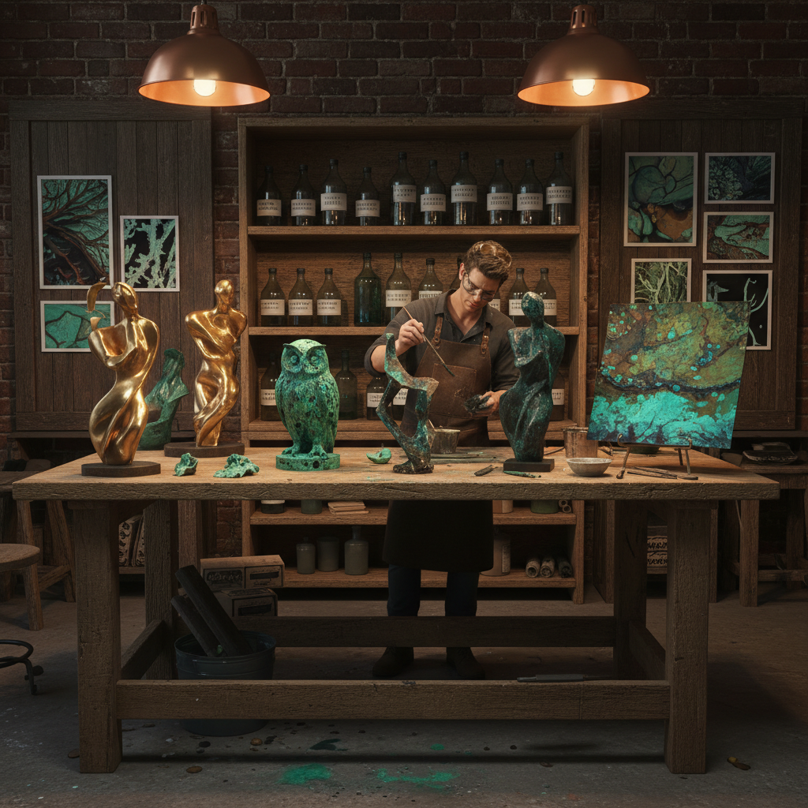

# Patina Art 铜绿艺术

> "Patina art celebrates the skin that time grows on metal — the green of aged copper, the black of tarnished silver, the iridescent blues of heat-treated steel. Patina is not damage; it is biography, a record of every rainstorm, every touch, every chemical encounter written in color on the surface of metal. The patina artist accelerates, guides, and celebrates this natural process, understanding that the most beautiful surfaces are those that have lived." — Unknown

## 概述

铜绿艺术（Patina Art）是以金属表面的自然或人工氧化层——铜绿（verdigris）、青铜锈（bronze patina）、银黑（tarnish）等——为核心美学元素的艺术实践。铜绿是铜及其合金在空气、水和化学物质作用下形成的表面层，呈现出独特的绿色、蓝色、棕色和黑色。

铜绿艺术的实践包括：1）化学着色——用化学溶液在金属表面创造特定颜色的铜绿；2）自然铜绿——让金属在户外自然氧化形成铜绿；3）铜绿绘画——将铜绿技术应用于平面创作；4）铜绿雕塑——在雕塑表面创造丰富的铜绿效果；5）仿铜绿——在非金属材料上模拟铜绿效果；6）铜绿保护——将历史建筑和雕塑的铜绿作为文化遗产保护。

## 核心特征

| 特征 | 描述 |
|------|------|
| 氧化 | 金属氧化过程 |
| 色彩 | 绿、蓝、棕、黑 |
| 时间 | 时间的印记 |
| 化学 | 化学反应 |
| 表面 | 表面层的美学 |
| 历史 | 历史感 |

## 视觉特征

- **绿色**：铜绿的标志性绿色
- **层次**：多层氧化的色彩层次
- **斑驳**：不均匀的斑驳效果
- **金属**：金属基底的质感
- **古老**：古老和历史的感觉
- **丰富**：丰富的色彩变化

## 代表作品

| 作品 | 艺术家 | 年代 | 意义 |
|------|--------|------|------|
| *自由女神像* | Frédéric Bartholdi | 1886 | 最著名的铜绿 |
| *Bronze sculptures* | Various | 古代至今 | 青铜雕塑铜绿 |
| *Patina paintings* | Various | 2000年代 | 铜绿绘画 |
| *Chemical patina art* | Various | 当代 | 化学着色艺术 |
| *Architectural patina* | Various | 历史 | 建筑铜绿 |

## 历史时间线

| 时期 | 事件 |
|------|------|
| 古代 | 青铜器的自然铜绿 |
| 文艺复兴 | 铜绿着色技术发展 |
| 19世纪 | 工业化学着色 |
| 20世纪 | 铜绿作为艺术媒介 |
| 当代 | 铜绿艺术的独立发展 |

## 中国语境

铜绿艺术在中国有极其深厚的文化传统。中国是世界上最早的青铜文明之一——商周青铜器上的铜绿（"青铜锈"）被视为珍贵的历史印记和美学价值。中国收藏界有"铜锈如玉"的说法，认为好的铜绿是青铜器价值的重要组成部分。中国传统的"包浆"概念——物件经长期使用和氧化形成的表面层——与铜绿美学有深刻的联系。中国古代的鎏金、错金银等金属工艺也涉及对金属表面的化学处理。中国当代的一些艺术家在探索铜绿艺术：将中国古代青铜器的铜绿美学与当代雕塑结合、用化学着色技术在铜板上创作当代绘画、以及将中国传统的"古色"审美与当代材料艺术对话。

## AI生成概念图

## 与其他风格的关系

- **Rust Art** → 锈蚀艺术
- **Bronze Sculpture** → 青铜雕塑
- **Process Art** → 过程艺术
- **Material Art** → 材料艺术
- **Erosion Art** → 侵蚀艺术
- **Metal Art** → 金属艺术

---

*浮光艺志 | Chronicle of Artistry*
