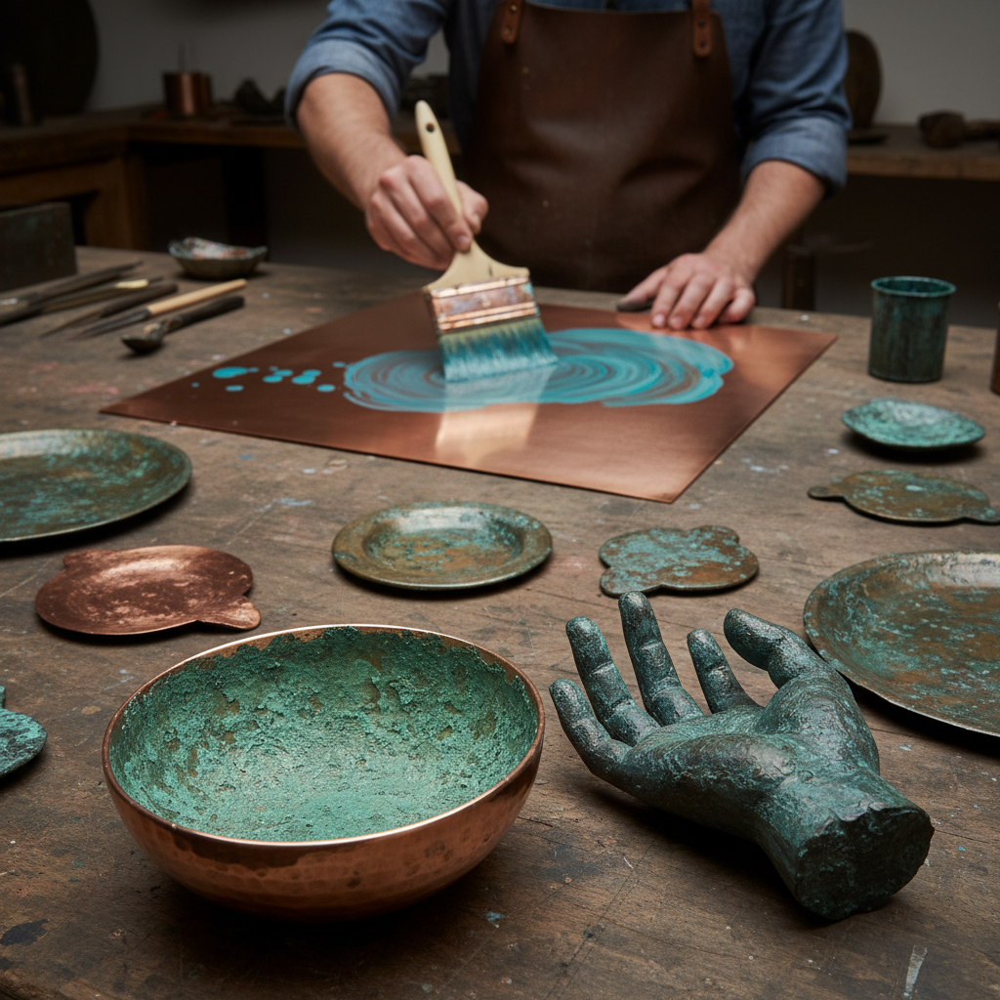

# Patina 铜绿/锈色艺术

> "Patina is time made visible — the slow conversation between metal and atmosphere." — Unknown

## 概述

铜绿/锈色艺术（Patina）是金属表面在时间、化学反应或人工处理下形成的氧化层和色彩变化。从自由女神像标志性的绿色到日本茶道器物的"寂"之美，从古董青铜器的岁月痕迹到当代艺术家刻意创造的化学着色，铜绿不仅是时间的印记，更是一种独立的美学追求。艺术家通过控制化学反应——酸、盐、氨、热——在金属表面"绘制"出丰富的色彩和纹理。

铜绿的哲学在于：时间的美学——不是对抗衰老和变化，而是拥抱它，将时间本身变成艺术的合作者。

## 核心特征

| 特征 | 描述 |
|------|------|
| 氧化 | 金属的氧化反应 |
| 时间 | 时间的可见痕迹 |
| 色彩 | 丰富的化学色彩 |
| 表面 | 表面质感的变化 |
| 保护 | 氧化层保护内部 |
| 不可控 | 部分不可预测性 |

## 视觉特征

- **绿色**：铜的碳酸盐绿锈
- **棕色**：铁的氧化棕色
- **蓝色**：硫化物的蓝黑色
- **纹理**：不规则的表面纹理
- **渐变**：自然的色彩渐变
- **岁月**：时间感和历史感

## 代表作品

| 作品 | 艺术家 | 年代 | 意义 |
|------|--------|------|------|
| *Statue of Liberty* | Bartholdi | 1886+ | 最著名的自然铜绿 |
| *Chinese bronze vessels* | 匿名 | 商周 | 青铜器的千年铜绿 |
| *Richard Serra sculptures* | Richard Serra | 1960s+ | 耐候钢的锈色美学 |
| *Japanese tea kettles* | 匿名 | 传统 | 茶道器物的寂之美 |
| *Patinated jewelry* | Various | 当代 | 当代铜绿珠宝 |

## 历史时间线

| 时期 | 事件 |
|------|------|
| 古代 | 自然铜绿的发现和欣赏 |
| 文艺复兴 | 人工铜绿技法的发展 |
| 日本传统 | 侘寂美学中的铜绿 |
| 19世纪 | 雕塑铜绿的系统化 |
| 20世纪 | 耐候钢的建筑应用 |
| 当代 | 铜绿作为独立艺术媒介 |

## 中国语境

中国对铜绿的欣赏有深厚传统——古代青铜器的"铜锈"被视为岁月和文化的象征，收藏家珍视"生坑"（自然出土状态）的青铜器。宋代文人已经开始欣赏和模仿古铜器的锈色。中国传统的"做旧"工艺也是一种人工铜绿技法。当代中国艺术家如展望等人在作品中探索金属氧化的美学可能性。

## AI生成概念图

## 与其他风格的关系

- **Wabi-sabi** → 侘寂美学中的时间之美
- **Bronze Sculpture** → 青铜雕塑的表面处理
- **Weathering Steel** → 耐候钢建筑
- **Kintsugi** → 金缮的修复美学
- **Metalwork** → 金属工艺的表面处理
- **Aging** → 材料老化的美学

---

*浮光艺志 | Chronicle of Artistry*
