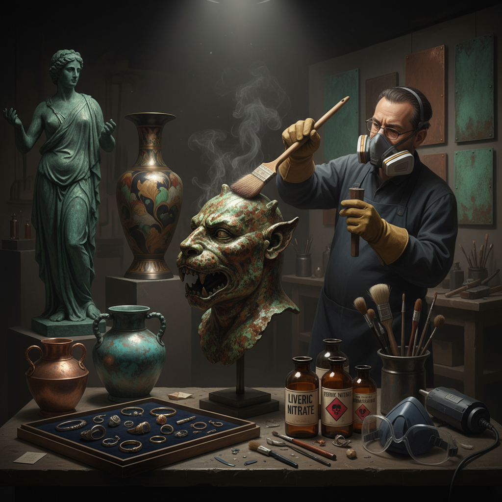

# Patination 铜绿/做旧

> "Patination is time made visible — the artist accelerates what nature takes centuries to achieve, coaxing metal surfaces into colors that speak of age, weather, and the slow chemistry of existence." — Unknown

## 概述

铜绿/做旧（Patination）是通过化学或自然过程在金属表面形成氧化层或腐蚀层的工艺。铜绿（patina）是金属表面因氧化、硫化或其他化学反应而形成的有色表层——最典型的是铜和青铜表面的绿色氧化层（铜绿/verdigris）。

Patination既是自然过程（如自由女神像的绿色铜绿），也是一种有意为之的装饰技法。艺术家和工匠使用各种化学试剂（如肝硫、醋酸铜、氯化铵、硝酸铁等）来加速和控制金属表面的氧化过程，创造出丰富的色彩效果——从深黑到翠绿、从棕红到蓝紫。Patination广泛应用于：青铜雕塑、首饰、建筑金属件、家具五金、艺术品等。

## 核心特征

| 特征 | 描述 |
|------|------|
| 氧化 | 化学氧化过程 |
| 色彩 | 丰富的色彩变化 |
| 表层 | 形成有色表层 |
| 控制 | 可控制的化学反应 |
| 保护 | 同时起保护作用 |
| 时间 | 模拟时间的效果 |

## 视觉特征

- **绿色**：经典的铜绿色
- **多色**：从黑到绿到蓝的变化
- **质感**：丰富的表面质感
- **古旧**：古旧的美感
- **深沉**：深沉的色调
- **自然**：自然的不规则感

## 代表作品

| 作品 | 艺术家 | 年代 | 意义 |
|------|--------|------|------|
| *Statue of Liberty* | Bartholdi | 1886 | 自由女神像的铜绿 |
| *Bronze sculptures* | Various | 各时期 | 青铜雕塑的铜绿 |
| *Japanese bronze vases* | 日本工匠 | 传统 | 日本青铜花瓶 |
| *Patinated jewelry* | Various | 当代 | 做旧首饰 |
| *Architectural patina* | Various | 各时期 | 建筑铜绿 |

## 历史时间线

| 时期 | 事件 |
|------|------|
| 古代 | 自然铜绿的观察 |
| 文艺复兴 | 有意识的铜绿处理 |
| 18-19世纪 | 化学铜绿配方的发展 |
| 19世纪 | 日本色上（irogane）技法 |
| 20世纪 | 现代化学铜绿的系统化 |
| 当代 | 铜绿作为当代艺术手法 |

## 中国语境

铜绿在中国文化中有着特殊的地位——中国古代青铜器上的铜绿（铜锈）被视为"古色"，是鉴赏古董的重要标准。中国的青铜器收藏中，自然形成的铜绿被视为珍贵的历史痕迹。中国传统的金属工艺中也有意识地使用做旧技法——如仿古铜器的制作。当代中国的金属艺术家和首饰设计师使用化学做旧来创造独特的色彩效果。中国的建筑装饰中也使用铜绿效果——如一些现代建筑的铜质外墙。

## AI生成概念图

## 与其他风格的关系

- **Bronze Casting** → 青铜铸造
- **Metalwork** → 金属工艺
- **Verdigris** → 铜绿
- **Aging/Antiquing** → 做旧
- **Sculpture** → 雕塑
- **Jewelry Making** → 首饰制作

---

*浮光艺志 | Chronicle of Artistry*
