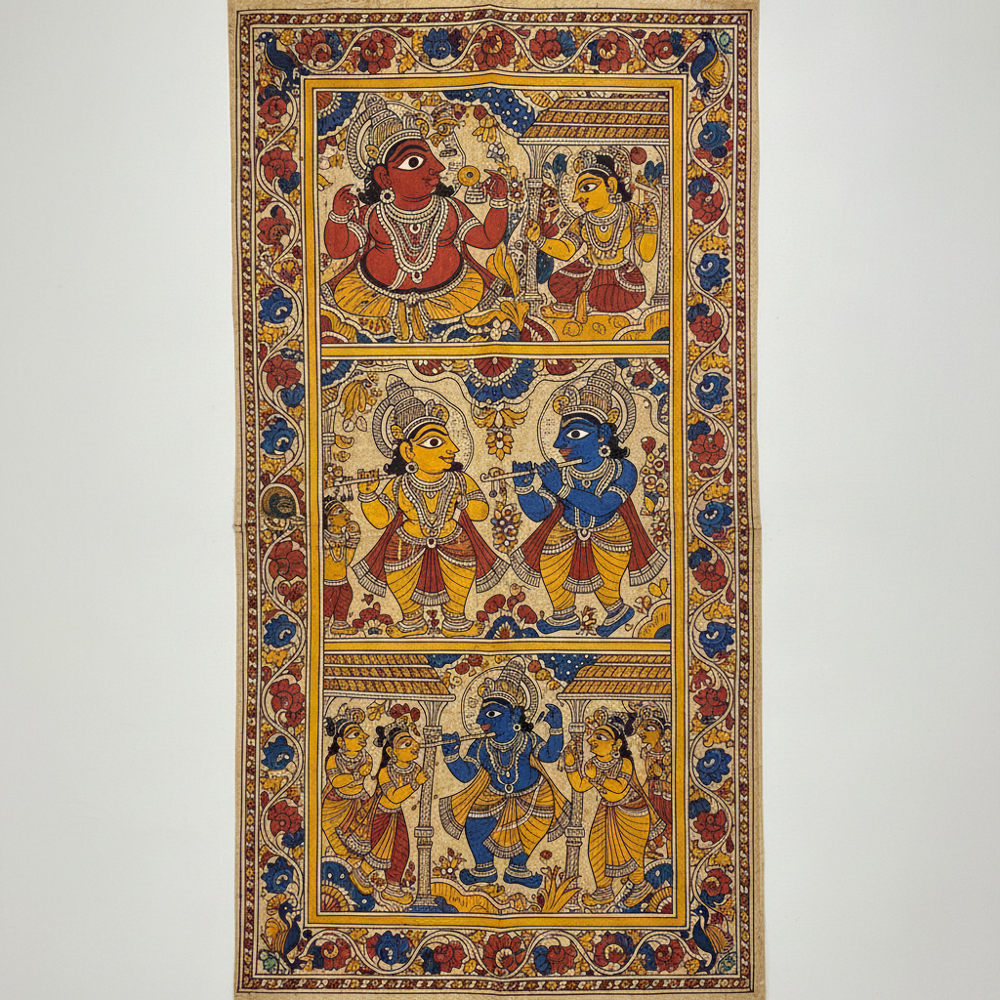

# Pattachitra 帕塔奇特拉 | ପଟ୍ଟଚିତ୍ର

> **"布上的神话——奥里萨邦的画师用千年不变的技法讲述贾格纳特的故事。"**

## 概述

帕塔奇特拉（Pattachitra / ପଟ୍ଟଚିତ୍ର）是印度奥里萨邦（Odisha）和西孟加拉邦的传统卷轴绘画艺术，"Patta"意为布，"Chitra"意为画。这一传统与普里（Puri）的贾格纳特神庙（Jagannath Temple）紧密相连，画师（Chitrakar）世代为神庙绘制宗教画作。帕塔奇特拉以其精细的线描、鲜艳的天然颜料和严格的图像学规范著称，是印度最古老的绘画传统之一，可追溯至公元5世纪。

## 核心特征

- **布面准备**：棉布涂覆白垩和树胶的底料（Patti）
- **天然颜料**：白（贝壳粉）、红（朱砂/赭石）、黄（石黄/姜黄）、黑（灯烟）、蓝（靛蓝）
- **精细线描**：用老鼠毛或松鼠毛制成的极细画笔
- **装饰边框**：精美的花卉和几何边框围绕主画面
- **程式化人物**：大眼睛、尖鼻子、圆脸的标准化造型
- **叙事性**：连续场景讲述完整的神话故事

## 主要题材

| 题材 | 内容 |
|------|------|
| 贾格纳特三神 | 普里神庙的主神形象 |
| 克里希纳故事 | 《薄伽梵歌》的叙事场景 |
| 达萨瓦塔拉 | 毗湿奴的十大化身 |
| 生命之树 | 宇宙树与各种生灵 |
| 塔萨帕塔 | 扑克牌形式的圆形绘画 |

## 视觉特征

- 鲜艳饱和的天然颜料色彩
- 精细流畅的黑色轮廓线
- 大眼睛的程式化人物造型
- 精美的花卉/几何装饰边框
- 平面化的空间处理
- 红色和黄色为主的暖色调

## 与其他风格的关系

| 风格 | 关系 |
|------|------|
| Madhubani | 共享印度民间绘画传统 |
| Kalamkari | 共享印度教叙事和天然颜料 |
| 巴厘岛绘画 | 共享印度教神话题材 |
| 埃塞俄比亚圣像 | 共享大眼正面人物和宗教功能 |
| Tanjore Painting | 共享印度宗教绘画传统 |

## 概念图

---

*浮光艺志 | Chronicle of Artistry*
