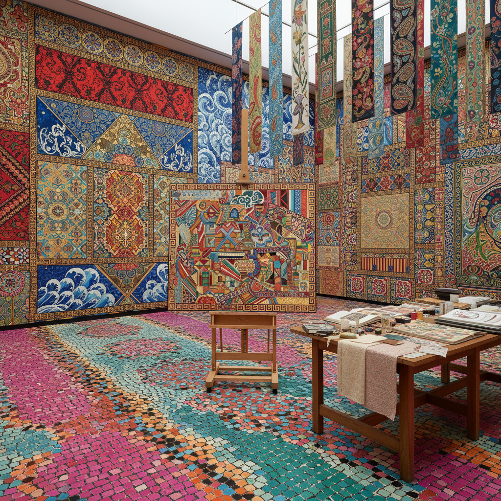

# Pattern and Decoration Art 图案与装饰艺术

> "Pattern and Decoration was the most radical movement of the 1970s precisely because it seemed the least radical — in a world where seriousness meant austerity, where decoration was a dirty word, where ornament was crime, these artists committed the ultimate transgression: they made things beautiful, they celebrated craft traditions dismissed as women's work, they looked to Islamic tiles and Ukrainian embroidery and Navajo blankets and said these are as important as any Minimalist cube, that the human need for pattern and color and ornament is not a weakness to be purged but a fundamental expression of our species' creativity." — Unknown

## 概述

图案与装饰运动（Pattern and Decoration，简称P&D）是1970年代中期至1980年代初在美国兴起的艺术运动，反对极简主义和概念艺术对装饰性的排斥，积极拥抱图案、色彩、装饰和工艺传统。P&D运动的艺术家们从全球各地的装饰传统中汲取灵感——伊斯兰几何图案、非洲纺织品、日本和纸、墨西哥民间艺术——并将这些"低等"的装饰传统提升到"高等"艺术的地位。

P&D运动也有明确的女性主义维度：它挑战了将"装饰"贬低为"女性化"和"次要"的艺术等级制度，重新评价了被归类为"工艺"而非"艺术"的实践——如刺绣、拼布、编织。代表性的艺术家包括：Miriam Schapiro、Robert Kushner、Joyce Kozloff、Kim MacConnel、Robert Zakanitch和Valerie Jaudon。

## 核心特征

| 特征 | 描述 |
|------|------|
| 装饰 | 拥抱装饰性 |
| 图案 | 重复的图案 |
| 全球 | 全球装饰传统 |
| 女性 | 女性主义立场 |
| 工艺 | 工艺的重新评价 |
| 色彩 | 丰富的色彩 |

## 视觉特征

- **图案**：重复的几何和有机图案
- **色彩**：丰富饱和的色彩
- **织物**：织物和纺织品的引用
- **拼贴**：多种图案的拼贴
- **对称**：对称和重复
- **边框**：装饰性的边框

## 代表作品

| 作品 | 艺术家 | 年代 | 意义 |
|------|--------|------|------|
| *Anatomy of a Kimono* | Miriam Schapiro | 1976 | P&D的标志性作品 |
| *Persian Line* | Robert Kushner | 1975 | 东方图案的引用 |
| *An Interior Decorated* | Joyce Kozloff | 1979 | 公共空间的装饰 |
| *Untitled patterns* | Kim MacConnel | 1970年代 | 织物图案的绘画化 |
| *Brocade* series | Valerie Jaudon | 1970年代 | 几何装饰的抽象 |

## 历史时间线

| 时期 | 事件 |
|------|------|
| 1975 | P&D运动的形成 |
| 1977 | Holly Solomon画廊的展览 |
| 1970年代末 | 运动的高峰 |
| 1980年代 | 逐渐被新表现主义取代 |
| 2000年代 | 历史重新评价和复兴 |

## 中国语境

图案与装饰运动的理念在中国有深刻的共鸣。中国拥有世界上最丰富的装饰传统之一——从青铜器的饕餮纹到瓷器的青花图案，从丝绸的织锦到建筑的彩画，从剪纸到刺绣。然而，在20世纪中国现代艺术的发展中，"装饰性"同样被视为"落后"和"非艺术"的。P&D运动的精神——重新评价装饰传统的艺术价值——对中国当代艺术有启示意义。一些中国当代艺术家在探索将传统装饰图案与当代艺术语言结合，如将传统纹样进行当代化的重新诠释，或将民间工艺（如苗族刺绣、藏族编织）引入当代艺术的语境。

## AI生成概念图

## 与其他风格的关系

- **Minimalism** → 极简主义（反对）
- **Feminist Art** → 女性主义艺术
- **Islamic Art** → 伊斯兰艺术
- **Textile Art** → 纺织艺术
- **Folk Art** → 民间艺术
- **Postmodernism** → 后现代主义

---

*浮光艺志 | Chronicle of Artistry*
