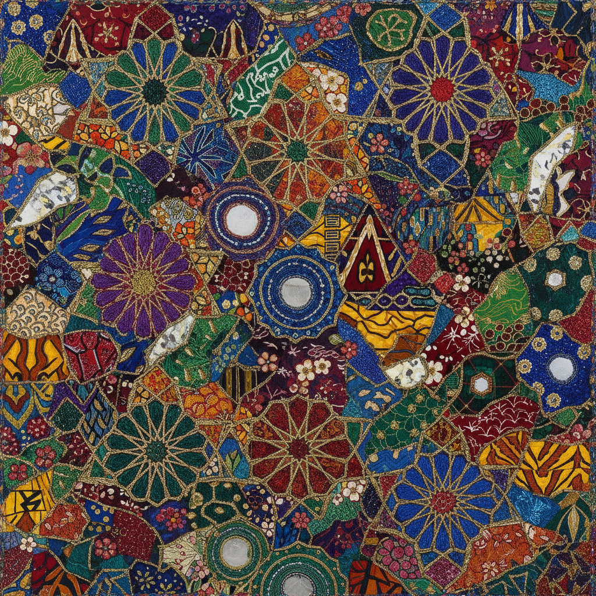

# Pattern and Decoration 图案与装饰运动

> **时期：** 1975–1985  
> **关键词：** 装饰性、女性主义、多元文化图案、反极简、手工艺

## 概述

Pattern and Decoration（P&D）运动是1970年代中期兴起于纽约的艺术运动，直接挑战极简主义和观念艺术对"装饰"的贬低。艺术家们从伊斯兰瓷砖、日本和服、非洲纺织品、美国拼布等全球装饰传统中汲取灵感，创造出色彩丰富、图案繁复的大型作品——宣称装饰性本身就是一种严肃的艺术语言。

## 风格特征

- **繁复图案**：重复的几何和有机纹样覆盖整个画面
- **多元文化**：融合全球各地的装饰传统
- **鲜艳色彩**：大胆的色彩组合，拒绝单色克制
- **混合媒介**：绘画与织物、亮片、珠子等材料结合
- **反等级**：模糊"高雅艺术"与"工艺/装饰"的界限

## 代表人物与作品

- Miriam Schapiro 拼贴画（Femmage）
- Robert Kushner 织物绘画
- Joyce Kozloff 瓷砖壁画
- Kim MacConnel 图案织物
- Valerie Jaudon 几何交织

## 概念图

