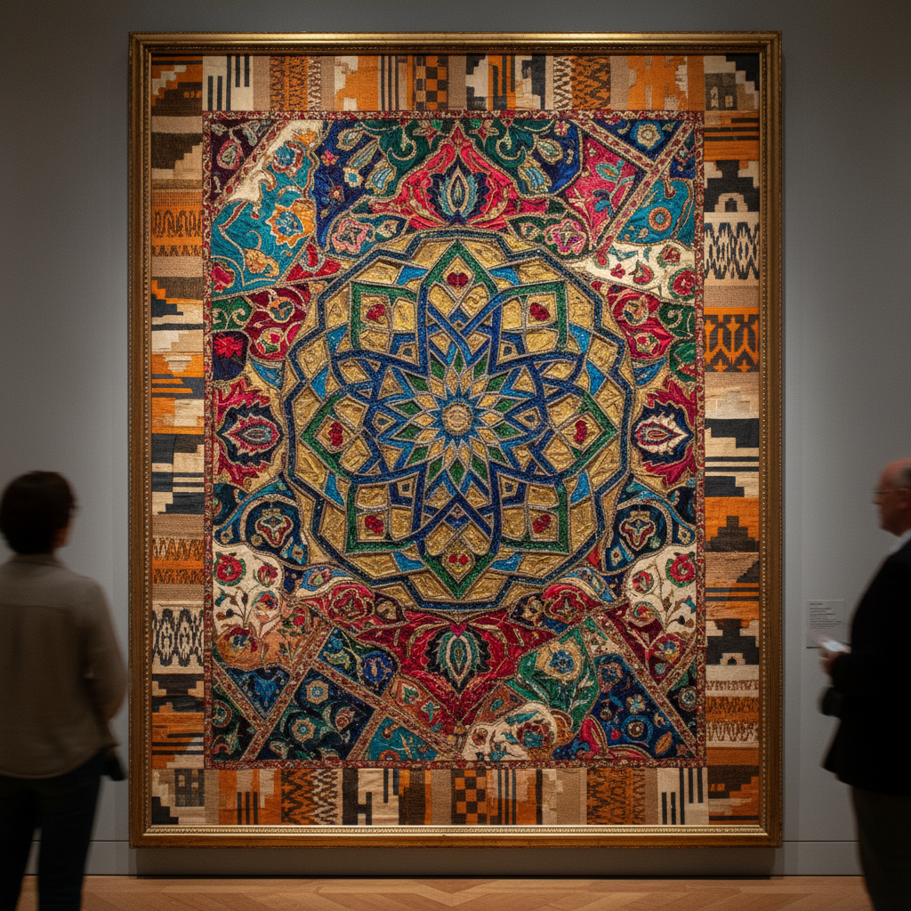

# Pattern and Decoration 图案与装饰运动

> "Decoration is not a crime." — Joyce Kozloff

## 概述

图案与装饰运动（Pattern and Decoration / P&D）是1970年代中期至1980年代初在美国兴起的艺术运动，反对极简主义对装饰的排斥，重新拥抱图案、色彩、手工艺和非西方装饰传统。P&D艺术家认为，现代主义对"装饰"的贬低本质上是对女性艺术、手工艺和非西方文化的歧视。

P&D运动是后现代主义的重要组成部分，它挑战了高雅艺术与工艺、西方与非西方、男性与女性的等级制度。

## 核心特征

| 特征 | 描述 |
|------|------|
| 装饰性 | 有意拥抱被现代主义贬低的"装饰" |
| 图案重复 | 重复图案作为核心视觉策略 |
| 跨文化 | 引用伊斯兰、非洲、亚洲装饰传统 |
| 手工艺 | 拥抱织物、陶瓷、拼布等"低等"媒介 |
| 女性主义 | 为被贬低的"女性"艺术形式正名 |
| 反极简 | 直接反对极简主义的清教徒美学 |

## 视觉特征

- **图案**：重复的几何和有机图案——花卉、阿拉伯纹样、格子
- **色彩**：丰富饱和、多色并置、不回避"俗艳"
- **材料**：织物、瓷砖、壁纸、拼布、亮片
- **尺度**：从小型装饰物到建筑尺度的壁画
- **表面**：充满的、密集的、没有留白
- **质感**：混合媒介——光滑与粗糙、硬与软

## 代表作品

| 作品 | 艺术家 | 年代 | 意义 |
|------|--------|------|------|
| *Fanfare* | Miriam Schapiro | 1979 | 大型拼贴——"femmage"的代表 |
| *An Interior Decorated* | Robert Kushner | 1979 | 织物与绘画的融合 |
| *Galla Placidia in Philadelphia* | Joyce Kozloff | 1985 | 公共空间的装饰壁画 |
| *Sankofa* | Kim MacConnel | 1980 | 非洲织物图案的挪用 |
| *Tent-Roofs-Floor-Carpet* | Robert Zakanitch | 1976 | 花卉图案的大尺度绘画 |
| *Barcelona Fan* | Valerie Jaudon | 1979 | 伊斯兰几何的抽象化 |

## 历史时间线

| 时期 | 事件 |
|------|------|
| 1975 | Amy Goldin发表关于装饰的重要文章 |
| 1976 | "Ten Approaches to the Decorative"展览 |
| 1977 | Holly Solomon画廊开始代理P&D艺术家 |
| 1979 | "Pattern Painting"在P.S.1展出 |
| 1980 | P&D运动达到高峰 |
| 1982 | 后现代主义兴起，P&D被更广泛的多元主义吸收 |
| 1990s | P&D被艺术史边缘化 |
| 2008 | "Pattern and Decoration"回顾展——重新评价 |
| 2019 | MOCA大型回顾展——P&D的历史地位被重新确认 |

## 子类型

| 子类型 | 特征 |
|--------|------|
| Femmage | Schapiro——女性手工艺的升华 |
| 伊斯兰几何 | Jaudon、Kozloff——伊斯兰装饰的抽象化 |
| 织物绘画 | Kushner、MacConnel——织物作为绘画媒介 |
| 公共装饰 | Kozloff——地铁站和公共空间的装饰 |
| 花卉图案 | Zakanitch——花卉的大尺度抽象 |

## 中国语境

P&D运动对中国当代艺术的启示在于重新审视中国丰富的装饰传统——从青花瓷图案到苏绣、从敦煌壁画到民间剪纸。中国当代艺术家如徐冰的版画、吕胜中的剪纸装置、以及年轻一代对传统纹样的当代转化，都可以在P&D的理论框架中找到共鸣。中国的"国潮"设计运动在某种程度上也是P&D精神的当代中国版本。

## 争议与遗产

- **争议**：P&D是否只是"漂亮的壁纸"而缺乏深度？
- **文化挪用**：引用非西方装饰传统的伦理问题
- **性别政治**：为"女性"艺术正名的政治意义
- **遗产**：为后现代多元主义、当代手工艺复兴铺平道路
- **当代回响**：当代纺织艺术、国潮设计、装饰性抽象的回归

## AI生成概念图

## 与其他风格的关系

- **Minimalism** → P&D是对极简主义的直接反叛
- **Feminist Art** → 女性主义艺术为P&D提供政治基础
- **Arts and Crafts** → 工艺美术运动是P&D的历史先驱
- **Islamic Art** → 伊斯兰装饰是P&D的重要灵感来源
- **Post-Modernism** → P&D是后现代主义的重要组成部分
- **Maximalism** → 极繁主义继承了P&D的反极简精神

---

*浮光艺志 | Chronicle of Artistry*
