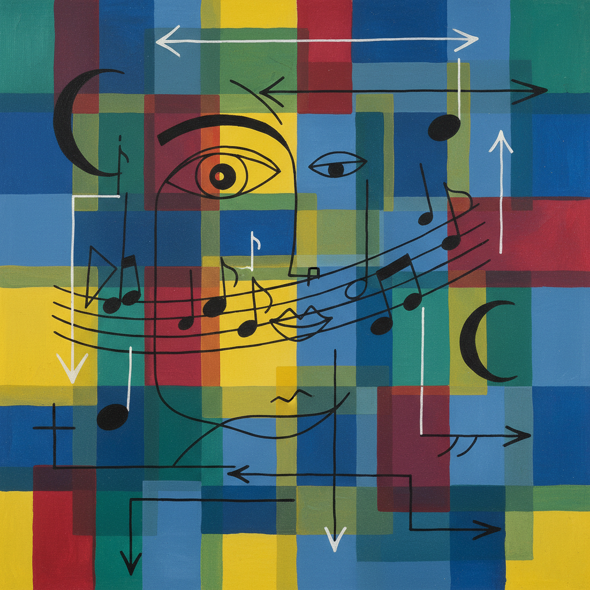

# Paul Klee 保罗·克利

> **流派**: 表现主义 · 包豪斯 · 超现实主义  
> **时期**: 1879–1940 瑞士/德国  
> **关键词**: 色彩方格、童趣线条、音乐性、教学理论

## 概述

保罗·克利是20世纪最具独创性的艺术家之一。他的作品融合了儿童画的天真、音乐的节奏感和深邃的色彩理论，创造出一个介于抽象与具象之间的诗意世界。作为包豪斯的核心教师，他的艺术理论影响了整个现代设计教育。

## 视觉特征

- **色彩方格**: 用半透明的色块像马赛克一样铺满画面
- **线条游戏**: 简洁的线条像孩子涂鸦，却暗含精密的构成
- **音乐结构**: 画面常具有节奏、复调和对位的音乐性
- **符号语言**: 箭头、眼睛、月亮等符号反复出现
- **透明叠加**: 色彩层层叠加，创造深度和光感

## 代表作品

- 《金鱼》(1925)
- 《通往帕纳塞斯的大道》(1938)
- 《塞内西奥》(1922)
- 《猫与鸟》(1928)

## 历史影响

克利证明了艺术可以同时是智性的和感性的、理论的和直觉的。他的教学笔记《造型思维》是现代艺术教育的基石，影响了从平面设计到数字艺术的广泛领域。

## 相关风格

- [Bauhaus 包豪斯](bauhaus.md)
- [Joan Miró 胡安·米罗](joan-miro.md)
- [Piet Mondrian 皮特·蒙德里安](piet-mondrian.md)
