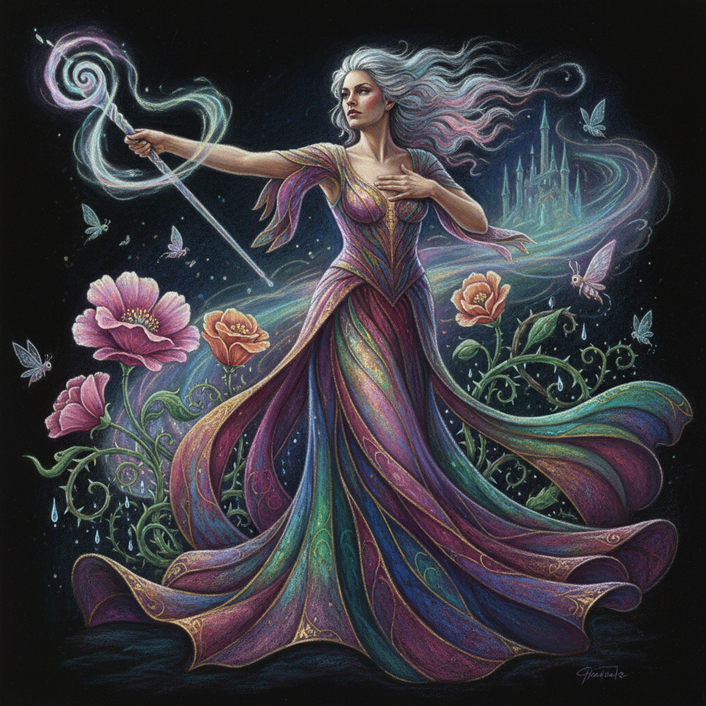

# Paula Rego 葆拉·雷戈

> **时期：** 1935–2022  
> **关键词：** 叙事具象、女性权力、葡萄牙民间故事、心理戏剧

## 概述

Paula Rego 是葡萄牙裔英国画家，以充满心理张力的叙事性具象绘画闻名。她的作品融合了葡萄牙民间故事、童话、天主教图像和个人记忆，描绘女性在权力关系中的复杂处境——既是受害者也是施暴者，既脆弱又强大。

## 风格特征

- **叙事性**：每幅画都讲述一个故事，但故事永远不完整，留给观者填补
- **女性主体**：画面中心几乎总是女性，以强有力的姿态占据空间
- **粉彩技法**：后期大量使用粉彩，色彩浓烈而表面柔和
- **戏剧构图**：人物如同舞台上的演员，姿态夸张而具有表演性
- **暗色背景**：人物常置于深色或不确定的空间中，增加心理压迫感

## 代表作品

- *The Dance*（1988）
- *Dog Women*（1994，系列）
- *Abortion*（1998，系列）
- *The Pillowman*（2004，系列）

## 历史意义

Rego 是20世纪最重要的叙事画家之一，她证明了具象绘画可以同时是政治的、心理的和诗意的。她关于堕胎权的系列作品直接影响了葡萄牙2007年的堕胎合法化公投。

## 概念图

