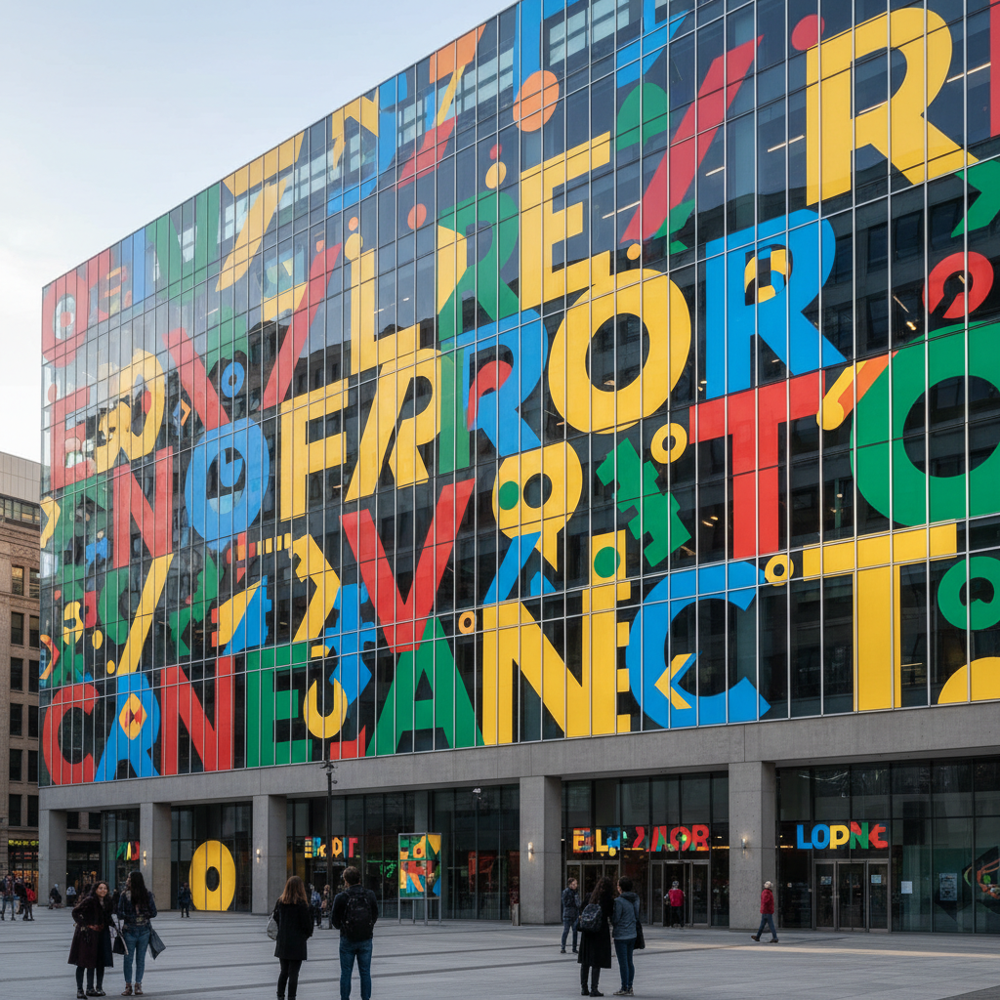

# Paula Scher 宝拉·谢尔

> **时期：** 1948–至今  
> **关键词：** 大字体设计、Pentagram、环境图形、表现主义排版

## 概述

Paula Scher 是美国平面设计师，Pentagram合伙人。她以大胆的大字体设计和环境图形闻名——将整栋建筑变成巨型排版作品，用手绘地图覆盖画布，让文字本身成为建筑和景观的一部分。

## 风格特征

- **大字体**：文字被放大到建筑尺度
- **手绘地图**：用密集的手写文字绘制世界地图
- **环境图形**：将排版融入建筑空间和城市环境
- **表现主义**：文字的形态传达情绪和能量
- **历史引用**：俄国构成主义、瑞士风格等历史设计的当代演绎

## 代表作品

- *公共剧院视觉识别*（1994–至今）
- *花旗银行品牌重塑*（1998）
- *新泽西表演艺术中心环境图形*
- *手绘地图系列*

## 概念图

