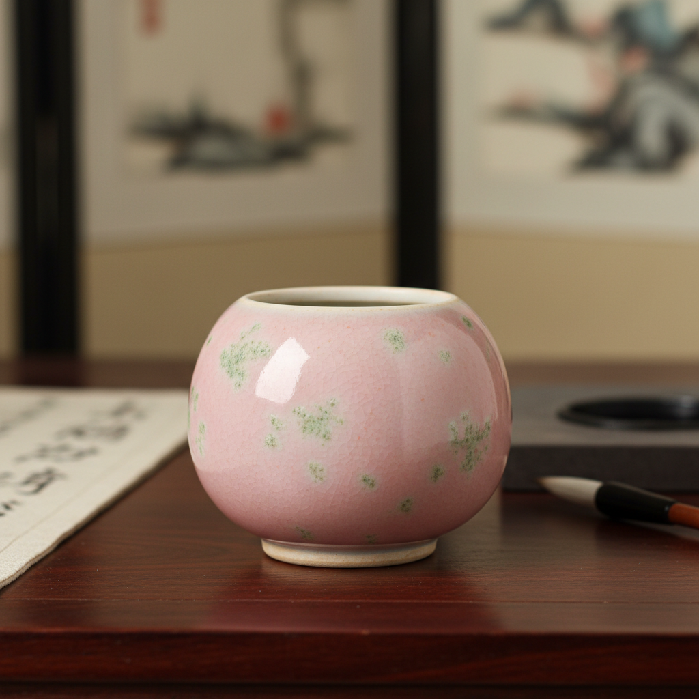

# Peach Bloom Art 豇豆红釉艺术

> "Peach bloom is the blush of dawn on porcelain — a delicate pink suffused with green spots like moss on a peach, the most subtle and elusive of all copper red glazes, requiring such precise control that even the imperial kilns of Kangxi could not guarantee success, each piece a captured moment of chromatic uncertainty where copper hovers between red and green, never quite deciding which to become." — Unknown

## 概述

豇豆红釉艺术（Peach Bloom Art）是一种以柔和粉红色调中带有绿色苔点为特征的精细铜红釉艺术。豇豆红因其色泽如同成熟豇豆的粉红色而得名，又因其如桃花般的粉嫩色调在西方被称为"Peach Bloom"。豇豆红是铜红釉家族中最精致微妙的品种——其色调在粉红、淡红之间变化，并常伴有绿色苔点（铜在氧化状态下的呈色），形成独特的"美人醉"效果。

豇豆红釉艺术的核心要素包括：1）粉红色调——柔和的粉红基调；2）绿色苔点——铜氧化形成的绿斑；3）极致精细——最精细的铜红釉；4）小器专用——多用于小型文房器；5）康熙巅峰——清康熙时期的巅峰；6）不可复制——极难精确复制；7）文人审美——符合文人的含蓄审美。

## 核心特征

| 特征 | 描述 |
|------|------|
| 粉红色调 | 柔和的粉红基调 |
| 绿色苔点 | 铜氧化的绿斑 |
| 极致精细 | 最精细的铜红釉 |
| 小器专用 | 多用于小型器物 |
| 康熙巅峰 | 清康熙时期巅峰 |
| 不可复制 | 极难精确复制 |

## 视觉特征

- **粉红底色**：柔和的粉红色基调
- **绿色苔点**：散布的绿色小斑点
- **色调渐变**：粉红到淡红的渐变
- **含蓄内敛**：不张扬的含蓄美
- **如桃花**：如桃花般的粉嫩
- **精致小巧**：多见于精致小器

## 代表作品

| 作品 | 艺术家/文化 | 年代 | 意义 |
|------|-------------|------|------|
| *豇豆红太白尊* | 中国清代 | 康熙 | 豇豆红的经典器形 |
| *豇豆红柳叶瓶* | 中国清代 | 康熙 | 精致的文房器 |
| *豇豆红印盒* | 中国清代 | 康熙 | 文房小器 |
| *豇豆红水盂* | 中国清代 | 康熙 | 文房用器 |
| *当代豇豆红* | 当代陶艺家 | 当代 | 当代的复烧尝试 |

## 历史时间线

| 时期 | 事件 |
|------|------|
| 清康熙 | 豇豆红釉的创烧和巅峰 |
| 雍正乾隆 | 豇豆红的延续但品质下降 |
| 19世纪 | 欧洲收藏家的追捧 |
| 20世纪 | 豇豆红成为拍卖珍品 |
| 当代 | 当代陶艺家的复烧探索 |

## 中国语境

豇豆红是中国陶瓷中最具文人气质的釉色之一。它专为康熙朝的文房小器而创——太白尊、柳叶瓶、菊瓣瓶、印盒、水盂等精致小器是豇豆红的典型载体。豇豆红的美在于其含蓄和不确定性——粉红中带绿，如同美人微醺的面颊，因此又被称为"美人醉"或"桃花片"。中国文人审美崇尚含蓄、内敛、不张扬，豇豆红完美地体现了这种审美理想。豇豆红的烧成极为困难——即使在康熙御窑的鼎盛时期，成功率也很低，这使得每一件豇豆红器都弥足珍贵。在国际拍卖市场上，康熙豇豆红器物始终是最受追捧的中国陶瓷品种之一。

## AI生成概念图

## 与其他风格的关系

- **Sang de Boeuf** → 牛血红
- **Copper Red** → 铜红釉
- **Scholar's Objects** → 文房器
- **Kangxi Porcelain** → 康熙瓷器
- **Chinese Imperial** → 中国官窑
- **Subtle Aesthetics** → 含蓄美学

---

*浮光艺志 | Chronicle of Artistry*
