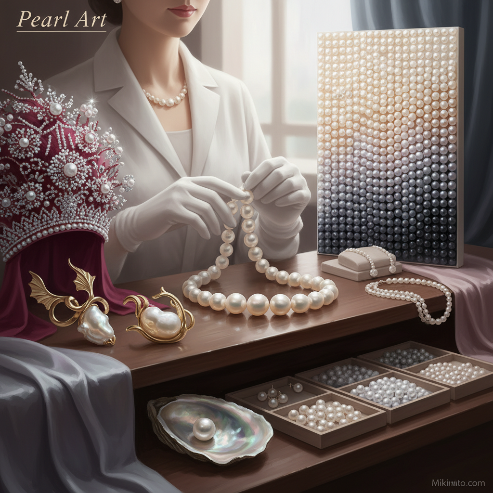

# Pearl Art 珍珠艺术

> "A pearl is the only gem created by a living creature — born from irritation, built layer by layer over years of patient secretion, each microscopic plate of nacre aligned to create the soft iridescent glow that has captivated humanity for millennia. Unlike gems cut from stone, a pearl arrives perfect from nature, needing no human intervention to reveal its beauty. It is organic patience made luminous." — Unknown

## 概述

珍珠艺术（Pearl Art）是以珍珠为主要材料进行艺术创作的实践——利用珍珠的天然光泽、虹彩、圆润形态和有机起源创造首饰、装饰和艺术品。珍珠是唯一由生物体产生的宝石，有着独特的文化象征意义。

珍珠艺术的实践包括：1）珍珠首饰——用珍珠制作的项链、耳环、胸针等；2）珍珠刺绣——将珍珠缝缀在织物上的装饰技法；3）珍珠镶嵌——将珍珠镶嵌在金属、木材或漆器中；4）珍珠母艺术——利用珍珠母（贝壳内层）的虹彩效果；5）珍珠编织——用珍珠编织成图案和造型；6）珍珠服装——用珍珠装饰的高级时装；7）当代珍珠艺术——用珍珠创作的当代装置和雕塑。

## 核心特征

| 特征 | 描述 |
|------|------|
| 有机 | 唯一的有机宝石 |
| 光泽 | 独特的珍珠光泽 |
| 虹彩 | 表面的虹彩效果 |
| 圆润 | 完美的球形 |
| 温润 | 温润柔和的质感 |
| 珍贵 | 天然珍珠的稀有性 |

## 视觉特征

- **光泽**：珍珠特有的柔和光泽
- **虹彩**：表面的彩虹色泽
- **白色**：经典的珍珠白
- **圆润**：完美的球形形态
- **温暖**：温暖柔和的视觉感受
- **优雅**：优雅高贵的气质

## 代表作品

| 作品 | 艺术家 | 年代 | 意义 |
|------|--------|------|------|
| *La Peregrina* | Unknown | 16世纪 | 著名历史珍珠 |
| *Pearl jewelry* | Mikimoto | 1893至今 | 养殖珍珠首饰 |
| *Pearl embroidery* | Various | 中世纪至今 | 珍珠刺绣 |
| *Vermeer's Girl with Pearl Earring* | Vermeer | 1665 | 珍珠在绘画中 |
| *Contemporary pearl art* | Various | 当代 | 当代珍珠艺术 |

## 历史时间线

| 时期 | 事件 |
|------|------|
| 古代 | 最早的珍珠装饰 |
| 罗马帝国 | 珍珠作为奢侈品 |
| 中世纪 | 珍珠刺绣的黄金时代 |
| 1893 | 御木本幸吉发明养殖珍珠 |
| 当代 | 珍珠在当代设计中的运用 |

## 中国语境

珍珠艺术在中国有极其悠久的历史。中国是世界上最早养殖珍珠的国家——宋代就有了淡水珍珠养殖的记载。中国的合浦珍珠（南珠）自汉代起就是贡品，"珠还合浦"的典故流传至今。中国传统的珍珠首饰和装饰品以精美著称——清代的珍珠朝珠、凤冠上的珍珠装饰都是珍珠艺术的杰作。中国目前是世界最大的淡水珍珠生产国，浙江诸暨是全球淡水珍珠的主要产地。中国当代的珍珠设计师将传统珍珠美学与现代设计结合，创作出融合东方优雅与当代时尚的珍珠艺术品。中国的珍珠粉在传统美容和中医中也有重要地位。

## AI生成概念图

## 与其他风格的关系

- **Jewelry Art** → 首饰艺术
- **Shell Art** → 贝壳艺术
- **Embroidery Art** → 刺绣艺术
- **Fashion Art** → 时尚艺术
- **Textile Art** → 纺织艺术
- **Organic Art** → 有机艺术

---

*浮光艺志 | Chronicle of Artistry*
