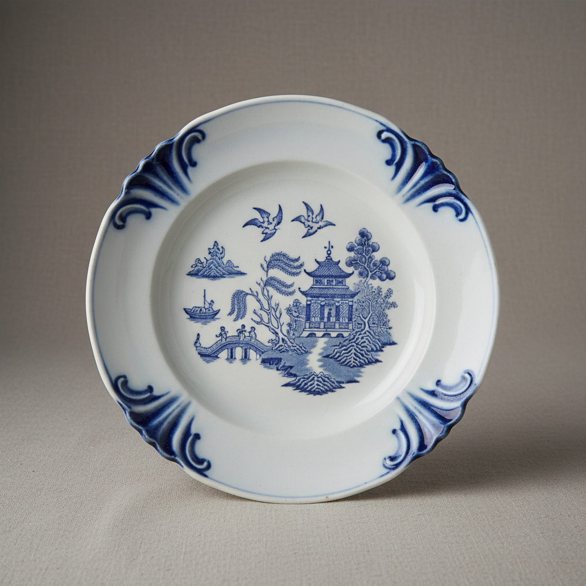

# Pearlware Art 珍珠釉陶艺术

> "Pearlware is creamware's cooler cousin — the addition of cobalt to the glaze transforms warm cream into a blue-white luminosity that mimics the prestige of Chinese porcelain at a fraction of the cost, a democratic material that brought the appearance of fine china to ordinary tables, its pooled blue tint in the crevices giving every piece a subtle depth that plain white cannot achieve." — Unknown

## 概述

珍珠釉陶艺术（Pearlware Art）是一种18世纪末至19世纪英国发展的精细陶器艺术形式。珍珠釉陶在奶油色陶器（creamware）的基础上，在釉料中添加少量氧化钴，使釉面呈现出冷调的蓝白色泽——模仿中国青花瓷的外观。这种改良使得英国陶器在视觉上更接近昂贵的进口瓷器，同时保持了较低的生产成本，使精美的蓝白餐具进入普通家庭。

珍珠釉陶艺术的核心要素包括：1）蓝白釉色——含钴釉料的冷调蓝白；2）精细坯体——改良的精细陶土配方；3）装饰多样——转印、手绘、浮雕等多种装饰；4）模仿瓷器——模仿中国瓷器的外观；5）大众化——使精美陶器进入普通家庭；6）工业化——早期工业化生产的代表；7）文化交流——东西方陶瓷文化交流的产物。

## 核心特征

| 特征 | 描述 |
|------|------|
| 蓝白釉色 | 含钴的冷调蓝白釉 |
| 精细坯体 | 改良的精细陶土 |
| 装饰丰富 | 转印手绘浮雕等 |
| 模仿瓷器 | 模仿中国瓷器外观 |
| 大众化 | 进入普通家庭 |
| 工业化 | 早期工业化生产 |

## 视觉特征

- **蓝白色调**：釉面呈冷调蓝白色
- **积釉蓝色**：凹处积釉呈现深蓝
- **转印图案**：精细的蓝色转印装饰
- **精细质感**：光滑精细的表面质感
- **中国风图案**：模仿中国瓷器的图案
- **浮雕装饰**：模压浮雕的边缘装饰

## 代表作品

| 作品 | 艺术家/文化 | 年代 | 意义 |
|------|-------------|------|------|
| *Wedgwood珍珠釉陶* | Josiah Wedgwood | 1779年 | 珍珠釉陶的发明 |
| *Willow Pattern* | 英国 | 1790年代 | 最著名的珍珠釉陶图案 |
| *Shell Edge* | 英国各窑 | 18-19世纪 | 经典的贝壳边装饰 |
| *Leeds Pottery* | Leeds | 18世纪末 | 精细的珍珠釉陶 |
| *转印珍珠釉陶* | Staffordshire | 19世纪 | 工业化转印装饰 |

## 历史时间线

| 时期 | 事件 |
|------|------|
| 1779年 | Wedgwood推出珍珠釉陶 |
| 1780年代 | 珍珠釉陶在英国普及 |
| 1790年代 | Willow Pattern等经典图案出现 |
| 19世纪初 | 珍珠釉陶大量出口 |
| 1830年代 | 逐渐被白色铁石陶取代 |

## 中国语境

珍珠釉陶的诞生本身就是中国陶瓷影响世界的证据——它是英国陶工试图模仿中国青花瓷外观的产物。中国青花瓷的蓝白美学通过贸易传播到欧洲，激发了英国陶瓷工业的创新。珍珠釉陶上的许多装饰图案直接模仿中国瓷器——如著名的"柳树图案"（Willow Pattern）就是英国人想象中的中国风景。这种文化交流是双向的：中国瓷器影响了英国陶器的发展，而英国工业化生产的廉价陶器后来又反过来冲击了中国的陶瓷出口市场。珍珠釉陶是全球化早期东西方文化交流的重要物证。

## AI生成概念图

## 与其他风格的关系

- **Creamware** → 奶油色陶器
- **Blue and White** → 青花
- **Transfer Printing** → 转印装饰
- **Delftware** → 代尔夫特陶器
- **Chinoiserie** → 中国风
- **Industrial Ceramics** → 工业陶瓷

---

*浮光艺志 | Chronicle of Artistry*
