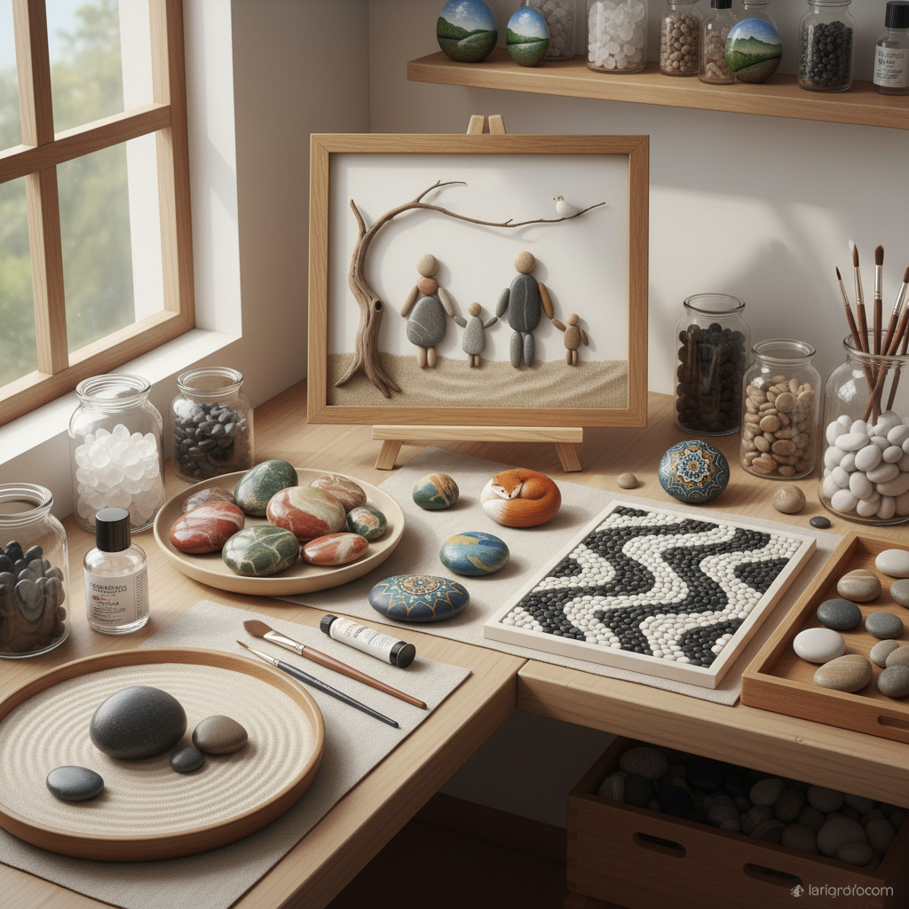

# Pebble Art 鹅卵石艺术

> "A pebble is a stone that has been polished by time — tumbled by rivers, rolled by waves, smoothed by centuries of patient friction. Each pebble carries the memory of its journey from mountain to sea, and when an artist arranges pebbles into patterns or paints upon their surfaces, they are adding a human chapter to a geological story that began millions of years ago." — Unknown

## 概述

鹅卵石艺术（Pebble Art）是以天然鹅卵石为主要材料进行艺术创作的实践——利用鹅卵石的天然形态、色彩、纹理和光滑表面创造各种艺术形式。鹅卵石艺术是一种亲民的、与自然紧密相连的艺术实践。

鹅卵石艺术的实践包括：1）鹅卵石拼贴画——用不同形状和颜色的鹅卵石在画框中拼出人物、风景等场景；2）鹅卵石彩绘——在鹅卵石表面绘画；3）鹅卵石马赛克——用鹅卵石铺设地面图案；4）鹅卵石雕塑——用鹅卵石堆叠或粘合成雕塑；5）鹅卵石花园——用鹅卵石设计的景观艺术；6）鹅卵石曼陀罗——用鹅卵石排列的曼陀罗图案；7）鹅卵石故事画——用鹅卵石的天然形状讲述故事。

## 核心特征

| 特征 | 描述 |
|------|------|
| 天然 | 天然的形态和色彩 |
| 光滑 | 水磨的光滑表面 |
| 多样 | 形状大小极其多样 |
| 亲民 | 材料随处可得 |
| 耐久 | 石头的永久性 |
| 触感 | 温润的触感 |

## 视觉特征

- **灰色**：鹅卵石的天然灰色调
- **圆润**：水磨的圆润形态
- **纹理**：石头的天然纹理和条纹
- **对比**：不同颜色石头的对比
- **排列**：精心排列的图案
- **简约**：简约的视觉效果

## 代表作品

| 作品 | 艺术家 | 年代 | 意义 |
|------|--------|------|------|
| *Pebble art frames* | Sharon Nowlan | 2000年代至今 | 鹅卵石拼贴画先驱 |
| *Painted rocks* | Various | 当代 | 彩绘石头运动 |
| *Pebble mosaics* | 希腊/罗马传统 | 古代至今 | 鹅卵石马赛克 |
| *Rock mandalas* | Various | 当代 | 石头曼陀罗 |
| *Kindness rocks* | Various | 2015至今 | 善意石头运动 |

## 历史时间线

| 时期 | 事件 |
|------|------|
| 古希腊 | 鹅卵石马赛克地面 |
| 古罗马 | 鹅卵石铺路艺术 |
| 中世纪 | 欧洲鹅卵石花园 |
| 2000年代 | 鹅卵石拼贴画的兴起 |
| 2015 | "善意石头"运动全球传播 |

## 中国语境

鹅卵石艺术在中国有深厚的文化传统。中国传统园林中的"卵石铺地"——用不同颜色的鹅卵石铺设成吉祥图案（如蝙蝠、鹿、花卉）——是中国独特的鹅卵石马赛克艺术。苏州园林的卵石小径是这一传统的杰出代表。中国南京的"雨花石"——以其天然的图案和色彩著称——被视为天然的艺术品，收藏和鉴赏雨花石是中国独特的文化传统。中国当代的鹅卵石艺术家将传统的卵石铺地美学与当代设计结合，创作出融合中国传统图案与现代审美的鹅卵石艺术作品。中国的"石头画"——在鹅卵石上绘画——也是近年来流行的艺术形式。

## AI生成概念图

## 与其他风格的关系

- **Stone Balancing Art** → 石头平衡艺术
- **Mosaic Art** → 马赛克艺术
- **Land Art** → 大地艺术
- **Folk Art** → 民间艺术
- **Nature Art** → 自然艺术
- **Miniature Art** → 微型艺术

---

*浮光艺志 | Chronicle of Artistry*
