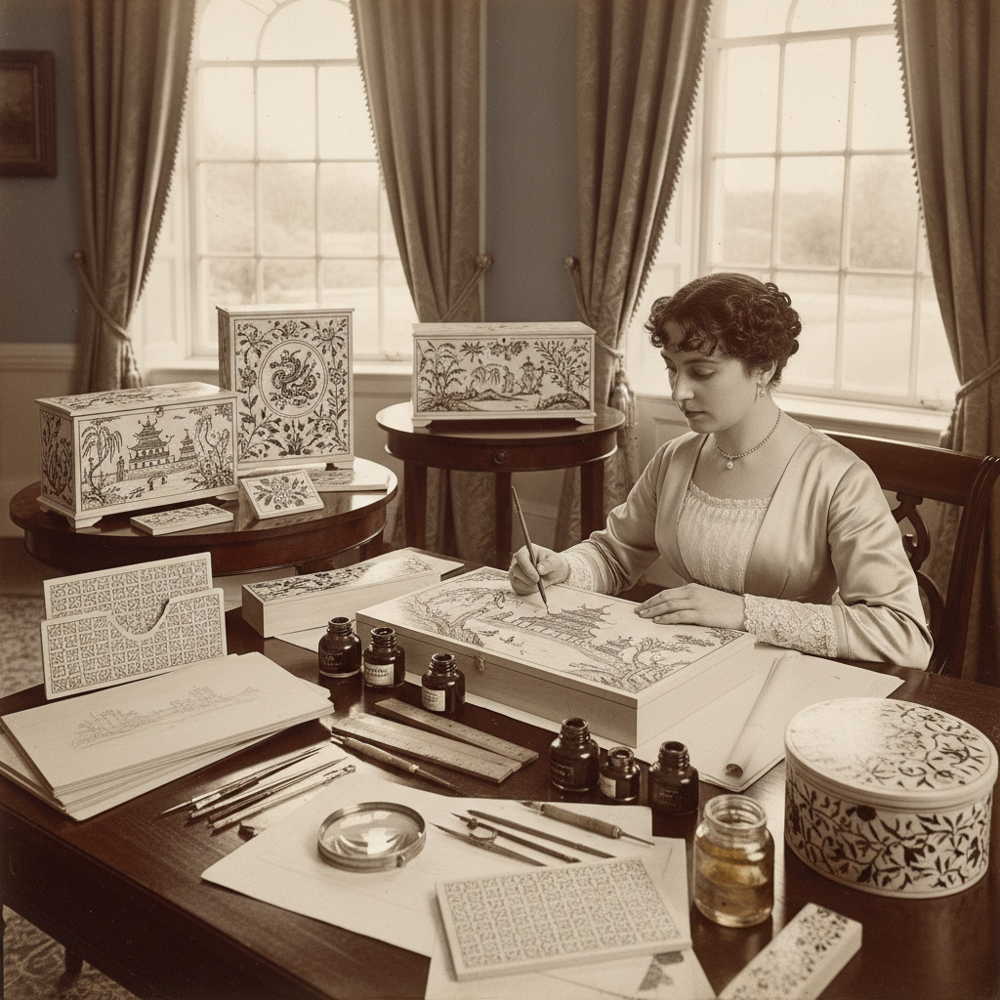

# Penwork Art 笔绘装饰艺术

> "Penwork is drawing elevated to furniture decoration — fine lines of India ink applied with a steel nib pen onto pale sycamore or holly wood, creating intricate designs that rival the finest engravings. Popular in Regency England, penwork transformed plain wooden boxes, tables, and cabinets into objects of extraordinary delicacy, their surfaces covered with arabesques, chinoiserie scenes, and botanical illustrations drawn with the patience of a medieval illuminator." — Unknown

## 概述

笔绘装饰艺术（Penwork Art）是使用钢笔和印度墨水在浅色木材（如枫木、冬青木）表面绘制精细装饰图案的家具和器物装饰技法——流行于18世纪末至19世纪初的英国摄政时期，以其极其精细的线条和丰富的装饰题材著称。笔绘装饰常见于首饰盒、茶叶罐、工作盒和小型家具上。

笔绘装饰艺术的实践包括：1）中国风笔绘——模仿中国风格的人物和风景；2）植物笔绘——精细的植物和花卉图案；3）阿拉伯风笔绘——几何和卷草纹样；4）风景笔绘——建筑和风景场景；5）边框笔绘——器物边缘的装饰带；6）当代笔绘——将传统技法与现代设计结合的创作。

## 核心特征

| 特征 | 描述 |
|------|------|
| 精细 | 极其精细的线条 |
| 手绘 | 纯手工钢笔绘制 |
| 对比 | 黑墨与白木的对比 |
| 耐心 | 极其耗时的工艺 |
| 装饰 | 丰富的装饰题材 |
| 英国 | 英国摄政时期风格 |

## 视觉特征

- **线条**：极其精细的墨线
- **密度**：密集的线条填充
- **对比**：黑白的强烈对比
- **细节**：极其丰富的细节
- **平面**：平面化的装饰效果
- **优雅**：优雅精致的整体感

## 代表作品

| 作品 | 艺术家/文化 | 年代 | 意义 |
|------|-------------|------|------|
| *Regency penwork boxes* | 英国 | 1800-1830 | 摄政时期笔绘盒 |
| *Chinoiserie penwork* | 英国 | 19世纪初 | 中国风笔绘 |
| *Penwork tea caddies* | 英国 | 19世纪初 | 笔绘茶叶罐 |
| *Penwork furniture* | 英国 | 19世纪初 | 笔绘家具 |
| *Contemporary penwork* | 当代 | 当代 | 当代笔绘创作 |

## 历史时间线

| 时期 | 事件 |
|------|------|
| 18世纪末 | 笔绘装饰的兴起 |
| 1800-1830 | 摄政时期笔绘的黄金时代 |
| 维多利亚时期 | 笔绘的衰落 |
| 20世纪 | 笔绘作为收藏品的价值认可 |
| 当代 | 笔绘技法的复兴和研究 |

## 中国语境

笔绘装饰艺术与中国有有趣的文化联系。英国摄政时期的笔绘装饰大量采用"中国风"（Chinoiserie）题材——模仿中国的人物、建筑、花鸟和风景，反映了当时欧洲对中国文化的想象和向往。中国传统的白描技法与笔绘有技术上的相似之处——都是使用墨线在浅色背景上创造精细的图案。中国的漆器装饰中有类似的"描金"和"描漆"技法——在漆面上用细笔绘制精细图案。中国当代的一些工艺美术师将笔绘技法与中国传统装饰结合——创造具有东方韵味的笔绘作品。中国的古董市场中，英国摄政时期的笔绘器物是受欢迎的收藏品——特别是带有中国风题材的作品。

## AI生成概念图

## 与其他风格的关系

- **Japanning** → 仿漆装饰
- **Chinoiserie** → 中国风
- **Marquetry** → 镶嵌细工
- **Illustration** → 插画艺术
- **Calligraphy** → 书法艺术
- **Decorative Art** → 装饰艺术

---

*浮光艺志 | Chronicle of Artistry*
