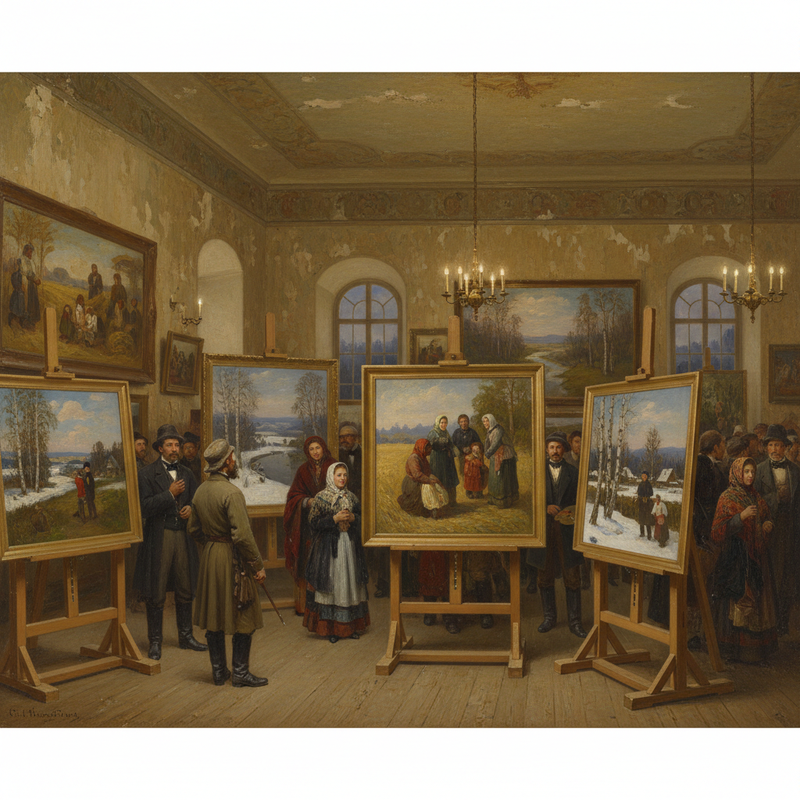

# Peredvizhniki Art 巡回展览画派艺术

> "Art must serve society — it must go to the people, not wait for the people to come to it." — Ivan Kramskoi

## 概述

巡回展览画派艺术（Peredvizhniki Art）是19世纪下半叶俄罗斯最重要的艺术运动——由一群反对学院派保守主义的画家于1870年组建"巡回艺术展览协会"（Товарищество передвижных художественных выставок），将艺术展览带到俄罗斯各地城市，使普通民众也能接触到高水平的绘画艺术。

巡回展览画派（又称"巡回派"或"流浪者画派"）的诞生源于1863年的"十四人事件"——14名圣彼得堡美术学院的优秀毕业生拒绝按照学院指定的神话题材创作毕业作品，集体退出学院，宣告了俄罗斯艺术从学院派向现实主义的历史性转向。1870年，以伊万·克拉姆斯柯依（Kramskoi）为核心，正式成立巡回展览协会——成员包括列宾、苏里科夫、希施金、列维坦、艾瓦佐夫斯基、瓦斯涅佐夫等俄罗斯艺术史上最伟大的画家。

巡回展览画派的核心要素包括：1）现实主义——忠实反映俄罗斯社会现实；2）民族性——表现俄罗斯的自然、历史和人民；3）社会批判——揭示社会不公和人民苦难；4）巡回展览——将艺术带到各地城市；5）反学院派——反对学院的保守和脱离现实；6）风景画革命——俄罗斯风景画的黄金时代；7）历史画巨制——大型历史题材绘画。

## 核心特征

| 特征 | 描述 |
|------|------|
| 现实主义 | 忠实反映俄罗斯社会现实 |
| 民族性 | 表现俄罗斯自然历史人民 |
| 社会批判 | 揭示社会不公人民苦难 |
| 巡回展览 | 将艺术带到各地城市 |
| 反学院派 | 反对学院保守脱离现实 |
| 风景画革命 | 俄罗斯风景画黄金时代 |

## 视觉特征

- **写实技法**：精湛的写实绘画技巧
- **俄罗斯风景**：广袤的俄罗斯大地
- **人民形象**：农民、工人、知识分子
- **历史场景**：俄罗斯历史的戏剧性瞬间
- **光影表现**：对自然光线的精确捕捉
- **情感深度**：深沉的情感和社会关怀

## 代表作品

| 作品 | 画家 | 意义 |
|------|------|------|
| *伏尔加河上的纤夫* | 列宾 | 社会批判巅峰 |
| *松树林的清晨* | 希施金 | 风景画经典 |
| *弗拉基米尔大道* | 列维坦 | 抒情风景 |
| *女贵族莫洛佐娃* | 苏里科夫 | 历史画巨制 |
| *第聂伯河上的月夜* | 库因芝 | 光影革命 |
| *无名女郎* | 克拉姆斯柯依 | 肖像经典 |

## 历史时间线

| 时期 | 事件 |
|------|------|
| 1863年 | "十四人事件"，退出学院 |
| 1870年 | 巡回展览协会成立 |
| 1871年 | 第一次巡回展览 |
| 1870-80年代 | 黄金时代 |
| 1890年代 | 新一代画家加入 |
| 1923年 | 协会正式解散 |

## 中国语境

巡回展览画派对中国美术有着极其深远的影响。20世纪50年代，中国全面学习苏联美术教育体系——巡回派的现实主义传统成为中国美术教育的核心。列宾美术学院（原圣彼得堡美术学院）培养了大批中国留学生——他们回国后成为中国美术教育的骨干力量。巡回派"艺术为人民服务"的理念与中国"文艺为工农兵服务"的方针高度契合——这使得巡回派的艺术观念在中国获得了比在俄罗斯本土更持久的影响力。希施金的森林、列维坦的风景、列宾的人物——这些巡回派大师的作品至今仍是中国美术教育的重要参考。当代中国写实绘画的技术传统很大程度上可以追溯到巡回展览画派。

## 概念图

## 与其他风格的关系

- **Shishkin** → 希施金（森林画大师）
- **Levitan** → 列维坦（抒情风景）
- **Repin** → 列宾（人物画巅峰）
- **Surikov** → 苏里科夫（历史画）
- **French Realism** → 法国现实主义（平行运动）
- **Socialist Realism** → 社会主义现实主义（后续发展）

---

*浮光艺志 | Chronicle of Artistry*
