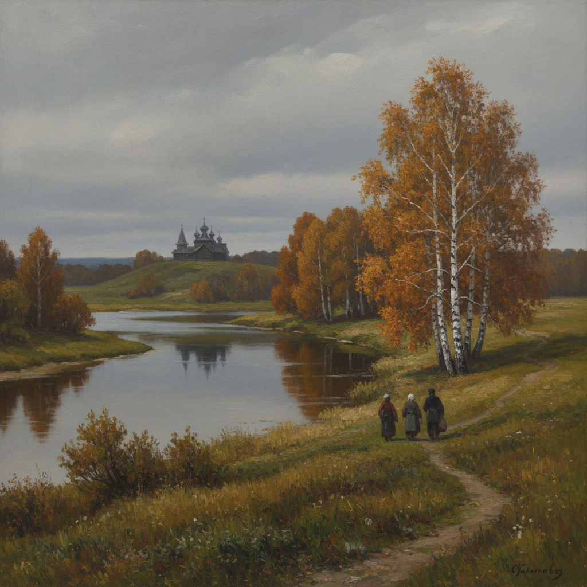

# Peredvizhniki 巡回展览画派

> "Искусство должно служить народу." — Иван Крамской
> ("艺术应当服务于人民。")

## 概述

巡回展览画派（Передвижники / Peredvizhniki，意为"巡回者"）是1870–1923年间俄罗斯最重要的现实主义艺术运动。画家们反抗圣彼得堡皇家美术学院的学院派束缚，组建"巡回艺术展览协会"，将展览带到俄罗斯各地城市，让普通民众也能接触艺术。

巡回画派以深刻的社会关怀、对俄罗斯风景和人民生活的真实描绘著称，是俄罗斯民族艺术意识觉醒的核心力量。

## 核心特征

| 特征 | 描述 |
|------|------|
| 社会批判 | 揭示社会不公、底层苦难 |
| 民族风景 | 描绘俄罗斯广袤大地的诗意 |
| 心理肖像 | 深刻的人物心理刻画 |
| 历史叙事 | 俄罗斯历史事件的戏剧性再现 |
| 巡回展览 | 将艺术带到全国各地 |
| 反学院派 | 拒绝古典主义的理想化 |

## 视觉特征

- **色调**：俄罗斯大地的灰绿、褐色、银白
- **光线**：北方的柔和光线，冬日的冷光
- **风景**：白桦林、伏尔加河、无尽的平原、春泥
- **人物**：农民、纤夫、流放者、知识分子
- **构图**：叙事性构图，戏剧性场景
- **笔触**：扎实的写实技法，精确的细节

## 代表人物

| 画家 | 代表作 | 特点 |
|------|--------|------|
| Ilya Repin | *Barge Haulers on the Volga* (1873) | 社会批判巅峰 |
| Ivan Shishkin | *Morning in a Pine Forest* (1889) | 俄罗斯森林的诗人 |
| Isaac Levitan | *Above Eternal Peace* (1894) | 俄罗斯风景画巅峰 |
| Arkhip Kuindzhi | *Moonlit Night on the Dnieper* (1880) | 光线魔术师 |
| Vasily Surikov | *Boyarynya Morozova* (1887) | 历史画大师 |
| Ivan Kramskoi | *Christ in the Wilderness* (1872) | 心理肖像大师 |
| Viktor Vasnetsov | *Bogatyrs* (1898) | 俄罗斯神话与民间传说 |

## 历史背景

1. **1863年**："十四人叛逃"——14名学生拒绝学院毕业创作题目
2. **1870年**：巡回艺术展览协会正式成立
3. **1871年**：第一次巡回展览在圣彼得堡开幕
4. **1870-90年代**：运动鼎盛期，列宾、希施金等大师活跃
5. **1890年代后**：特列季亚科夫大量收购巡回画派作品
6. **1923年**：协会正式解散，但精神被苏联社会主义现实主义继承

## 与其他风格的关系

- **Realism** → 俄罗斯现实主义的核心力量
- **Barbizon School** → 受法国巴比松画派影响
- **Social Realism** → 直接先驱
- **Socialist Realism** → 苏联时期的继承者
- **Plein Air** → 列维坦等人的外光风景画
- **Grimshaw/Kuindzhi** → 库因芝的月光效果与格里姆肖异曲同工

## 概念图

---

*浮光艺志 | Chronicle of Artistry*
